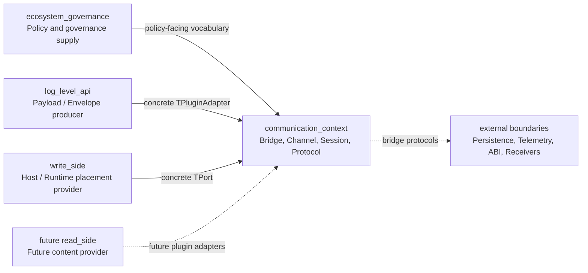
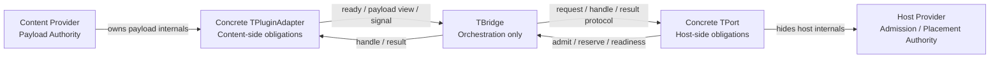
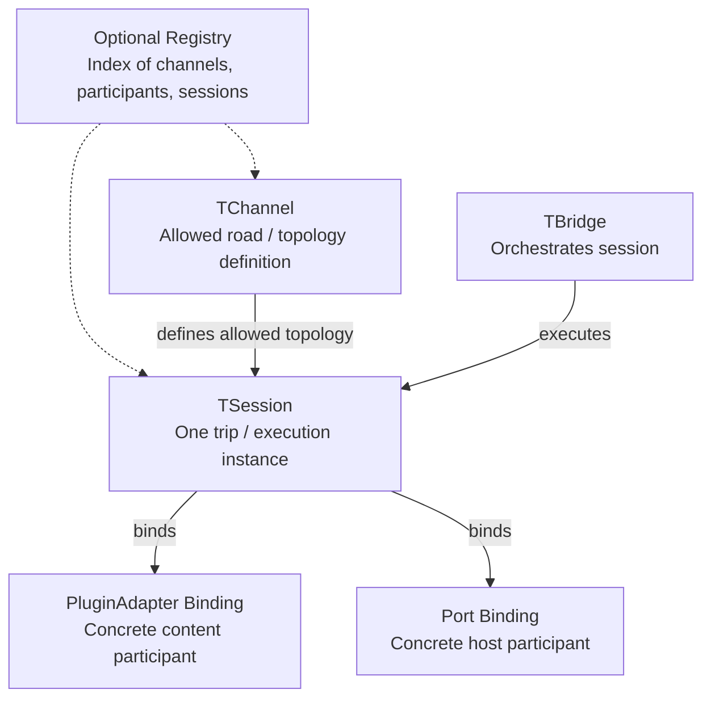
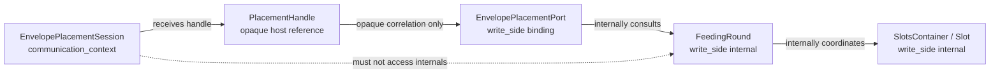

# ASCC-001 — Communication Context Foundation

## 1. Document Control

| Record ID | Field | Value |
|---:|---|---|
| ASCC-001-DOC-001 | Document Title | Communication Context Foundation |
| ASCC-001-DOC-002 | File Name | `ASCC-001_Communication_Context_Foundation.md` |
| ASCC-001-DOC-003 | Documentation Pack | ASCC — Assembler System Communication Context Documentation Pack |
| ASCC-001-DOC-004 | Formal Version | Formal Draft V1 |
| ASCC-001-DOC-005 | Project | Assembler System |
| ASCC-001-DOC-006 | Primary Language | English |
| ASCC-001-DOC-007 | Scope Level | Root communication domain foundation, bridge authority, channel/session distinction, endpoint non-ownership |
| ASCC-001-DOC-008 | Implementation Direction | C++17, templates, traits, CRTP-compatible abstractions, static-first communication bindings |
| ASCC-001-DOC-009 | Status | Foundational Architecture Draft |
| ASCC-001-DOC-010 | Depends On | Prior Assembler System domain, filesystem, and write-side modeling discussions |
| ASCC-001-DOC-011 | Next Document | `ASCC-002_Bridge_Channel_Session_Core_Model.md` |
| ASCC-001-DOC-012 | Primary Rule | The Communication Context owns communication orchestration, not endpoint internals |
| ASCC-001-DOC-013 | Root Domain Decision | `communication_context/` is promoted to a root DDD implementation domain |

---

## 2. Purpose

### 2.1 Purpose Statement

This document establishes the `communication_context/` domain as a root implementation domain inside the Assembler System.

It defines the conceptual foundation for bridge-mediated communication between content-producing domains, host/receiver domains, persistence boundaries, telemetry boundaries, and future ABI-facing boundaries.

It answers the foundational question:

```text
What does the Communication Context own, why does it deserve root-domain
status, and how does it prevent direct structural coupling between system
participants?
````

### 2.2 Core Thesis

The Communication Context exists because communication between domains must not be modeled as direct dependency between endpoint internals.

Instead, communication must be mediated through explicit bridge concepts:

1. `TBridge`,
2. `TChannel`,
3. `TSession`,
4. `TPort`,
5. `TPluginAdapter`,
6. `TBridgeCarriers`,
7. `TBridgeProtocol`,
8. optional `TRegistry`.

The Communication Context owns the language and orchestration of interaction.

It does not own:

1. payload preparation,
2. validation internals,
3. host placement internals,
4. write-side rounds,
5. persistence implementation,
6. telemetry SDK internals,
7. thin C ABI translation internals,
8. endpoint domain lifecycle.

---

## 3. Root Domain Promotion

### 3.1 Root Domain Decision

The Assembler System shall promote `communication_context/` into an independent root DDD implementation domain.

The updated root domain set is:

```text
assembler/
├── ecosystem_governance/
├── log_level_api/
├── communication_context/
└── write_side/
```

Future extension may add:

```text
assembler/
├── ecosystem_governance/
├── log_level_api/
├── communication_context/
├── write_side/
└── read_side/
```

### 3.2 Why This Domain Is Not a Write-Side Subfolder

Earlier modeling placed communication under write-side communication folders.

That placement is insufficient because the communication model is not write-side-specific.

The same bridge model must support:

1. Log Level API to Write Side envelope placement,
2. Write Side to registry-delivery boundary,
3. future Read Side to in-process receivers,
4. future Read Side to persistence boundaries,
5. telemetry export boundaries,
6. thin C ABI boundaries,
7. plugin-style integration between multiple internal or external participants.

Therefore, the Communication Context cannot be owned by `write_side/`.

It must be independently owned.

### 3.3 Why This Domain Is Not a Log-Level API Subfolder

The Communication Context is also not owned by `log_level_api/`.

`log_level_api/` may act as a content provider in one bridge scenario, but future scenarios may use different content providers:

1. `write_side/`,
2. future `read_side/`,
3. diagnostic producers,
4. telemetry event sources,
5. replay or projection sources,
6. ABI-facing selected surfaces.

Therefore, `log_level_api/` must not own the communication model.

### 3.4 Why This Domain Is Not a Generic Utility Layer

`communication_context/` is not a `utils/`, `common/`, `helpers/`, or generic infrastructure bucket.

It owns a precise semantic domain:

```text
Bridge-mediated communication authority.
```

It has its own bounded language, including:

1. bridge,
2. channel,
3. session,
4. plugin adapter,
5. port,
6. carriers,
7. protocol,
8. participant binding,
9. registry,
10. correlation.

---

## 4. Domain Ownership Statement

### 4.1 What `communication_context/` Owns

|        Record ID | Owned Concept                   | Ownership Meaning                                                                     |
| ---------------: | ------------------------------- | ------------------------------------------------------------------------------------- |
| ASCC-001-OWN-001 | Communication Authority         | Authority to orchestrate communication protocols without owning endpoint internals    |
| ASCC-001-OWN-002 | Bridge Language                 | Shared communication vocabulary: requests, handles, signals, readiness views, results |
| ASCC-001-OWN-003 | Bridge Protocols                | Ordered communication sequences between plugin adapters and ports                     |
| ASCC-001-OWN-004 | Channels                        | Topology definitions for allowed adapter-port relationships                           |
| ASCC-001-OWN-005 | Sessions                        | Runtime execution instances of bridge protocols                                       |
| ASCC-001-OWN-006 | Participant Bindings            | Concrete binding records of adapters and ports into a communication session           |
| ASCC-001-OWN-007 | Port Obligation Model           | Abstract host-side obligations required by bridges                                    |
| ASCC-001-OWN-008 | Plugin Adapter Obligation Model | Abstract content-side obligations required by bridges                                 |
| ASCC-001-OWN-009 | Optional Registries             | Indexes of channels, participants, and sessions when required                         |
| ASCC-001-OWN-010 | Correlation Model               | Safe correlation between bridge sessions and endpoint-side runtime concepts           |
| ASCC-001-OWN-011 | Integration Boundary Model      | Boundary model for persistence, telemetry, in-process receivers, and thin C ABI       |

### 4.2 What `communication_context/` Does Not Own

|         Record ID | Excluded Concept                   | Owning Context                                               |
| ----------------: | ---------------------------------- | ------------------------------------------------------------ |
| ASCC-001-XOWN-001 | Payload Construction               | Content provider domain                                      |
| ASCC-001-XOWN-002 | Payload Validation Internals       | Concrete plugin adapter or content provider                  |
| ASCC-001-XOWN-003 | Metadata Injection                 | `log_level_api/metadata_injector/`                           |
| ASCC-001-XOWN-004 | Timestamp Stabilization            | `log_level_api/timestamp_stabilizer/`                        |
| ASCC-001-XOWN-005 | Envelope Assembly                  | `log_level_api/envelope_assembler/`                          |
| ASCC-001-XOWN-006 | Slot Internals                     | `write_side/slot/`                                           |
| ASCC-001-XOWN-007 | Slots Container Internals          | `write_side/slots_container/`                                |
| ASCC-001-XOWN-008 | Waiting List Internals             | `write_side/waiting_list/`                                   |
| ASCC-001-XOWN-009 | Round Management                   | `write_side/round_manager/`                                  |
| ASCC-001-XOWN-010 | Reference Precalculation Internals | `write_side/reference_precalculator/`                        |
| ASCC-001-XOWN-011 | Dispatcher Internals               | `write_side/dispatcher/`                                     |
| ASCC-001-XOWN-012 | Database Persistence               | External persistence provider or future persistence boundary |
| ASCC-001-XOWN-013 | OpenTelemetry SDK Behavior         | Telemetry provider boundary                                  |
| ASCC-001-XOWN-014 | Thin C ABI Translation Internals   | ABI boundary implementation                                  |
| ASCC-001-XOWN-015 | Receiver Business Logic            | Receiver-side provider                                       |

---

## 5. Authority Model

### 5.1 Authority Separation

The Communication Context is based on explicit separation of authorities.

|         Record ID | Authority                         | Owner                             | Meaning                                                 |
| ----------------: | --------------------------------- | --------------------------------- | ------------------------------------------------------- |
| ASCC-001-AUTH-001 | Payload Authority                 | Content Provider                  | Owns or produces the payload                            |
| ASCC-001-AUTH-002 | Content-Side Obligation Authority | Concrete `TPluginAdapter`         | Decides how to expose payload and readiness             |
| ASCC-001-AUTH-003 | Communication Authority           | `TBridge` / Communication Context | Orchestrates protocol execution                         |
| ASCC-001-AUTH-004 | Topology Authority                | `TChannel`                        | Defines allowed binding topology                        |
| ASCC-001-AUTH-005 | Execution Instance Authority      | `TSession`                        | Tracks one concrete execution                           |
| ASCC-001-AUTH-006 | Host / Admission Authority        | Host Provider                     | Decides admission, placement, reservation, or receiving |
| ASCC-001-AUTH-007 | Host-Side Obligation Authority    | Concrete `TPort`                  | Decides how to satisfy host-side obligations            |
| ASCC-001-AUTH-008 | Persistence Authority             | Persistence provider              | Owns durable storage semantics                          |
| ASCC-001-AUTH-009 | Telemetry Authority               | Telemetry provider                | Owns telemetry export semantics                         |
| ASCC-001-AUTH-010 | ABI Boundary Authority            | Thin C ABI boundary               | Owns foreign-language crossing semantics                |

### 5.2 Core Authority Rule

```text
Bridge owns communication orchestration.

PluginAdapter owns content-side realization.

Port owns host-side realization.

Channel owns topology definition.

Session owns one execution instance.

Concrete endpoint domains own their internal procedures.
```

### 5.3 Anti-Super-Actor Rule

The bridge must not become a super actor.

It must not absorb:

1. validation engines,
2. host placement algorithms,
3. write-side round logic,
4. payload preparation,
5. persistence procedures,
6. telemetry export implementation,
7. ABI translation details,
8. dynamic message-broker behavior.

---

## 6. Primary Concept Definitions

### 6.1 `TBridge`

`TBridge` is an orchestration-only executor of a bridge protocol.

It coordinates a session over a channel using bridge-owned carriers.

It may ask a plugin adapter for content-side readiness.

It may ask a port for host-side admission, reservation, readiness, or signal acceptance.

It must not inspect or mutate endpoint internals.

### 6.2 `TPluginAdapter`

`TPluginAdapter` is the content-side plugin obligation abstraction.

It encapsulates what the bridge needs from the content-producing side.

It may expose:

1. payload readiness,
2. payload view,
3. payload identity,
4. acceptance of handle,
5. load confirmation,
6. failure signal.

The concrete plugin adapter decides whether validation, hot-path handling, caching, lazy checks, or preparation is required.

The bridge must not know those details.

### 6.3 `TPort`

`TPort` is the host-side obligation abstraction.

It encapsulates what the bridge needs from the hosting, receiving, placement, persistence, telemetry, or ABI-facing side.

It may expose:

1. admission,
2. reservation,
3. readiness view,
4. handle production,
5. signal acceptance,
6. next destination,
7. rejection reason.

The concrete port decides how to satisfy those obligations internally.

The bridge must not know host internals.

### 6.4 `TBridgeCarriers`

`TBridgeCarriers` is the shared communication vocabulary owned by the Communication Context.

It defines the nouns used by bridge, ports, adapters, channels, and sessions.

Typical carrier families include:

1. request,
2. handle,
3. admission result,
4. readiness view,
5. load signal,
6. next destination request,
7. bridge result,
8. failure reason,
9. correlation token,
10. session reference.

The bridge owns the language.

Ports and plugin adapters consume or produce values in that language.

### 6.5 `TBridgeProtocol`

`TBridgeProtocol` defines the allowed order of communication stages.

It is not endpoint business logic.

It may define protocol stages such as:

1. session opening,
2. channel resolution,
3. participant binding,
4. content readiness,
5. request construction,
6. host admission,
7. reservation,
8. handle delivery,
9. load confirmation,
10. signal acceptance,
11. result production,
12. session closure.

### 6.6 `TChannel`

`TChannel` is the communication topology definition.

It is not a session.

It defines the allowed road.

A channel may declare:

1. protocol family,
2. topology profile,
3. allowed plugin adapter family,
4. allowed port family,
5. binding policy,
6. fanout policy if applicable,
7. aggregation policy if applicable,
8. failure policy if applicable.

Initial implementation remains one-to-one.

### 6.7 `TSession`

`TSession` is one concrete execution instance over a channel.

It is one trip on the road.

A session may contain:

1. session ID,
2. channel reference,
3. plugin adapter binding,
4. port binding,
5. protocol stage,
6. bridge carriers used in execution,
7. bridge result,
8. failure reason,
9. correlation ID,
10. trace metadata.

A session may correlate with a write-side round, but must not own the round.

### 6.8 `TRegistry`

`TRegistry` is an optional or future index of channels, participants, and sessions.

It may index:

1. known channels,
2. available plugin adapters,
3. available ports,
4. active sessions,
5. completed sessions,
6. failed sessions,
7. participant bindings.

Registry existence is not required for the first static one-to-one implementation profile.

---

## 7. Channel, Session, and Registry Distinction

### 7.1 Simple Metaphor

```text
Channel = allowed road.
Session = one trip on that road.
Bridge = orchestrator of the trip.
PluginAdapter and Port = endpoints participating in the trip.
Registry = map or index of roads, participants, and trips.
```

### 7.2 Distinction Table

|        Record ID | Concept             | Not This               | Correct Meaning                                   |
| ---------------: | ------------------- | ---------------------- | ------------------------------------------------- |
| ASCC-001-CSR-001 | Channel             | Not a runtime session  | Defines allowed topology and participant families |
| ASCC-001-CSR-002 | Session             | Not a channel          | One concrete protocol execution                   |
| ASCC-001-CSR-003 | Registry            | Not the bridge         | Indexes channels, participants, or sessions       |
| ASCC-001-CSR-004 | Bridge              | Not a registry         | Executes protocol orchestration                   |
| ASCC-001-CSR-005 | Participant Binding | Not endpoint ownership | Binds a concrete adapter or port into a session   |
| ASCC-001-CSR-006 | Round               | Not a session          | Write-side runtime cycle hidden behind host port  |

### 7.3 Channel Rule

```text
Channel defines communication topology.
Channel does not execute communication.
Channel does not store payload.
Channel is not a broker.
```

### 7.4 Session Rule

```text
Session records one bridge execution instance.
Session does not own endpoint internals.
Session may correlate with endpoint runtime concepts through opaque references only.
```

### 7.5 Registry Rule

```text
Registry is optional in the initial profile.
Registry must not turn the communication context into a message broker.
```

---

## 8. Bridge as Orchestration-Only

### 8.1 Bridge Responsibility

The bridge may:

1. open a session,
2. resolve a channel,
3. bind participants,
4. call plugin adapter obligations,
5. call port obligations,
6. move through protocol stages,
7. pass bridge carriers between participants,
8. collect results,
9. produce bridge result,
10. close the session.

### 8.2 Bridge Non-Responsibility

The bridge must not:

1. validate payload contents directly,
2. assemble envelopes,
3. inject metadata,
4. stabilize timestamps,
5. inspect slot internals,
6. choose concrete slots directly,
7. mutate waiting lists,
8. advance write-side rounds directly,
9. persist data to a database,
10. export telemetry using SDK internals,
11. perform ABI translation,
12. implement receiver business logic.

### 8.3 Orchestration Rule

```text
Bridge asks.
PluginAdapter decides content-side details.
Port decides host-side details.
Bridge coordinates the result.
```

---

## 9. Port and Plugin Adapter Boundary

### 9.1 Plugin Adapter Side

A plugin adapter is a plug-in surface provided by or on behalf of a content provider.

It hides content-side internals from the bridge.

Example content-side providers may include:

1. `log_level_api` producing a `LogLevelEnvelope`,
2. `write_side` producing dispatch material,
3. future `read_side` producing query results or projections,
4. telemetry event sources,
5. replay sources,
6. ABI-facing selected content sources.

### 9.2 Port Side

A port is a host-side or receiver-side surface provided by or on behalf of a host provider.

It hides host-side internals from the bridge.

Example host/receiver-side providers may include:

1. `write_side` as envelope placement host,
2. registry-delivery boundary as handoff receiver,
3. persistence boundary,
4. in-process receiver,
5. OpenTelemetry export boundary,
6. thin C ABI boundary.

### 9.3 Port/Adapter Symmetry

|       Record ID | Side            | Abstract Surface  | Concrete Owner                | Bridge Sees        |
| --------------: | --------------- | ----------------- | ----------------------------- | ------------------ |
| ASCC-001-PA-001 | Content Side    | `TPluginAdapter`  | Content provider domain       | Obligations only   |
| ASCC-001-PA-002 | Host Side       | `TPort`           | Host/receiver provider domain | Obligations only   |
| ASCC-001-PA-003 | Bridge Side     | `TBridge`         | Communication Context         | Protocol execution |
| ASCC-001-PA-004 | Shared Language | `TBridgeCarriers` | Communication Context         | Carrier values     |
| ASCC-001-PA-005 | Execution       | `TSession`        | Communication Context         | One protocol run   |

---

## 10. Relationship to Write-Side Round

### 10.1 Conceptual Separation

The write-side `Round` and the communication-context `Session` are related but not identical.

|        Record ID | Concept          | Owner                                     | Meaning                                                  |
| ---------------: | ---------------- | ----------------------------------------- | -------------------------------------------------------- |
| ASCC-001-RND-001 | Round            | `write_side/round_manager/`               | Write-side runtime cycle                                 |
| ASCC-001-RND-002 | Session          | `communication_context/sessions/`         | One bridge execution instance                            |
| ASCC-001-RND-003 | Correlation      | Bridge carriers / session trace           | Safe reference between bridge execution and host runtime |
| ASCC-001-RND-004 | Placement Handle | Bridge carrier with opaque host reference | Safe handle without exposing round internals             |

### 10.2 Correlation Rule

```text
A communication session may correlate with a write-side round,
but the session must not own, mutate, or expose the round.
```

### 10.3 Example

A log-level envelope placement may involve:

```text
EnvelopePlacementSession #EP-1042
```

This session may correlate internally, through an opaque handle, with:

```text
CurrentFeedingRound #FR-7
```

The bridge sees:

1. placement request,
2. admission result,
3. placement handle,
4. load signal,
5. bridge result.

The write side sees:

1. current round,
2. waiting list,
3. target container,
4. target slot,
5. moderator state,
6. round transition.

The bridge must not see write-side internals.

---

## 11. Initial Runtime Profile

### 11.1 Current Active Profile

The current active implementation profile is:

```text
Single Writer / Dedicated Pipeline
```

It maps to:

```text
one plugin adapter
one port
one channel
one bridge
one session at a time
```

### 11.2 Initial Profile Table

|         Record ID | Profile Aspect            | Current Decision                               |
| ----------------: | ------------------------- | ---------------------------------------------- |
| ASCC-001-PROF-001 | Writer Count              | Single writer                                  |
| ASCC-001-PROF-002 | Pipeline Shape            | Dedicated pipeline                             |
| ASCC-001-PROF-003 | Channel Topology          | Single plugin adapter to single port           |
| ASCC-001-PROF-004 | Registry Requirement      | Not required initially                         |
| ASCC-001-PROF-005 | Session Runtime           | One bridge execution instance                  |
| ASCC-001-PROF-006 | Multi-Port Fanout         | Future only                                    |
| ASCC-001-PROF-007 | Multi-Adapter Aggregation | Future only                                    |
| ASCC-001-PROF-008 | Broker Semantics          | Explicitly forbidden                           |
| ASCC-001-PROF-009 | Dynamic Routing           | Deferred                                       |
| ASCC-001-PROF-010 | Hot Path Decisions        | Owned by concrete adapter/port implementations |

### 11.3 Future Profiles

Future profiles may include:

1. one adapter to many ports,
2. many adapters to one port,
3. many adapters to many ports,
4. broadcast channel,
5. selective channel,
6. aggregating channel,
7. mirroring channel,
8. observer channel,
9. telemetry side-channel.

These future profiles require explicit review.

They are not authorized by this foundation document as immediate implementation behavior.

---

## 12. Non-Broker Doctrine

### 12.1 Communication Context Is Not a Broker

The Communication Context must not be confused with a message broker.

|        Record ID | Communication Context                        | Message Broker                     |
| ---------------: | -------------------------------------------- | ---------------------------------- |
| ASCC-001-BRK-001 | Typed bridge protocols                       | Generic message routing            |
| ASCC-001-BRK-002 | Explicit plugin adapter and port obligations | Producer/consumer topics or queues |
| ASCC-001-BRK-003 | No generic message storage                   | May store messages                 |
| ASCC-001-BRK-004 | No generic topic system                      | May own topics                     |
| ASCC-001-BRK-005 | No domain-independent routing engine         | May own routing logic              |
| ASCC-001-BRK-006 | Endpoint internals hidden                    | Broker may be endpoint-agnostic    |
| ASCC-001-BRK-007 | Bridge-owned carriers                        | Generic messages                   |
| ASCC-001-BRK-008 | Session-level execution                      | Queue/topic lifecycle              |

### 12.2 Anti-Broker Rule

```text
Channel is not a broker.
Session is not a queue.
Bridge is not a dispatcher.
Registry is not a message bus.
```

---

## 13. External Extension Readiness

### 13.1 Why This Foundation Must Support Future Read-Side Work

The Communication Context must not be designed only for write-side feeding.

Future read-side work may need to deliver:

1. query results,
2. projections,
3. record views,
4. replay payloads,
5. diagnostic material,
6. stream fragments,
7. receiver-ready output.

In those cases, the read side may become the content provider, while persistence, receivers, telemetry, or ABI boundaries become host/receiver providers.

### 13.2 Extension Scenarios

|        Record ID | Scenario             | Content Provider                        | Host / Receiver Provider      | Bridge Protocol        |
| ---------------: | -------------------- | --------------------------------------- | ----------------------------- | ---------------------- |
| ASCC-001-EXT-001 | Envelope Placement   | `log_level_api`                         | `write_side`                  | `envelope_placement`   |
| ASCC-001-EXT-002 | Registry Delivery    | `write_side`                            | Registry/persistence boundary | `registry_delivery`    |
| ASCC-001-EXT-003 | Receiver Delivery    | future `read_side`                      | In-process receiver           | `receiver_delivery`    |
| ASCC-001-EXT-004 | Persistence Delivery | future `read_side` or write-side output | Persistence port              | `persistence_delivery` |
| ASCC-001-EXT-005 | Telemetry Export     | Any event source                        | OpenTelemetry boundary        | `telemetry_export`     |
| ASCC-001-EXT-006 | Thin C ABI Crossing  | Selected C++ bridge surface             | C ABI boundary                | `thin_c_abi`           |

### 13.3 Extension Rule

```text
New integrations must be modeled as bridge protocols, plugin adapters,
ports, channels, sessions, and optional registries.

They must not introduce direct dependency on endpoint internals.
```

---

## 14. Foundational Diagram

### 14.1 Root Communication Context Map



### 14.2 Bridge Authority Map



### 14.3 Channel and Session Distinction



### 14.4 Session and Write-Side Round Correlation



---

## 15. Foundational Pseudo-C++ Sketch

### 15.1 Bridge Carriers

```cpp
template<class TPayloadView, class THandle, class TResult>
struct TBridgeCarriers
{
    using payload_view      = TPayloadView;
    using handle_type       = THandle;
    using request_type      = /* protocol-specific request */;
    using admission_result  = /* protocol-specific admission result */;
    using readiness_view    = /* protocol-specific readiness view */;
    using load_signal       = /* protocol-specific signal */;
    using bridge_result     = TResult;
};
```

### 15.2 Plugin Adapter Obligation Surface

```cpp
template<class TCarriers>
struct TPluginAdapter
{
    using payload_view   = typename TCarriers::payload_view;
    using handle_type    = typename TCarriers::handle_type;
    using load_signal    = typename TCarriers::load_signal;
    using readiness_view = typename TCarriers::readiness_view;

    bool ready() const;
    payload_view expose_payload() const;
    readiness_view readiness() const;
    void accept_handle(handle_type const&);
    load_signal confirm_load();
};
```

### 15.3 Port Obligation Surface

```cpp
template<class TCarriers>
struct TPort
{
    using request_type      = typename TCarriers::request_type;
    using handle_type       = typename TCarriers::handle_type;
    using admission_result  = typename TCarriers::admission_result;
    using readiness_view    = typename TCarriers::readiness_view;
    using load_signal       = typename TCarriers::load_signal;

    admission_result admit(request_type const&);
    handle_type reserve(request_type const&);
    readiness_view readiness() const;
    admission_result accept_signal(load_signal const&);
};
```

### 15.4 Channel and Session Sketch

```cpp
template<class TPluginAdapterFamily, class TPortFamily, class TTopologyProfile>
struct TChannel
{
    using plugin_adapter_family = TPluginAdapterFamily;
    using port_family           = TPortFamily;
    using topology_profile      = TTopologyProfile;
};
```

```cpp
template<class TChannel, class TPluginAdapterBinding, class TPortBinding>
struct TSession
{
    using channel_type = TChannel;
    using adapter_binding_type = TPluginAdapterBinding;
    using port_binding_type = TPortBinding;

    // protocol state and bridge result are protocol-specific
};
```

### 15.5 Bridge Sketch

```cpp
template<class TSession, class TProtocol>
class TBridge
{
public:
    using bridge_result = typename TProtocol::bridge_result;

    bridge_result execute(TSession& session);
};
```

### 15.6 Interpretation

The pseudo-code above is illustrative only.

It does not freeze:

1. final C++ class names,
2. final method signatures,
3. final namespace strategy,
4. final include graph,
5. final template boundaries.

It exists to clarify the architectural separation.

---

## 16. Foundation Rules

|           Rule ID | Rule                                                                                     |
| ----------------: | ---------------------------------------------------------------------------------------- |
| ASCC-001-RULE-001 | `communication_context/` is a root DDD implementation domain                             |
| ASCC-001-RULE-002 | The bridge is orchestration-only                                                         |
| ASCC-001-RULE-003 | The bridge must not perform endpoint validation or placement internals                   |
| ASCC-001-RULE-004 | `TPluginAdapter` encapsulates content-side obligations                                   |
| ASCC-001-RULE-005 | `TPort` encapsulates host-side obligations                                               |
| ASCC-001-RULE-006 | Concrete adapters and ports own validation and hot-path decisions                        |
| ASCC-001-RULE-007 | `TBridgeCarriers` define the shared communication language                               |
| ASCC-001-RULE-008 | `TChannel` defines topology and is not a session                                         |
| ASCC-001-RULE-009 | `TSession` is one execution instance and is not a channel                                |
| ASCC-001-RULE-010 | `TRegistry` is optional or future-facing in the initial profile                          |
| ASCC-001-RULE-011 | Session may correlate with write-side round but must not own it                          |
| ASCC-001-RULE-012 | Channel, session, bridge, and registry must not become broker semantics                  |
| ASCC-001-RULE-013 | All endpoint internals remain behind concrete adapter or port implementations            |
| ASCC-001-RULE-014 | Future read-side, persistence, telemetry, and ABI integrations must use bridge protocols |
| ASCC-001-RULE-015 | No direct dependency between endpoint domain internals is allowed through communication  |

---

## 17. Open Questions Deferred to Later ASCC Documents

|         Record ID | Question                                                                              | Deferred To |
| ----------------: | ------------------------------------------------------------------------------------- | ----------- |
| ASCC-001-OPEN-001 | What is the exact formal relationship between Bridge, Channel, Session, and Registry? | `ASCC-002`  |
| ASCC-001-OPEN-002 | What are the full obligation sets of `TPort` and `TPluginAdapter`?                    | `ASCC-003`  |
| ASCC-001-OPEN-003 | What are the protocol states and transitions?                                         | `ASCC-004`  |
| ASCC-001-OPEN-004 | How do external boundaries map to protocols?                                          | `ASCC-005`  |
| ASCC-001-OPEN-005 | What is the folder structure of `communication_context/`?                             | `ASCC-006`  |
| ASCC-001-OPEN-006 | Which diagrams and pseudo-code become canonical references?                           | `ASCC-007`  |

---

## 18. Summary

This document establishes the Communication Context as a root DDD implementation domain.

The key decisions are:

1. `communication_context/` is a root domain, not a subfolder of `write_side/` or `log_level_api/`.
2. The bridge is orchestration-only.
3. The bridge does not validate, place, persist, export telemetry, or translate ABI internals.
4. `TPluginAdapter` represents content-side obligations.
5. `TPort` represents host-side obligations.
6. Concrete adapters and ports own validation, hot-path decisions, and internal procedures.
7. `TBridgeCarriers` define the communication language.
8. `TChannel` defines allowed topology.
9. `TSession` represents one execution instance.
10. `TRegistry` is optional or future-facing in the initial profile.
11. Session may correlate with write-side round, but must not own or expose round internals.
12. The initial profile remains single writer, dedicated pipeline, one adapter to one port.
13. Future read-side, persistence, telemetry, in-process receiver, and thin C ABI integrations are prepared through the same bridge model.

The next document is:

```text
ASCC-002_Bridge_Channel_Session_Core_Model.md
```

It should formalize the core model of:

```text
TBridge
TChannel
TSession
TRegistry
TParticipantBinding
TBridgeCarriers
TBridgeProtocol
```
