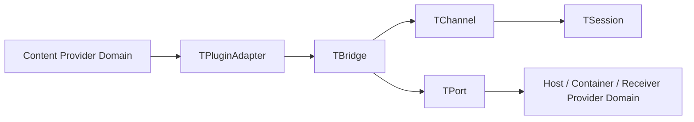
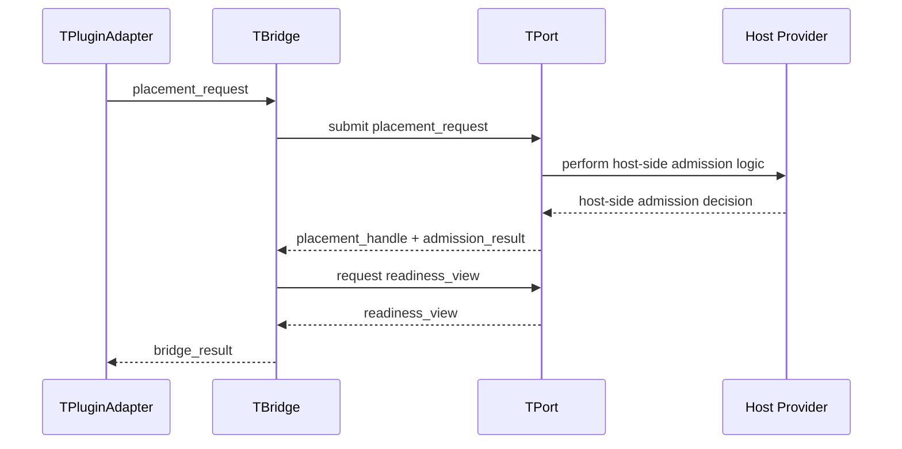

# ASCC-002 — Bridge, Channel, and Session Core Model

## 1. Document Control

| Record ID | Field | Value |
|---:|---|---|
| ASCC-002-DOC-001 | Document Title | Bridge, Channel, and Session Core Model |
| ASCC-002-DOC-002 | File Name | `ASCC-002_Bridge_Channel_Session_Core_Model.md` |
| ASCC-002-DOC-003 | Documentation Pack | ASCC — Assembler System Communication Context Documentation Pack |
| ASCC-002-DOC-004 | Formal Version | Formal Draft V1 |
| ASCC-002-DOC-005 | Project | Assembler System |
| ASCC-002-DOC-006 | Primary Language | English |
| ASCC-002-DOC-007 | Scope Level | Bridge, channel, session, participants, bindings, protocol carriers, and orchestration model |
| ASCC-002-DOC-008 | Implementation Direction | C++17, templates, traits, CRTP-compatible abstractions, static-first communication bindings |
| ASCC-002-DOC-009 | Status | Core Model Architecture Draft |
| ASCC-002-DOC-010 | Depends On | `ASCC-001_Communication_Context_Foundation.md` |
| ASCC-002-DOC-011 | Previous Document | `ASCC-001_Communication_Context_Foundation.md` |
| ASCC-002-DOC-012 | Next Candidate Document | `ASCC-003_TPort_TPluginAdapter_Contract_Model.md` |
| ASCC-002-DOC-013 | Primary Rule | Bridge orchestrates communication; it does not own endpoint internals or execute endpoint-specific validation logic |
| ASCC-002-DOC-014 | Core Model Elements | `TBridge`, `TChannel`, `TSession`, `TBinding`, `TParticipant`, `TPort`, `TPluginAdapter`, `TBridgeProtocol`, `TBridgeCarriers` |

---

## 2. Document Purpose

### 2.1 Purpose Statement

This document defines the core model of the Assembler System Communication Context.

It explains the relationship between:

1. `TBridge`,
2. `TChannel`,
3. `TSession`,
4. `TBinding`,
5. `TParticipant`,
6. `TPort`,
7. `TPluginAdapter`,
8. `TBridgeProtocol`,
9. `TBridgeCarriers`.

It answers the question:

```text
How should bridge-mediated communication be modeled without confusing
communication topology, runtime exchange, endpoint obligations, plugin
adaptation, port contracts, or bridge orchestration?
```

### 2.2 Relationship to ASCC-001

`ASCC-001` established that `communication_context/` is a root DDD implementation domain and that it owns bridge-mediated communication authority rather than endpoint internals.

This document continues that foundation by defining the internal core model of the communication domain.

Where `ASCC-001` answered:

```text
Why does Communication Context exist as an independent root domain?
```

This document answers:

```text
What are the core communication primitives, how do they relate,
and how must they not be collapsed into each other?
```

### 2.3 Non-Purpose

This document does not define:

1. final C++ class bodies,
2. final templates,
3. final CRTP bases,
4. final validation algorithms,
5. final endpoint implementation,
6. final persistence adapter implementation,
7. final telemetry adapter implementation,
8. final thin C ABI implementation,
9. network protocols,
10. web sessions,
11. WebSocket sessions,
12. HTTP request/response semantics.

The Communication Context may be implemented in C++ and may later be used near network, persistence, telemetry, ABI, or in-process boundaries, but this document does not turn the Assembler System into a web, network, or messaging platform.

---

## 3. Core Thesis

### 3.1 Core Thesis Statement

The Communication Context models interaction as bridge-mediated orchestration between content providers and host/receiver providers.

The bridge composes obligations from both sides through explicit contracts:

```text
Content Provider side
  exposes or supplies a TPluginAdapter

Bridge
  orchestrates channel/session/binding/protocol carriers

Host / Container / Receiver Provider side
  exposes or supplies a TPort
```

### 3.2 Why Bridge Is Central

The bridge is central because direct dependency between endpoint internals creates semantic confusion.

Without the bridge, the architecture risks collapsing:

1. content provider into host provider,
2. adapter into port,
3. endpoint validation into bridge behavior,
4. placement into content preparation,
5. dispatch readiness into persistence ownership,
6. channel topology into session runtime,
7. session state into protocol identity,
8. write-side communication into generic messaging.

The bridge prevents those collapses by becoming the explicit orchestration authority.

### 3.3 Bridge Authority Boundary

The bridge owns communication orchestration.

The bridge does not own endpoint internals.

The bridge asks each side for what the communication protocol requires, but each side remains responsible for its own internal details.

---

## 4. Core Vocabulary

| Record ID | Term | Category | Short Definition |
|---:|---|---|---|
| ASCC-002-VOC-001 | `TBridge` | orchestrator | Central communication orchestrator that composes one or more plugin adapters with one or more ports through explicit protocol carriers |
| ASCC-002-VOC-002 | `TChannel` | topology model | Declared communication topology between participant sets, allowed directions, and binding rules |
| ASCC-002-VOC-003 | `TSession` | runtime exchange model | Runtime exchange instance or round-like communication context created under a channel |
| ASCC-002-VOC-004 | `TBinding` | association relation | Explicit association between one plugin adapter and one or more ports, or one port and one or more plugin adapters |
| ASCC-002-VOC-005 | `TParticipant` | endpoint role descriptor | Abstract participant record describing a content-side or host-side party without exposing endpoint internals |
| ASCC-002-VOC-006 | `TPort` | host obligation surface | Abstract contract surface representing what the host/container/receiver side provides to the bridge |
| ASCC-002-VOC-007 | `TPluginAdapter` | content obligation surface | Abstract adapter surface representing what the content provider side provides to the bridge |
| ASCC-002-VOC-008 | `TBridgeProtocol` | sequence law | Ordered protocol governing how bridge carriers move between plugin adapters and ports |
| ASCC-002-VOC-009 | `TBridgeCarriers` | communication carrier set | Carrier types exchanged through the bridge, such as placement request, handle, readiness view, signals, and results |
| ASCC-002-VOC-010 | `TRegistry` | optional catalog | Optional registry of channels, participants, bindings, adapters, ports, or active sessions |

---

## 5. Conceptual Model

### 5.1 High-Level Relationship



### 5.2 Meaning

The content provider does not directly manipulate the host provider.

The host provider does not directly depend on content provider internals.

The plugin adapter represents content-side obligations.

The port represents host-side obligations.

The bridge composes the two sides through channels, sessions, bindings, and protocol carriers.

### 5.3 Core Orchestration Shape

```text
TPluginAdapter
  supplies content-side communication obligations

TBridge
  selects channel
  creates or uses session
  applies binding
  passes bridge carriers
  observes readiness/result carriers

TPort
  supplies host-side communication obligations
```

---

## 6. TBridge

### 6.1 Definition

`TBridge` is the central communication orchestrator inside the Communication Context.

It composes content-provider adapters and host-provider ports through declared channels, runtime sessions, bindings, and protocol carriers.

### 6.2 Architectural Role

`TBridge` is responsible for communication orchestration.

It may:

1. resolve a channel,
2. establish a session,
3. bind participants,
4. pass a placement request,
5. receive a placement handle,
6. observe an admission result,
7. observe load signals,
8. request next destination decisions,
9. request readiness views,
10. produce or return a bridge result.

### 6.3 What TBridge Does Not Do

`TBridge` does not:

1. validate payload internals directly,
2. inject metadata directly,
3. stabilize timestamps directly,
4. own queue slot internals,
5. mutate host/container internals directly,
6. own persistence lifecycle,
7. own telemetry SDK lifecycle,
8. own C ABI translation internals,
9. replace endpoint-specific policy logic,
10. act as a message broker.

### 6.4 Bridge Responsibilities

| Record ID | Responsibility | Description |
|---:|---|---|
| ASCC-002-BR-RESP-001 | Orchestration | Coordinates the communication path between adapter and port |
| ASCC-002-BR-RESP-002 | Composition | Composes a plugin adapter with one or more ports according to binding rules |
| ASCC-002-BR-RESP-003 | Channel Selection | Chooses or receives the declared communication topology |
| ASCC-002-BR-RESP-004 | Session Framing | Creates or references a runtime session where needed |
| ASCC-002-BR-RESP-005 | Carrier Passing | Passes protocol carriers between adapter and port |
| ASCC-002-BR-RESP-006 | Result Consolidation | Produces a bridge result from protocol outcomes |
| ASCC-002-BR-RESP-007 | Endpoint Non-Ownership | Preserves endpoint autonomy and internal responsibility |
| ASCC-002-BR-RESP-008 | Anti-Collapse Enforcement | Prevents adapter/port/session/channel role confusion |

### 6.5 Bridge Anti-Collapse Rule

```text
TBridge orchestrates.
TBridge does not become the adapter, port, content provider, host provider,
queue, registry, validator, persistence owner, telemetry exporter, or ABI layer.
```

---

## 7. TChannel

### 7.1 Definition

`TChannel` is a declared communication topology model.

It describes which participant roles may communicate, how many participants may exist on each side, what binding shape is valid, and which protocol family governs exchange.

### 7.2 Architectural Role

`TChannel` answers:

```text
What communication topology is allowed?
```

A channel may describe:

1. one-to-one communication,
2. one-to-many communication,
3. many-to-one communication,
4. many-to-many communication,
5. directed communication,
6. bidirectional negotiated communication,
7. read-side receiver integration,
8. write-side placement integration,
9. telemetry export integration,
10. persistence boundary integration,
11. thin C ABI boundary integration.

### 7.3 Channel Is Not Session

`TChannel` is not the runtime exchange instance.

It is a declared topology or communication lane.

`TSession` is the runtime exchange context created under a channel.

### 7.4 Channel Record Model

| Record ID | Field | Meaning |
|---:|---|---|
| ASCC-002-CH-MODEL-001 | Channel ID | Stable identifier for the channel |
| ASCC-002-CH-MODEL-002 | Channel Kind | one_to_one, one_to_many, many_to_one, many_to_many |
| ASCC-002-CH-MODEL-003 | Direction | content_to_host, host_to_content, bidirectional, observer |
| ASCC-002-CH-MODEL-004 | Adapter Role Set | Allowed plugin adapter roles |
| ASCC-002-CH-MODEL-005 | Port Role Set | Allowed port roles |
| ASCC-002-CH-MODEL-006 | Binding Rules | Rules for connecting adapters and ports |
| ASCC-002-CH-MODEL-007 | Protocol Family | Bridge protocol family used by the channel |
| ASCC-002-CH-MODEL-008 | Session Policy | Whether sessions are ephemeral, round-scoped, long-lived, or disabled |
| ASCC-002-CH-MODEL-009 | Multiplicity | Participant count constraints |
| ASCC-002-CH-MODEL-010 | Ownership Boundary | Endpoint non-ownership statement |

### 7.5 Channel Multiplicity

| Record ID | Channel Kind | Meaning |
|---:|---|---|
| ASCC-002-CH-KIND-001 | one_to_one | One adapter binds to one port |
| ASCC-002-CH-KIND-002 | one_to_many | One adapter may bind to multiple ports |
| ASCC-002-CH-KIND-003 | many_to_one | Multiple adapters may bind to one port |
| ASCC-002-CH-KIND-004 | many_to_many | Multiple adapters may bind to multiple ports through declared rules |

### 7.6 Channel Anti-Collapse Rule

```text
TChannel defines communication topology.
It must not be treated as runtime state, endpoint implementation, protocol
payload, session object, queue container, or bridge result.
```

---

## 8. TSession

### 8.1 Definition

`TSession` is a runtime communication exchange context created or referenced under a channel.

It frames the current communication exchange, round, correlation, lifecycle, and temporary state needed by the bridge protocol.

### 8.2 Architectural Role

`TSession` answers:

```text
What runtime exchange is currently active under this channel?
```

In Assembler System terms, `TSession` is closer to a controlled round/exchange context than a web session.

It may represent:

1. one placement attempt,
2. one feeding round,
3. one delivery round,
4. one bridge-mediated registration exchange,
5. one telemetry export exchange,
6. one read-side receiver integration exchange,
7. one ABI boundary exchange.

### 8.3 Session Is Not Web Protocol

`TSession` is not inherently:

1. HTTP session,
2. WebSocket session,
3. request/response session,
4. user login session,
5. browser state,
6. network connection.

Those may be implementation contexts in other systems, but they are not the meaning of `TSession` in this architecture.

### 8.4 Session Record Model

| Record ID | Field | Meaning |
|---:|---|---|
| ASCC-002-SE-MODEL-001 | Session ID | Stable runtime or logical correlation identifier |
| ASCC-002-SE-MODEL-002 | Channel ID | Channel under which the session exists |
| ASCC-002-SE-MODEL-003 | Binding ID | Binding used by the session |
| ASCC-002-SE-MODEL-004 | Correlation ID | Cross-carrier correlation value |
| ASCC-002-SE-MODEL-005 | Session Kind | ephemeral, round_scoped, long_lived, diagnostic |
| ASCC-002-SE-MODEL-006 | State View | Session-visible state, not endpoint-private state |
| ASCC-002-SE-MODEL-007 | Active Carriers | Carrier instances in the exchange |
| ASCC-002-SE-MODEL-008 | Result State | incomplete, accepted, rejected, failed, completed |
| ASCC-002-SE-MODEL-009 | Lifetime Rule | When the session begins and ends |
| ASCC-002-SE-MODEL-010 | Endpoint Boundary | What endpoint internals remain hidden |

### 8.5 Session Anti-Collapse Rule

```text
TSession is runtime exchange framing.
It must not be confused with channel topology, bridge identity, endpoint
lifecycle, web session, queue lifetime, or downstream persistence lifetime.
```

---

## 9. TBinding

### 9.1 Definition

`TBinding` is an explicit association relation between content-side adapters and host-side ports under a declared channel.

### 9.2 Architectural Role

`TBinding` answers:

```text
Which adapter is allowed to communicate with which port or ports,
under which channel and protocol family?
```

A binding may be:

1. static,
2. dynamic,
3. configured,
4. discovered,
5. registry-backed,
6. test-only,
7. extension-provided.

### 9.3 Binding Shapes

```text
one adapter -> one port
one adapter -> many ports
many adapters -> one port
many adapters -> many ports
```

### 9.4 Binding Record Model

| Record ID | Field | Meaning |
|---:|---|---|
| ASCC-002-BIND-MODEL-001 | Binding ID | Stable binding identifier |
| ASCC-002-BIND-MODEL-002 | Channel ID | Channel that owns the binding topology |
| ASCC-002-BIND-MODEL-003 | Adapter IDs | Content-side plugin adapters participating in the binding |
| ASCC-002-BIND-MODEL-004 | Port IDs | Host-side ports participating in the binding |
| ASCC-002-BIND-MODEL-005 | Binding Kind | one_to_one, one_to_many, many_to_one, many_to_many |
| ASCC-002-BIND-MODEL-006 | Selection Policy | How the bridge chooses among available endpoints |
| ASCC-002-BIND-MODEL-007 | Activation State | inactive, active, degraded, disabled |
| ASCC-002-BIND-MODEL-008 | Compatibility Rules | Required protocol and carrier compatibility |
| ASCC-002-BIND-MODEL-009 | Validation Authority | Who validates endpoint-specific compatibility |
| ASCC-002-BIND-MODEL-010 | Non-Ownership Rule | Binding does not own endpoint internals |

### 9.5 Binding Anti-Collapse Rule

```text
TBinding declares an allowed association.
It is not the communication exchange itself, not a session, not a port,
not an adapter, and not endpoint implementation.
```

---

## 10. TParticipant

### 10.1 Definition

`TParticipant` is a participant descriptor used by the Communication Context to represent a party in bridge-mediated communication without exposing that party’s internals.

### 10.2 Participant Kinds

| Record ID | Participant Kind | Meaning |
|---:|---|---|
| ASCC-002-PART-001 | content_provider | Provides content-side material or prepared communication material |
| ASCC-002-PART-002 | host_provider | Provides host/container/receiver-side capability |
| ASCC-002-PART-003 | receiver_provider | Receives read-side, telemetry, persistence, ABI, or diagnostic output |
| ASCC-002-PART-004 | observer | Observes signals without owning communication |
| ASCC-002-PART-005 | registry | Catalogs available bindings, adapters, ports, or channels when used |

### 10.3 Participant Anti-Collapse Rule

```text
TParticipant is a descriptor of a communication role.
It must not expose endpoint internals or become the endpoint implementation.
```

---

## 11. TPort

### 11.1 Definition

`TPort` is the host-side obligation surface exposed to the bridge.

It represents what the host/container/receiver provider promises to make available so the bridge can complete communication orchestration.

### 11.2 What TPort May Provide

A concrete port may provide operations or views corresponding to:

1. accepting a placement request,
2. producing a placement handle,
3. returning an admission result,
4. exposing load signal,
5. selecting next destination,
6. exposing readiness view,
7. returning bridge-compatible result material.

### 11.3 Port Owns Host-Side Contract, Not Bridge

`TPort` is not the bridge.

`TPort` is the host-side contract surface that the bridge uses.

The bridge composes ports with plugin adapters; it does not become the host provider.

### 11.4 Port Anti-Collapse Rule

```text
TPort represents host-side obligations.
It must not be confused with TBridge, TPluginAdapter, channel topology,
session state, endpoint internals, or downstream persistence ownership.
```

---

## 12. TPluginAdapter

### 12.1 Definition

`TPluginAdapter` is the content-side adapter surface exposed to the bridge.

It represents what the content provider promises to make available so the bridge can communicate with host-side ports without depending on content provider internals.

### 12.2 What TPluginAdapter May Provide

A concrete plugin adapter may provide operations or views corresponding to:

1. creating a placement request,
2. preparing bridge-carrier material,
3. interpreting placement handles,
4. reacting to admission results,
5. reacting to load signals,
6. requesting a next destination,
7. reading readiness views,
8. receiving or mapping bridge results.

### 12.3 Adapter Owns Content-Side Contract, Not Bridge

`TPluginAdapter` is not the bridge.

It is not the port.

It does not own host placement internals.

It does not own queue/container internals.

It represents content-side obligations in a form the bridge can compose.

### 12.4 Plugin Adapter Anti-Collapse Rule

```text
TPluginAdapter represents content-side obligations.
It must not be confused with TBridge, TPort, host provider, channel topology,
session state, validation internals, or queue internals.
```

---

## 13. TBridgeProtocol

### 13.1 Definition

`TBridgeProtocol` is the ordered communication sequence governing how the bridge moves carriers between plugin adapters and ports.

### 13.2 Core Protocol Shape

A typical bridge protocol may follow this abstract sequence:

```text
1. Adapter prepares or exposes placement_request
2. Bridge submits placement_request to Port
3. Port returns placement_handle
4. Port or Bridge obtains admission_result
5. Bridge observes load_signal if needed
6. Bridge requests next_destination if needed
7. Bridge obtains readiness_view if needed
8. Bridge returns bridge_result to Adapter or caller
```

### 13.3 Protocol Is Not Endpoint Implementation

The protocol defines communication order.

It does not decide endpoint internals.

Validation details remain inside the adapter or port according to their concrete contract.

### 13.4 Protocol Anti-Collapse Rule

```text
TBridgeProtocol defines communication sequence.
It is not a runtime algorithm implementation, not endpoint validation,
not queue implementation, and not downstream delivery implementation.
```

---

## 14. TBridgeCarriers

### 14.1 Definition

`TBridgeCarriers` are the communication carrier types exchanged through the bridge.

They are the abstract carrier vocabulary needed by bridges, ports, and plugin adapters.

### 14.2 Core Carrier Set

| Record ID | Carrier | Direction | Meaning |
|---:|---|---|---|
| ASCC-002-CAR-001 | `placement_request` | adapter → bridge → port | Request to place or route material into a host-side context |
| ASCC-002-CAR-002 | `placement_handle` | port → bridge → adapter | Handle identifying accepted or provisional placement context |
| ASCC-002-CAR-003 | `admission_result` | port → bridge → adapter | Result of admission attempt |
| ASCC-002-CAR-004 | `load_signal` | port → bridge → adapter | Host-side load or pressure signal |
| ASCC-002-CAR-005 | `next_destination_request` | adapter/bridge → port | Request for next routing or destination decision |
| ASCC-002-CAR-006 | `readiness_view` | port → bridge → adapter | View of host readiness or eligibility |
| ASCC-002-CAR-007 | `bridge_result` | bridge → adapter/caller | Consolidated communication outcome |
| ASCC-002-CAR-008 | `correlation_token` | any | Token linking protocol carriers in one session |
| ASCC-002-CAR-009 | `binding_view` | bridge/registry → participants | Read-only view of binding state |
| ASCC-002-CAR-010 | `session_view` | bridge → participants | Read-only view of session state |

### 14.3 Carrier Ownership

Bridge carriers are owned by the Communication Context as protocol vocabulary.

Concrete interpretation may belong to the adapter or port.

For example:

1. `placement_request` is bridge-visible but may be constructed from content-provider semantics.
2. `admission_result` is bridge-visible but may be produced by host-side logic.
3. `readiness_view` is bridge-visible but does not expose all host internals.

### 14.4 Carrier Anti-Collapse Rule

```text
Bridge carriers are communication artifacts.
They are not endpoint internals, not actors, not sessions, not channels,
and not downstream records.
```

---

## 15. Channel / Session Distinction

### 15.1 Distinction Table

| Record ID | Concept | Stable Meaning | Example Question |
|---:|---|---|---|
| ASCC-002-DIST-001 | `TChannel` | Topology / declared lane | Who may communicate with whom? |
| ASCC-002-DIST-002 | `TSession` | Runtime exchange / round context | What exchange is active now? |
| ASCC-002-DIST-003 | `TBinding` | Allowed association | Which adapter is attached to which port? |
| ASCC-002-DIST-004 | `TBridgeProtocol` | Ordered sequence | What carrier order governs the exchange? |
| ASCC-002-DIST-005 | `TBridgeCarriers` | Exchanged artifacts | What is being passed between parties? |

### 15.2 Practical Interpretation

A channel can exist before a session.

A binding can be configured before a session.

A session occurs under a channel and uses a binding.

Protocol carriers move during a session.

The bridge orchestrates the whole exchange.

### 15.3 Example

```text
Channel:
  log_level_api_to_write_side_placement

Binding:
  log_level_envelope_adapter -> write_side_placement_port

Session:
  placement_round_2026_04_27_0001

Protocol carriers:
  placement_request
  placement_handle
  admission_result
  readiness_view
  bridge_result
```

---

## 16. Multiplicity Model

### 16.1 Why Multiplicity Exists

The current implementation path may begin with one writer and one dedicated pipeline.

However, the core Communication Context must not hard-code only one-to-one interaction.

The bridge model must allow future expansion toward:

1. one content provider to multiple ports,
2. multiple content providers to one receiver,
3. multiple adapters to multiple receivers,
4. read-side receivers,
5. in-process receivers,
6. persistence ports,
7. OpenTelemetry ports,
8. thin C ABI ports.

### 16.2 Multiplicity Rules

| Record ID | Rule | Meaning |
|---:|---|---|
| ASCC-002-MULT-001 | Multiplicity is channel-governed | The channel declares whether one-to-one or one-to-many is allowed |
| ASCC-002-MULT-002 | Binding must be explicit | Multiplicity must not be implicit or hidden |
| ASCC-002-MULT-003 | Bridge composes, not owns | Bridge coordinates multiple endpoints without owning internals |
| ASCC-002-MULT-004 | Sessions remain bounded | A session must define which binding and participant set it uses |
| ASCC-002-MULT-005 | Hot-path restrictions may narrow multiplicity | Concrete high-performance contexts may restrict multiplicity |
| ASCC-002-MULT-006 | Future extension must preserve current one-writer validity | Scalability must not invalidate the current valid dedicated writer pipeline |

---

## 17. Core Flow: Placement Example

### 17.1 Flow Diagram



### 17.2 Flow Meaning

The bridge controls the communication sequence.

The adapter prepares content-side request material.

The port performs or delegates host-side admission logic.

The host provider remains hidden behind the port.

The bridge result summarizes the communication outcome without absorbing endpoint internals.

---

## 18. Read-Side Extension Model

### 18.1 Future Read-Side Interpretation

The read-side may later act as a content provider.

In that case:

```text
Read Side
  supplies TPluginAdapter

Communication Context
  hosts TBridge / TChannel / TSession

Receivers
  expose TPort
```

Receivers may include:

1. in-process receivers,
2. persistence ports,
3. OpenTelemetry ports,
4. thin C ABI ports,
5. diagnostic ports,
6. projection ports.

### 18.2 Read-Side Boundary Rule

The read-side extension must not modify the meaning of the core bridge model.

It must instantiate the same bridge/channel/session abstractions with read-side-specific participants and carriers.

### 18.3 Read-Side Anti-Collapse Rule

```text
Read-side integration may use the Communication Context.
It must not redefine bridge, channel, session, port, adapter, or carrier
semantics.
```

---

## 19. Hot Path and Cold Path Considerations

### 19.1 Principle

The Communication Context defines the architectural model.

Concrete adapters and ports may decide whether their internal implementation belongs to:

1. hot path,
2. warm path,
3. cold path,
4. diagnostic path,
5. test path.

### 19.2 Bridge Constraint

The bridge should not force heavy validation, reflection, allocation, or registry lookup into a hot path unless explicitly accepted by a concrete performance contract.

### 19.3 Adapter and Port Autonomy

Adapters and ports decide internal optimizations within their contracts.

The bridge observes contract-level carriers and results.

It does not dictate internal implementation steps.

---

## 20. Abstract C++ Shape

### 20.1 Direction

The future C++ representation should be template-compatible and CRTP-compatible, but this document does not freeze final code.

The following pseudo-shape is illustrative only.

### 20.2 Pseudo-Code: Core Concepts

```cpp
template <typename CarrierSetT, typename ProtocolT>
struct TBridgeProtocolContext;

template <typename DerivedT, typename CarrierSetT>
struct TPluginAdapter {
    // content-side obligation surface
};

template <typename DerivedT, typename CarrierSetT>
struct TPort {
    // host-side obligation surface
};

template <typename AdapterT, typename PortT, typename ChannelT>
struct TBinding {
    // association relation; not endpoint implementation
};

template <typename BindingT, typename CarrierSetT>
struct TSession {
    // runtime exchange framing
};

template <typename ChannelT, typename ProtocolT>
struct TBridge {
    // orchestrates protocol carriers between adapters and ports
};
```

### 20.3 Pseudo-Code: Carrier Vocabulary

```cpp
struct placement_request;
struct placement_handle;
struct admission_result;
struct load_signal;
struct next_destination_request;
struct readiness_view;
struct bridge_result;
struct correlation_token;
```

### 20.4 Pseudo-Code Rule

The pseudo-code expresses architectural direction only.

It must not be treated as final class hierarchy, final template signature, final namespace structure, or final include graph.

---

## 21. Folder Implications

### 21.1 Root Domain Placement

The updated root implementation baseline becomes:

```text
include/
└── assembler/
    ├── ecosystem_governance/
    ├── log_level_api/
    ├── communication_context/
    └── write_side/
```

### 21.2 Candidate Communication Context Folder Shape

```text
communication_context/
├── docs/
├── tests/
├── bridge/
│   ├── docs/
│   ├── tests/
│   ├── carriers/
│   ├── state/
│   └── detail/
├── channel/
│   ├── docs/
│   ├── tests/
│   ├── views/
│   └── detail/
├── session/
│   ├── docs/
│   ├── tests/
│   ├── views/
│   ├── handles/
│   └── detail/
├── binding/
│   ├── docs/
│   ├── tests/
│   ├── views/
│   └── detail/
├── participants/
│   ├── docs/
│   ├── tests/
│   └── views/
├── ports/
│   ├── docs/
│   ├── tests/
│   └── detail/
├── plugin_adapters/
│   ├── docs/
│   ├── tests/
│   └── detail/
├── protocols/
│   ├── docs/
│   ├── tests/
│   └── detail/
└── registry/
    ├── docs/
    ├── tests/
    ├── views/
    └── detail/
```

### 21.3 Folder Implication Rule

This folder shape is a candidate.

It does not freeze final files.

It establishes that `communication_context/` owns bridge-mediated communication primitives independently from `log_level_api/` and `write_side/`.

---

## 22. Anti-Collapse Index

| Rule ID | Protected Term | Must Not Collapse Into | Severity |
|---:|---|---|---|
| ASCC-002-AC-001 | `TBridge` | `TPort` | Critical |
| ASCC-002-AC-002 | `TBridge` | `TPluginAdapter` | Critical |
| ASCC-002-AC-003 | `TBridge` | endpoint validation internals | Critical |
| ASCC-002-AC-004 | `TChannel` | `TSession` | High |
| ASCC-002-AC-005 | `TSession` | web session | High |
| ASCC-002-AC-006 | `TBinding` | endpoint implementation | High |
| ASCC-002-AC-007 | `TPort` | host provider internals | Critical |
| ASCC-002-AC-008 | `TPluginAdapter` | content provider internals | Critical |
| ASCC-002-AC-009 | `TBridgeProtocol` | runtime algorithm implementation | Medium |
| ASCC-002-AC-010 | `TBridgeCarriers` | endpoint private state | High |
| ASCC-002-AC-011 | `communication_context/` | `utils/` or `common/` | Critical |
| ASCC-002-AC-012 | read-side extension | redefinition of bridge semantics | Critical |

---

## 23. Validation Questions

### 23.1 Bridge Validation

1. Does the bridge orchestrate rather than execute endpoint-specific internals?
2. Does the bridge use carriers rather than direct endpoint state?
3. Does the bridge return a result without owning downstream lifecycle?
4. Does the bridge preserve both adapter and port autonomy?

### 23.2 Channel Validation

1. Does the channel define topology rather than runtime exchange?
2. Is multiplicity explicit?
3. Are allowed participant roles declared?
4. Is the protocol family visible?

### 23.3 Session Validation

1. Does the session belong under a channel?
2. Is the session a runtime exchange context?
3. Is it free from web/session/network assumptions?
4. Does it avoid owning endpoint lifecycle?

### 23.4 Binding Validation

1. Are adapter and port associations explicit?
2. Is the binding shape known?
3. Are compatibility rules declared?
4. Does binding avoid owning endpoint internals?

### 23.5 Port and Adapter Validation

1. Does the port express host-side obligations only?
2. Does the adapter express content-side obligations only?
3. Are internal validation details left to concrete endpoint contexts?
4. Is the bridge using only declared contract surfaces?

---

## 24. Implementation Readiness Notes

### 24.1 Ready for Next Derivation

This document makes the following items ready for deeper derivation:

1. `TPort` contract model,
2. `TPluginAdapter` contract model,
3. bridge carrier schema,
4. channel registry model,
5. session state model,
6. binding compatibility model,
7. bridge protocol family model,
8. communication-context folder and file inventory updates.

### 24.2 Not Yet Ready

The following remain intentionally deferred:

1. final C++ signatures,
2. final CRTP base classes,
3. final template constraints,
4. final channel registry implementation,
5. final bridge runtime algorithm,
6. final hot-path memory policy,
7. final persistence integration,
8. final telemetry integration,
9. final thin C ABI integration.

---

## 25. Summary

`ASCC-002` establishes the core bridge/channel/session model for the Communication Context.

The key conclusions are:

1. `TBridge` is the central orchestrator.
2. `TChannel` defines topology.
3. `TSession` frames runtime exchange.
4. `TBinding` declares allowed adapter-port association.
5. `TPort` represents host-side obligations.
6. `TPluginAdapter` represents content-side obligations.
7. `TBridgeProtocol` defines communication sequence.
8. `TBridgeCarriers` define bridge-visible carrier vocabulary.
9. Multiplicity is channel-governed.
10. Endpoint internals remain behind ports and adapters.
11. The bridge composes obligations; it does not perform endpoint-specific validation.
12. The model supports write-side now and read-side, telemetry, persistence, and thin C ABI extensions later.

The next document should define:

```text
ASCC-003_TPort_TPluginAdapter_Contract_Model.md
```

That document should formalize the abstract obligations of `TPort` and `TPluginAdapter`, including how concrete ports and adapters map bridge carriers to endpoint-specific behavior without leaking endpoint internals into the bridge.
