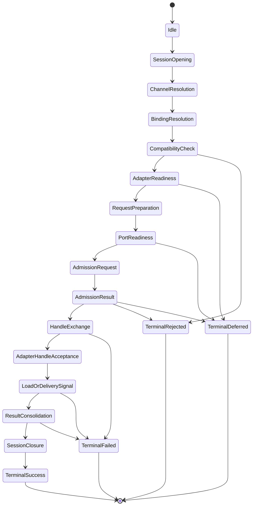
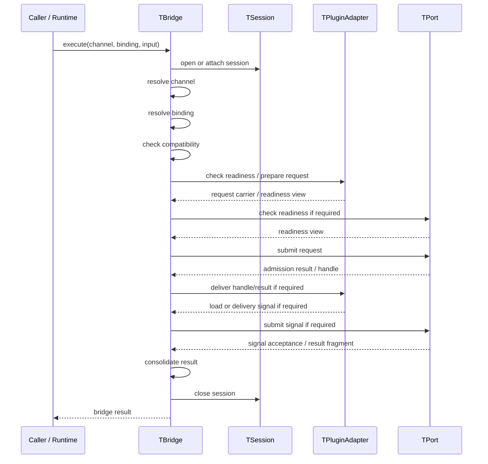
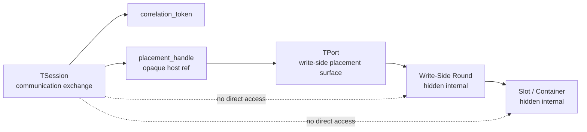

# ASCC-004 — Bridge Protocol and State Model

## 1. Document Control

| Record ID | Field | Value |
|---:|---|---|
| ASCC-004-DOC-001 | Document Title | Bridge Protocol and State Model |
| ASCC-004-DOC-002 | File Name | `ASCC-004_Bridge_Protocol_And_State_Model.md` |
| ASCC-004-DOC-003 | Documentation Pack | ASCC — Assembler System Communication Context Documentation Pack |
| ASCC-004-DOC-004 | Formal Version | Formal Draft V1 |
| ASCC-004-DOC-005 | Project | Assembler System |
| ASCC-004-DOC-006 | Primary Language | English |
| ASCC-004-DOC-007 | Scope Level | Bridge protocol stages, protocol state, bridge carriers, state transitions, session correlation, bridge-result lifecycle |
| ASCC-004-DOC-008 | Implementation Direction | C++17, templates, traits, CRTP-compatible abstractions, static-first communication bindings |
| ASCC-004-DOC-009 | Status | Protocol and State Architecture Draft |
| ASCC-004-DOC-010 | Depends On | `ASCC-001_Communication_Context_Foundation.md`, `ASCC-002_Bridge_Channel_Session_Core_Model.md`, `ASCC-003_TPort_TPluginAdapter_Contract_Model.md` |
| ASCC-004-DOC-011 | Previous Document | `ASCC-003_TPort_TPluginAdapter_Contract_Model.md` |
| ASCC-004-DOC-012 | Next Candidate Document | `ASCC-005_External_Relationships_And_Extension_Model.md` |
| ASCC-004-DOC-013 | Primary Rule | Bridge protocol state is communication state, not endpoint domain state |
| ASCC-004-DOC-014 | Carrier Rule | Bridge carriers are protocol artifacts, not endpoint-private state |
| ASCC-004-DOC-015 | Protocol Rule | Bridge protocol sequences obligations; it does not implement endpoint validation, host placement, persistence, telemetry, or ABI internals |

---

## 2. Purpose

### 2.1 Purpose Statement

This document defines the bridge protocol and protocol-state model for the Assembler System Communication Context.

It answers the question:

```text
How does a bridge execute a communication protocol across a plugin adapter,
a port, a channel, and a session using bridge-visible carriers without owning
endpoint internals or domain-specific runtime state?
```

### 2.2 Why This Document Includes Carriers

The originally proposed title for this document was:

```text
ASCC-004_Bridge_Carrier_Protocol_Model.md
```

The final selected title is:

```text
ASCC-004_Bridge_Protocol_And_State_Model.md
```

This document still includes carrier modeling because protocol and state cannot be defined without carriers.

Protocol defines the ordered movement and interpretation of carriers.

State records where the protocol currently is.

Carriers are the bridge-visible artifacts that move between `TPluginAdapter`, `TBridge`, and `TPort`.

Therefore, this document treats carriers as part of protocol/state modeling rather than as a separate documentation track.

### 2.3 Relationship to Earlier Documents

`ASCC-001` established `communication_context/` as a root DDD implementation domain and defined the Communication Context as orchestration-only.

`ASCC-002` defined the core model:

1. `TBridge`,
2. `TChannel`,
3. `TSession`,
4. `TBinding`,
5. `TParticipant`,
6. `TPort`,
7. `TPluginAdapter`,
8. `TBridgeProtocol`,
9. `TBridgeCarriers`.

`ASCC-003` defined the contract model for `TPort` and `TPluginAdapter`.

This document now defines:

1. protocol stages,
2. protocol carriers,
3. protocol state,
4. transition rules,
5. result lifecycle,
6. failure lifecycle,
7. session correlation,
8. write-side round correlation boundaries.

### 2.4 Non-Purpose

This document does not define:

1. final C++ code,
2. final class bodies,
3. final function signatures,
4. final namespace tree,
5. final include graph,
6. final memory model,
7. final lock/concurrency strategy,
8. endpoint validation algorithms,
9. host placement algorithms,
10. write-side round implementation,
11. persistence implementation,
12. telemetry exporter implementation,
13. thin C ABI implementation,
14. network protocol behavior,
15. web session behavior,
16. message broker behavior.

---

## 3. Core Thesis

### 3.1 Protocol Thesis

A bridge protocol is the ordered communication law executed by `TBridge` over a `TSession` under a `TChannel`.

It uses `TBridgeCarriers` to communicate with `TPluginAdapter` and `TPort`.

It does not own endpoint internals.

```text
TBridgeProtocol = ordered communication sequence
TBridgeState    = current protocol position and outcome frame
TBridgeCarriers = bridge-visible artifacts moving through the protocol
```

### 3.2 State Thesis

Bridge state is not domain state.

Bridge state only records communication progress, such as:

1. session opened,
2. channel resolved,
3. binding validated,
4. request prepared,
5. port admission requested,
6. handle produced,
7. signal observed,
8. result produced,
9. session closed.

Bridge state must not record or mutate:

1. content provider private state,
2. validator private state,
3. metadata injector private state,
4. timestamp stabilizer private state,
5. slot private state,
6. slots-container private state,
7. waiting-list private state,
8. round-manager private state,
9. dispatcher private state,
10. persistence storage state,
11. telemetry SDK state,
12. ABI translation state.

### 3.3 Carrier Thesis

Bridge carriers are the protocol-visible nouns of communication.

They are not endpoint-private data structures.

They are not database records.

They are not full payload lifecycle owners.

They are not message-broker messages.

They are contract-governed artifacts used by bridge, port, adapter, channel, and session.

---

## 4. Protocol Ownership

### 4.1 Ownership Table

| Record ID | Element | Owner | Meaning |
|---:|---|---|---|
| ASCC-004-OWN-001 | Protocol Family | Communication Context | Defines the ordered communication pattern |
| ASCC-004-OWN-002 | Protocol State | Communication Context | Tracks where a bridge execution currently is |
| ASCC-004-OWN-003 | Protocol Carriers | Communication Context | Defines the carrier vocabulary |
| ASCC-004-OWN-004 | Adapter-Side Interpretation | Concrete `TPluginAdapter` | Interprets carriers according to content-side semantics |
| ASCC-004-OWN-005 | Port-Side Interpretation | Concrete `TPort` | Interprets carriers according to host-side semantics |
| ASCC-004-OWN-006 | Endpoint Validation | Concrete endpoint side | May be performed internally by adapter or port |
| ASCC-004-OWN-007 | Endpoint State Mutation | Concrete endpoint side | May be performed internally behind adapter or port |
| ASCC-004-OWN-008 | Bridge Result | Communication Context | Summarizes communication outcome |

### 4.2 Ownership Rule

```text
Communication Context owns protocol, state, and carriers.

Concrete adapters and ports own endpoint-specific interpretation and internal
procedures required to satisfy their obligations.
```

---

## 5. Protocol Scope

### 5.1 What a Protocol May Govern

A bridge protocol may govern:

1. which carrier is requested first,
2. which participant must respond,
3. whether channel compatibility must be checked,
4. whether session must be opened,
5. whether binding must be validated,
6. whether readiness must be checked,
7. whether admission must occur,
8. whether handle exchange is required,
9. whether load signal is required,
10. whether next destination may be requested,
11. whether result consolidation is needed,
12. whether the session closes on success or failure.

### 5.2 What a Protocol Must Not Govern

A bridge protocol must not govern:

1. how payload validation is internally performed,
2. how metadata is injected,
3. how timestamps are stabilized,
4. how a slot is selected internally,
5. how a slots container is reinitialized,
6. how a round manager rotates queues,
7. how a database persists records,
8. how OpenTelemetry exports spans,
9. how a thin C ABI marshals memory,
10. how a receiver consumes business data.

### 5.3 Protocol Boundary Rule

```text
Protocol governs carrier order and bridge-visible exchange.
Protocol must not become endpoint implementation logic.
```

---

## 6. Bridge Carrier Families

### 6.1 Carrier Family Table

| Record ID | Carrier Family | Description |
|---:|---|---|
| ASCC-004-CAR-FAM-001 | Request Carriers | Describe what the adapter or bridge asks from the port |
| ASCC-004-CAR-FAM-002 | Handle Carriers | Carry safe, opaque references returned by a port |
| ASCC-004-CAR-FAM-003 | Admission Carriers | Represent acceptance, rejection, deferral, or failure |
| ASCC-004-CAR-FAM-004 | Readiness Carriers | Expose readiness without leaking private state |
| ASCC-004-CAR-FAM-005 | Signal Carriers | Represent load, pressure, completion, failure, or availability signals |
| ASCC-004-CAR-FAM-006 | Destination Carriers | Represent request or response around next-destination decisions |
| ASCC-004-CAR-FAM-007 | Result Carriers | Represent bridge-level outcome |
| ASCC-004-CAR-FAM-008 | Error Carriers | Represent bridge-visible error categories |
| ASCC-004-CAR-FAM-009 | Correlation Carriers | Carry identity, tracing, and correlation tokens |
| ASCC-004-CAR-FAM-010 | View Carriers | Expose read-only views of state, binding, session, or readiness |

### 6.2 Carrier Requiredness

Not every bridge protocol requires every carrier.

A specific protocol must declare its required carrier set.

| Record ID | Protocol Type | Likely Required Carriers |
|---:|---|---|
| ASCC-004-CAR-REQ-001 | Envelope Placement | request, handle, admission result, readiness view, signal, result, correlation |
| ASCC-004-CAR-REQ-002 | Registry Delivery | request, admission result, signal, result, error, correlation |
| ASCC-004-CAR-REQ-003 | Receiver Delivery | request, admission result, readiness view, result, correlation |
| ASCC-004-CAR-REQ-004 | Persistence Delivery | request, admission result, result, error, correlation |
| ASCC-004-CAR-REQ-005 | Telemetry Export | request, signal, result, error, correlation |
| ASCC-004-CAR-REQ-006 | Thin C ABI Boundary | request, admission result, result, error, correlation |

### 6.3 Carrier Non-Ownership Rule

```text
A carrier is not the full endpoint object.

A carrier is the bridge-visible communication artifact derived from,
or interpreted by, endpoint objects through adapter/port obligations.
```

---

## 7. Core Carrier Definitions

### 7.1 `request`

| Record ID | Field | Meaning |
|---:|---|---|
| ASCC-004-CAR-REQ-MODEL-001 | Purpose | Begins or advances a bridge-visible operation |
| ASCC-004-CAR-REQ-MODEL-002 | Typical Producer | `TPluginAdapter` or `TBridge` |
| ASCC-004-CAR-REQ-MODEL-003 | Typical Consumer | `TPort` |
| ASCC-004-CAR-REQ-MODEL-004 | Must Include | correlation token, protocol family, operation kind |
| ASCC-004-CAR-REQ-MODEL-005 | Must Not Include | endpoint-private mutable internals |
| ASCC-004-CAR-REQ-MODEL-006 | Example | placement request, delivery request, export request, ABI boundary request |

### 7.2 `handle`

| Record ID | Field | Meaning |
|---:|---|---|
| ASCC-004-CAR-HND-MODEL-001 | Purpose | Represents safe host-side reference or granted placement |
| ASCC-004-CAR-HND-MODEL-002 | Typical Producer | `TPort` |
| ASCC-004-CAR-HND-MODEL-003 | Typical Consumer | `TBridge`, `TPluginAdapter` |
| ASCC-004-CAR-HND-MODEL-004 | Must Include | opaque reference, correlation token, validity information |
| ASCC-004-CAR-HND-MODEL-005 | Must Not Include | direct pointer to host internals unless explicitly wrapped and safe |
| ASCC-004-CAR-HND-MODEL-006 | Example | placement handle, receiver handle, export handle |

### 7.3 `admission_result`

| Record ID | Field | Meaning |
|---:|---|---|
| ASCC-004-CAR-ADM-MODEL-001 | Purpose | Communicates host-side acceptance, rejection, deferral, or failure |
| ASCC-004-CAR-ADM-MODEL-002 | Typical Producer | `TPort` |
| ASCC-004-CAR-ADM-MODEL-003 | Typical Consumer | `TBridge`, `TPluginAdapter` |
| ASCC-004-CAR-ADM-MODEL-004 | Must Include | result category and correlation token |
| ASCC-004-CAR-ADM-MODEL-005 | Must Not Include | private admission algorithm details |
| ASCC-004-CAR-ADM-MODEL-006 | Example | accepted, rejected, deferred, not_ready, capacity_limited |

### 7.4 `readiness_view`

| Record ID | Field | Meaning |
|---:|---|---|
| ASCC-004-CAR-RDY-MODEL-001 | Purpose | Exposes host or adapter readiness without leaking private state |
| ASCC-004-CAR-RDY-MODEL-002 | Typical Producer | `TPort`, `TPluginAdapter`, or `TBridge` |
| ASCC-004-CAR-RDY-MODEL-003 | Typical Consumer | `TBridge`, opposite participant side |
| ASCC-004-CAR-RDY-MODEL-004 | Must Include | readiness category and optional constraint reason |
| ASCC-004-CAR-RDY-MODEL-005 | Must Not Include | mutable private state |
| ASCC-004-CAR-RDY-MODEL-006 | Example | ready, not_ready, degraded, saturated, unavailable |

### 7.5 `signal`

| Record ID | Field | Meaning |
|---:|---|---|
| ASCC-004-CAR-SIG-MODEL-001 | Purpose | Reports event-like protocol information |
| ASCC-004-CAR-SIG-MODEL-002 | Typical Producer | `TPort`, `TPluginAdapter`, or `TBridge` |
| ASCC-004-CAR-SIG-MODEL-003 | Typical Consumer | `TBridge`, opposite participant side |
| ASCC-004-CAR-SIG-MODEL-004 | Must Include | signal kind, correlation token, bridge-visible status |
| ASCC-004-CAR-SIG-MODEL-005 | Must Not Include | endpoint-private event bus internals |
| ASCC-004-CAR-SIG-MODEL-006 | Example | load_completed, load_failed, pressure_high, destination_changed |

### 7.6 `next_destination_request`

| Record ID | Field | Meaning |
|---:|---|---|
| ASCC-004-CAR-ND-MODEL-001 | Purpose | Requests the next bridge-visible destination or placement hint |
| ASCC-004-CAR-ND-MODEL-002 | Typical Producer | `TBridge` or `TPluginAdapter` |
| ASCC-004-CAR-ND-MODEL-003 | Typical Consumer | `TPort` |
| ASCC-004-CAR-ND-MODEL-004 | Must Include | correlation token, current handle, requested destination class |
| ASCC-004-CAR-ND-MODEL-005 | Must Not Include | direct mutation request into host internals |
| ASCC-004-CAR-ND-MODEL-006 | Example | next slot/container hint request, next receiver request |

### 7.7 `bridge_result`

| Record ID | Field | Meaning |
|---:|---|---|
| ASCC-004-CAR-BR-MODEL-001 | Purpose | Summarizes bridge-level communication outcome |
| ASCC-004-CAR-BR-MODEL-002 | Typical Producer | `TBridge` |
| ASCC-004-CAR-BR-MODEL-003 | Typical Consumer | caller, adapter, session registry |
| ASCC-004-CAR-BR-MODEL-004 | Must Include | final result category, correlation token, terminal state |
| ASCC-004-CAR-BR-MODEL-005 | Must Not Include | proof of downstream persistence or endpoint lifecycle completion |
| ASCC-004-CAR-BR-MODEL-006 | Example | completed, rejected, failed, deferred, partial |

### 7.8 `error`

| Record ID | Field | Meaning |
|---:|---|---|
| ASCC-004-CAR-ERR-MODEL-001 | Purpose | Represents bridge-visible error category |
| ASCC-004-CAR-ERR-MODEL-002 | Typical Producer | adapter, port, bridge, compatibility checker |
| ASCC-004-CAR-ERR-MODEL-003 | Typical Consumer | bridge, adapter, caller, diagnostic surface |
| ASCC-004-CAR-ERR-MODEL-004 | Must Include | error category, correlation token, safe explanation |
| ASCC-004-CAR-ERR-MODEL-005 | Must Not Include | endpoint-private stack or implementation details unless diagnostic contract permits |
| ASCC-004-CAR-ERR-MODEL-006 | Example | incompatible_channel, admission_rejected, unsupported_operation, endpoint_private_failure |

### 7.9 `correlation_token`

| Record ID | Field | Meaning |
|---:|---|---|
| ASCC-004-CAR-COR-MODEL-001 | Purpose | Correlates carriers within a bridge session |
| ASCC-004-CAR-COR-MODEL-002 | Typical Producer | bridge, adapter, session factory, caller |
| ASCC-004-CAR-COR-MODEL-003 | Typical Consumer | bridge, adapter, port, registry, diagnostics |
| ASCC-004-CAR-COR-MODEL-004 | Must Include | stable correlation identity |
| ASCC-004-CAR-COR-MODEL-005 | Must Not Include | direct endpoint ownership or mutable state |
| ASCC-004-CAR-COR-MODEL-006 | Example | session correlation ID, trace ID, placement attempt ID |

---

## 8. Protocol Families

### 8.1 Protocol Family Table

| Record ID | Protocol Family | Purpose |
|---:|---|---|
| ASCC-004-PROTO-FAM-001 | `envelope_placement` | Places prepared Log Level Envelopes into write-side host context |
| ASCC-004-PROTO-FAM-002 | `registry_delivery` | Delivers write-side material to registry or persistence-facing boundary |
| ASCC-004-PROTO-FAM-003 | `receiver_delivery` | Delivers read-side output to in-process or external receivers |
| ASCC-004-PROTO-FAM-004 | `persistence_delivery` | Delivers material to persistence-facing ports |
| ASCC-004-PROTO-FAM-005 | `telemetry_export` | Exports bridge-visible telemetry material to telemetry boundary |
| ASCC-004-PROTO-FAM-006 | `thin_c_abi` | Moves selected C++ bridge-visible material across a thin C ABI boundary |
| ASCC-004-PROTO-FAM-007 | `diagnostic_exchange` | Supports controlled diagnostic or test-only bridge exchange |

### 8.2 Protocol Family Rule

```text
Each protocol family must declare its carrier set, required participants,
state machine, transition rules, result categories, error categories, and
non-ownership boundaries.
```

---

## 9. Generic Protocol Stage Model

### 9.1 Stage Table

| Record ID | Stage ID | Stage Name | Meaning |
|---:|---|---|---|
| ASCC-004-STG-001 | `idle` | Idle | No active bridge execution |
| ASCC-004-STG-002 | `session_opening` | Session Opening | Bridge creates or receives a session |
| ASCC-004-STG-003 | `channel_resolution` | Channel Resolution | Bridge resolves channel topology |
| ASCC-004-STG-004 | `binding_resolution` | Binding Resolution | Bridge resolves adapter-port binding |
| ASCC-004-STG-005 | `compatibility_check` | Compatibility Check | Adapter, port, channel, protocol, and carrier compatibility are checked |
| ASCC-004-STG-006 | `adapter_readiness` | Adapter Readiness | Bridge asks adapter for readiness where required |
| ASCC-004-STG-007 | `request_preparation` | Request Preparation | Adapter or bridge prepares request carrier |
| ASCC-004-STG-008 | `port_readiness` | Port Readiness | Bridge asks port for readiness where required |
| ASCC-004-STG-009 | `admission_request` | Admission Request | Bridge submits request carrier to port |
| ASCC-004-STG-010 | `admission_result` | Admission Result | Port returns admission result |
| ASCC-004-STG-011 | `handle_exchange` | Handle Exchange | Port returns or updates handle carrier |
| ASCC-004-STG-012 | `adapter_handle_acceptance` | Adapter Handle Acceptance | Adapter receives handle where required |
| ASCC-004-STG-013 | `load_or_delivery_signal` | Load or Delivery Signal | Participant emits load/delivery signal where required |
| ASCC-004-STG-014 | `next_destination` | Next Destination | Bridge requests next destination where protocol requires |
| ASCC-004-STG-015 | `result_consolidation` | Result Consolidation | Bridge consolidates carrier outcomes |
| ASCC-004-STG-016 | `session_closure` | Session Closure | Bridge closes or finalizes session |
| ASCC-004-STG-017 | `terminal_success` | Terminal Success | Protocol completed successfully |
| ASCC-004-STG-018 | `terminal_rejected` | Terminal Rejected | Protocol ended by rejection |
| ASCC-004-STG-019 | `terminal_failed` | Terminal Failed | Protocol ended by failure |
| ASCC-004-STG-020 | `terminal_deferred` | Terminal Deferred | Protocol ended by deferral |

### 9.2 Stage Rule

```text
A protocol stage describes bridge-visible progress.
It must not expose endpoint-private state or internal domain algorithm steps.
```

---

## 10. Generic State Machine

### 10.1 State Diagram



### 10.2 State Machine Interpretation

The state machine defines bridge-visible protocol flow.

It does not define how each endpoint internally computes its response.

For example:

1. `PortReadiness` may internally involve write-side round manager checks.
2. `AdmissionResult` may internally involve placement policy or capacity checks.
3. `AdapterReadiness` may internally involve content validation or cached readiness.
4. `LoadOrDeliverySignal` may internally involve endpoint-specific completion logic.

The bridge sees only contract-visible state transitions.

### 10.3 State Machine Rule

```text
Bridge state tracks protocol execution.
Bridge state does not become endpoint runtime state.
```

---

## 11. Protocol Execution Sequence

### 11.1 Generic Sequence



### 11.2 Sequence Interpretation

This sequence is generic.

Specific protocols may omit stages.

For example:

1. telemetry export may not need handle exchange,
2. diagnostic exchange may not need admission,
3. thin C ABI boundary may not use next destination,
4. persistence delivery may not use readiness view in hot path,
5. envelope placement likely uses readiness, admission, handle, and signal.

---

## 12. Envelope Placement Protocol

### 12.1 Purpose

The `envelope_placement` protocol coordinates placement of a prepared Log Level Envelope from `log_level_api` into write-side host context.

### 12.2 Participant Roles

| Record ID | Role | Concrete Example |
|---:|---|---|
| ASCC-004-ENV-PART-001 | Content Side | `log_level_api` envelope plugin adapter |
| ASCC-004-ENV-PART-002 | Bridge | `communication_context` envelope placement bridge |
| ASCC-004-ENV-PART-003 | Host Side | `write_side` envelope placement port |
| ASCC-004-ENV-PART-004 | Hidden Host Internals | slot, slots container, waiting list, round manager, reference precalculator |

### 12.3 Required Carriers

| Record ID | Carrier | Required |
|---:|---|---|
| ASCC-004-ENV-CAR-001 | `placement_request` | Yes |
| ASCC-004-ENV-CAR-002 | `placement_handle` | Yes |
| ASCC-004-ENV-CAR-003 | `admission_result` | Yes |
| ASCC-004-ENV-CAR-004 | `readiness_view` | Yes |
| ASCC-004-ENV-CAR-005 | `load_signal` | Yes |
| ASCC-004-ENV-CAR-006 | `next_destination_request` | Contextual |
| ASCC-004-ENV-CAR-007 | `bridge_result` | Yes |
| ASCC-004-ENV-CAR-008 | `correlation_token` | Yes |
| ASCC-004-ENV-CAR-009 | `error` | Yes |

### 12.4 Envelope Placement Flow

```text
1. Bridge opens an envelope placement session.
2. Bridge resolves envelope placement channel.
3. Bridge validates adapter-port compatibility.
4. Plugin adapter exposes envelope placement request.
5. Bridge asks write-side port for readiness.
6. Bridge submits placement request to port.
7. Port internally consults write-side placement authority.
8. Port returns admission result and placement handle.
9. Bridge delivers handle to plugin adapter.
10. Plugin adapter confirms or fails load.
11. Bridge forwards load signal to port.
12. Port accepts signal and may update host-side state internally.
13. Bridge consolidates bridge result.
14. Bridge closes session.
```

### 12.5 Envelope Placement Non-Ownership Rule

```text
Envelope placement protocol may correlate with a write-side feeding round.

It must not own, mutate, expose, or replace the write-side round.
```

---

## 13. Session and Round Correlation

### 13.1 Correlation Need

In the write-side feeding scenario, a communication session may need to correlate with a write-side round.

This correlation is useful for:

1. traceability,
2. diagnostics,
3. session closure,
4. handle validation,
5. result interpretation,
6. round-level performance observation.

### 13.2 Correlation Boundary

The correlation must be opaque.

The bridge may carry:

1. session ID,
2. correlation token,
3. opaque host reference,
4. placement handle,
5. bridge result,
6. safe readiness view.

The bridge must not carry:

1. `RoundManager*`,
2. mutable round state,
3. slot pointer,
4. container pointer,
5. waiting-list internals,
6. moderator internals,
7. raw host locks,
8. host scheduler internals.

### 13.3 Session/Round Diagram



### 13.4 Correlation Rule

```text
Correlation is allowed.
Ownership is forbidden.
```

---

## 14. Protocol State Record Model

### 14.1 State Record Fields

| Record ID | Field | Meaning |
|---:|---|---|
| ASCC-004-STATE-MODEL-001 | `session_id` | Session identity |
| ASCC-004-STATE-MODEL-002 | `channel_id` | Channel identity |
| ASCC-004-STATE-MODEL-003 | `binding_id` | Binding identity |
| ASCC-004-STATE-MODEL-004 | `protocol_family` | Protocol family |
| ASCC-004-STATE-MODEL-005 | `current_stage` | Current protocol stage |
| ASCC-004-STATE-MODEL-006 | `previous_stage` | Previous protocol stage |
| ASCC-004-STATE-MODEL-007 | `carrier_snapshot` | Bridge-visible carrier snapshot |
| ASCC-004-STATE-MODEL-008 | `result_category` | Current or final result category |
| ASCC-004-STATE-MODEL-009 | `error_category` | Current error category, if any |
| ASCC-004-STATE-MODEL-010 | `correlation_token` | Correlation identity |
| ASCC-004-STATE-MODEL-011 | `terminal_flag` | Whether the protocol reached terminal state |
| ASCC-004-STATE-MODEL-012 | `diagnostic_view` | Optional bridge-visible diagnostic view |

### 14.2 State Record Non-Ownership

A protocol state record must not include endpoint-private mutable state.

A protocol state record may include opaque references and correlation tokens.

### 14.3 State Record Rule

```text
Protocol state records are bridge-visible execution records.
They are not endpoint runtime models.
```

---

## 15. Result Lifecycle

### 15.1 Result Lifecycle States

| Record ID | Result State | Meaning |
|---:|---|---|
| ASCC-004-RES-LC-001 | `unresolved` | No final result yet |
| ASCC-004-RES-LC-002 | `accepted` | Port accepted request |
| ASCC-004-RES-LC-003 | `rejected` | Port or compatibility rule rejected request |
| ASCC-004-RES-LC-004 | `deferred` | Protocol should be retried or delayed |
| ASCC-004-RES-LC-005 | `partial` | Some obligations completed |
| ASCC-004-RES-LC-006 | `completed` | Protocol completed successfully |
| ASCC-004-RES-LC-007 | `failed` | Protocol failed |
| ASCC-004-RES-LC-008 | `cancelled` | Protocol was cancelled |
| ASCC-004-RES-LC-009 | `expired` | Session expired before completion |
| ASCC-004-RES-LC-010 | `unsupported` | Required operation or carrier unsupported |

### 15.2 Result Lifecycle Rule

```text
Bridge result describes communication outcome only.

It does not prove downstream persistence, telemetry finality, receiver business
completion, or host lifecycle finality unless a specific protocol explicitly
defines such a proof carrier.
```

---

## 16. Failure Lifecycle

### 16.1 Failure Sources

| Record ID | Failure Source | Meaning |
|---:|---|---|
| ASCC-004-FAIL-001 | Channel Resolution Failure | Channel unavailable or invalid |
| ASCC-004-FAIL-002 | Binding Failure | Adapter and port cannot be bound |
| ASCC-004-FAIL-003 | Compatibility Failure | Carrier/protocol/topology mismatch |
| ASCC-004-FAIL-004 | Adapter Readiness Failure | Adapter cannot provide required readiness |
| ASCC-004-FAIL-005 | Request Preparation Failure | Adapter or bridge cannot produce request carrier |
| ASCC-004-FAIL-006 | Port Readiness Failure | Port cannot provide readiness |
| ASCC-004-FAIL-007 | Admission Failure | Port rejects or fails admission |
| ASCC-004-FAIL-008 | Handle Failure | Handle could not be produced or accepted |
| ASCC-004-FAIL-009 | Signal Failure | Required signal was missing or rejected |
| ASCC-004-FAIL-010 | Result Consolidation Failure | Bridge cannot consolidate final result |
| ASCC-004-FAIL-011 | Session Expiry | Session expired before terminal state |
| ASCC-004-FAIL-012 | Endpoint Private Failure | Endpoint failed internally but details remain hidden |

### 16.2 Failure Handling Rule

```text
Failure categories must be specific enough for bridge orchestration and
diagnostics, but not so specific that they leak endpoint-private implementation.
```

---

## 17. Protocol State vs Domain State

### 17.1 Comparison Table

| Record ID | Bridge Protocol State | Endpoint Domain State |
|---:|---|---|
| ASCC-004-COMP-001 | session opened | content payload assembled |
| ASCC-004-COMP-002 | channel resolved | validator internal status |
| ASCC-004-COMP-003 | binding validated | slot lifecycle state |
| ASCC-004-COMP-004 | request submitted | waiting-list ordering |
| ASCC-004-COMP-005 | admission result observed | round rotation state |
| ASCC-004-COMP-006 | handle exchanged | container occupancy state |
| ASCC-004-COMP-007 | signal observed | dispatcher internal state |
| ASCC-004-COMP-008 | bridge result produced | persistence record lifecycle |

### 17.2 Boundary Rule

```text
Bridge protocol state may correlate with domain state through handles, views,
tokens, and result categories.

It must not duplicate, own, or mutate domain state.
```

---

## 18. Protocol Variants

### 18.1 Variant Table

| Record ID | Variant | Description | Status |
|---:|---|---|---|
| ASCC-004-VAR-001 | `single_adapter_single_port` | One adapter communicates with one port | Initial valid profile |
| ASCC-004-VAR-002 | `single_adapter_many_ports` | One adapter communicates with multiple ports | Future / review-gated |
| ASCC-004-VAR-003 | `many_adapters_single_port` | Multiple adapters communicate with one port | Future / review-gated |
| ASCC-004-VAR-004 | `many_adapters_many_ports` | Multiple adapters communicate with multiple ports | Future / high review |
| ASCC-004-VAR-005 | `observer_side_channel` | Observers receive signals without owning exchange | Future |
| ASCC-004-VAR-006 | `diagnostic_protocol` | Diagnostic protocol with expanded visibility | Future / diagnostic-only |
| ASCC-004-VAR-007 | `hot_path_static_protocol` | Static-first protocol with minimal dynamic lookup | Preferred for hot paths |
| ASCC-004-VAR-008 | `cold_path_registry_protocol` | Registry-backed protocol with richer diagnostics | Setup/configuration |

### 18.2 Initial Variant Rule

```text
The initial implementation profile remains single adapter to single port
under a dedicated writer pipeline.

Future variants are modeled but not authorized as immediate runtime behavior.
```

---

## 19. Protocol Validation Matrix

### 19.1 Validation Table

| Record ID | Validation Check | Required Answer |
|---:|---|---|
| ASCC-004-VAL-001 | Does the protocol declare its carrier set? | Yes |
| ASCC-004-VAL-002 | Does the protocol declare its participant roles? | Yes |
| ASCC-004-VAL-003 | Does the protocol declare channel compatibility? | Yes |
| ASCC-004-VAL-004 | Does the protocol declare binding compatibility? | Yes |
| ASCC-004-VAL-005 | Does the protocol declare stage order? | Yes |
| ASCC-004-VAL-006 | Does the protocol declare terminal states? | Yes |
| ASCC-004-VAL-007 | Does the protocol declare result categories? | Yes |
| ASCC-004-VAL-008 | Does the protocol declare error categories? | Yes |
| ASCC-004-VAL-009 | Does the protocol prevent endpoint-private leakage? | Yes |
| ASCC-004-VAL-010 | Does the protocol avoid owning endpoint state? | Yes |
| ASCC-004-VAL-011 | Does the protocol avoid broker semantics? | Yes |
| ASCC-004-VAL-012 | Does the protocol specify whether registry lookup is hot-path-safe? | Yes, where applicable |
| ASCC-004-VAL-013 | Does the protocol distinguish communication outcome from downstream lifecycle proof? | Yes |
| ASCC-004-VAL-014 | Does the protocol support opaque correlation? | Yes |
| ASCC-004-VAL-015 | Does the protocol declare whether it supports future multiplicity? | Yes |

---

## 20. C++ Representation Direction

### 20.1 Pseudo-Code: Carrier Set

```cpp
struct TPlacementRequest;
struct TPlacementHandle;
struct TAdmissionResult;
struct TReadinessView;
struct TLoadSignal;
struct TNextDestinationRequest;
struct TBridgeResult;
struct TBridgeError;
struct TCorrelationToken;

template<class ProtocolFamilyT>
struct TBridgeCarrierSet;
```

### 20.2 Pseudo-Code: Protocol Stage

```cpp
enum class TBridgeStage
{
    idle,
    session_opening,
    channel_resolution,
    binding_resolution,
    compatibility_check,
    adapter_readiness,
    request_preparation,
    port_readiness,
    admission_request,
    admission_result,
    handle_exchange,
    adapter_handle_acceptance,
    load_or_delivery_signal,
    next_destination,
    result_consolidation,
    session_closure,
    terminal_success,
    terminal_rejected,
    terminal_failed,
    terminal_deferred
};
```

### 20.3 Pseudo-Code: Protocol State

```cpp
template<class CarrierSetT>
struct TBridgeProtocolState
{
    // illustrative only
    TBridgeStage current_stage;
    TBridgeStage previous_stage;
    typename CarrierSetT::correlation_token correlation;
    typename CarrierSetT::bridge_result result;
};
```

### 20.4 Pseudo-Code: Protocol

```cpp
template<class CarrierSetT, class StageModelT>
struct TBridgeProtocol
{
    using carriers = CarrierSetT;
    using stage_model = StageModelT;

    // The final implementation may use traits, CRTP, concepts-like validation,
    // or static protocol tables. This is illustrative only.
};
```

### 20.5 Non-Freeze Rule

The pseudo-code is architectural only.

It does not freeze:

1. final type names,
2. final enum names,
3. final method names,
4. final class hierarchy,
5. final namespace layout,
6. final include graph,
7. final build targets.

---

## 21. Folder and File Implications

### 21.1 Candidate Folder Implications

This protocol/state model suggests the following future folder structure inside `communication_context/`:

```text
communication_context/
├── bridge_carriers/
│   ├── requests/
│   ├── handles/
│   ├── admission/
│   ├── readiness/
│   ├── signals/
│   ├── destination/
│   ├── results/
│   ├── errors/
│   └── correlation/
│
├── protocols/
│   ├── common/
│   ├── envelope_placement/
│   ├── registry_delivery/
│   ├── receiver_delivery/
│   ├── persistence_delivery/
│   ├── telemetry_export/
│   ├── thin_c_abi/
│   └── diagnostic_exchange/
│
└── protocol_state/
    ├── stages/
    ├── transitions/
    ├── terminal_states/
    ├── snapshots/
    └── diagnostics/
```

### 21.2 Candidate File Families

| Record ID | Candidate Family | Example |
|---:|---|---|
| ASCC-004-FILE-001 | Carrier Set | `bridge_carrier_set.hpp` |
| ASCC-004-FILE-002 | Request Carrier | `placement_request.hpp` |
| ASCC-004-FILE-003 | Handle Carrier | `placement_handle.hpp` |
| ASCC-004-FILE-004 | Admission Carrier | `admission_result.hpp` |
| ASCC-004-FILE-005 | Readiness Carrier | `readiness_view.hpp` |
| ASCC-004-FILE-006 | Signal Carrier | `load_signal.hpp` |
| ASCC-004-FILE-007 | Result Carrier | `bridge_result.hpp` |
| ASCC-004-FILE-008 | Error Carrier | `bridge_error.hpp` |
| ASCC-004-FILE-009 | Correlation Carrier | `correlation_token.hpp` |
| ASCC-004-FILE-010 | Protocol Stage | `bridge_stage.hpp` |
| ASCC-004-FILE-011 | Protocol State | `bridge_protocol_state.hpp` |
| ASCC-004-FILE-012 | Protocol Traits | `bridge_protocol_traits.hpp` |
| ASCC-004-FILE-013 | Envelope Placement Protocol | `envelope_placement_protocol.hpp` |

### 21.3 File Non-Freeze Rule

These candidate file families are derivation hints only.

They do not freeze final file inventory.

---

## 22. Anti-Collapse Index

| Rule ID | Protected Term | Must Not Collapse Into | Severity |
|---:|---|---|---|
| ASCC-004-AC-001 | Bridge Protocol | Endpoint validation implementation | Critical |
| ASCC-004-AC-002 | Bridge State | Endpoint domain state | Critical |
| ASCC-004-AC-003 | Bridge Carrier | Endpoint-private state | Critical |
| ASCC-004-AC-004 | Readiness View | Mutable internal state | Critical |
| ASCC-004-AC-005 | Placement Handle | Direct slot/container ownership | Critical |
| ASCC-004-AC-006 | Admission Result | Host algorithm detail | High |
| ASCC-004-AC-007 | Bridge Result | Downstream persistence proof | Critical |
| ASCC-004-AC-008 | Signal Carrier | Generic event bus message | High |
| ASCC-004-AC-009 | Channel Variant | Message broker semantics | Critical |
| ASCC-004-AC-010 | Session/Round Correlation | Round ownership | Critical |
| ASCC-004-AC-011 | Diagnostic Protocol | Hot-path protocol | Medium |
| ASCC-004-AC-012 | Registry-backed Protocol | Dynamic message routing | High |

---

## 23. Implementation Readiness Notes

### 23.1 Ready for Future Derivation

This document prepares future derivation of:

1. bridge carrier schemas,
2. bridge protocol traits,
3. protocol-stage enum or type model,
4. protocol-state snapshot model,
5. envelope placement protocol,
6. error categories,
7. result categories,
8. correlation token model,
9. session/round correlation model,
10. future external protocol families.

### 23.2 Not Yet Ready

The following remain deferred:

1. final C++ implementation,
2. final concurrency model,
3. final registry lookup model,
4. final memory policy,
5. final hot-path optimization model,
6. final envelope placement concrete port,
7. final envelope plugin adapter,
8. final persistence delivery concrete port,
9. final telemetry export concrete port,
10. final thin C ABI concrete boundary.

---

## 24. Summary

`ASCC-004` defines the bridge protocol and state model.

The key conclusions are:

1. protocol governs bridge-visible communication order,
2. state tracks communication progress only,
3. carriers are bridge-visible protocol artifacts,
4. bridge state is not endpoint domain state,
5. envelope placement is the first concrete protocol family,
6. session may correlate with write-side round only through opaque handles and tokens,
7. bridge result is not downstream lifecycle proof,
8. failure categories must be useful without leaking endpoint-private details,
9. future multiplicity is modeled but not authorized as immediate runtime behavior,
10. pseudo-C++ remains illustrative and non-final.

The next document is:

```text
ASCC-005_External_Relationships_And_Extension_Model.md
```

That document should map the Communication Context to:

1. `log_level_api`,
2. `write_side`,
3. future `read_side`,
4. registry/persistence boundaries,
5. in-process receivers,
6. OpenTelemetry export,
7. thin C ABI boundaries,
8. future external extension profiles.
