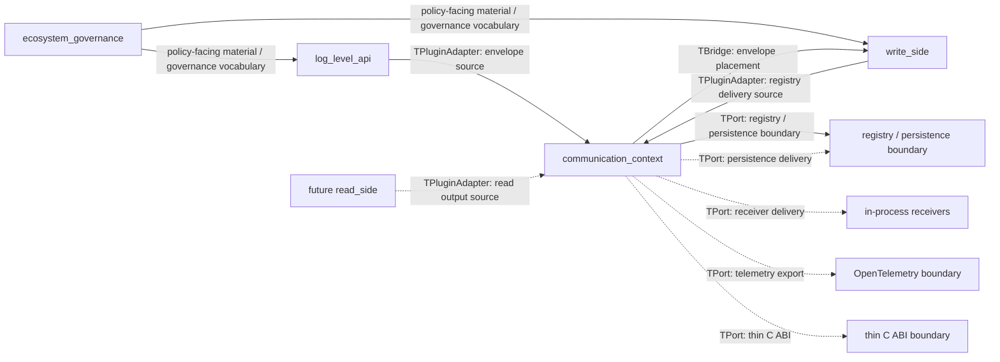
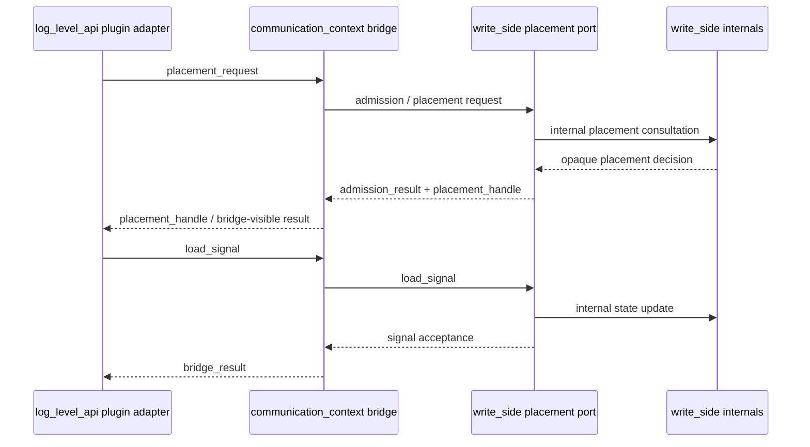
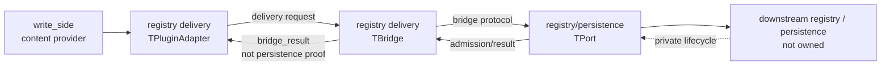
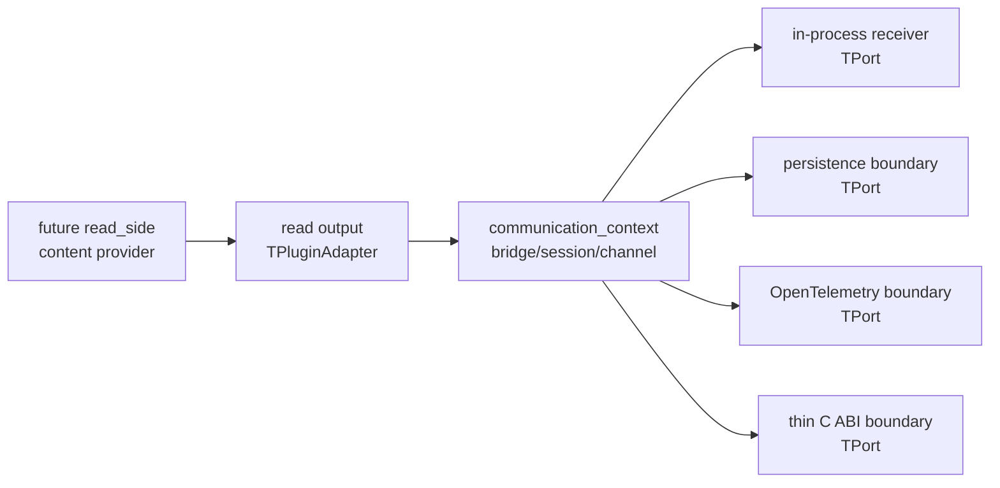
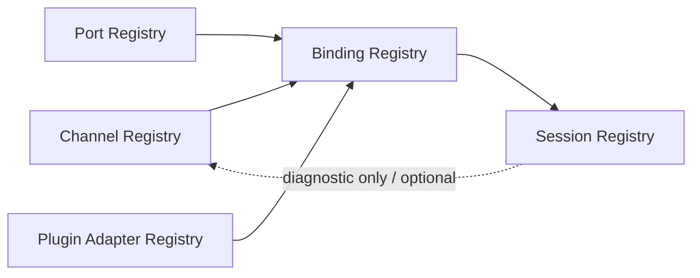

# ASCC-005 — External Relationships and Extension Model

## 1. Document Control

| Record ID | Field | Value |
|---:|---|---|
| ASCC-005-DOC-001 | Document Title | External Relationships and Extension Model |
| ASCC-005-DOC-002 | File Name | `ASCC-005_External_Relationships_And_Extension_Model.md` |
| ASCC-005-DOC-003 | Documentation Pack | ASCC — Assembler System Communication Context Documentation Pack |
| ASCC-005-DOC-004 | Formal Version | Formal Draft V1 |
| ASCC-005-DOC-005 | Project | Assembler System |
| ASCC-005-DOC-006 | Primary Language | English |
| ASCC-005-DOC-007 | Scope Level | External domain relationships, integration boundaries, future extension profiles, endpoint non-ownership, communication-context scalability |
| ASCC-005-DOC-008 | Implementation Direction | C++17, templates, traits, CRTP-compatible abstractions, static-first communication bindings |
| ASCC-005-DOC-009 | Status | External Relationship and Extension Architecture Draft |
| ASCC-005-DOC-010 | Depends On | `ASCC-001_Communication_Context_Foundation.md`, `ASCC-002_Bridge_Channel_Session_Core_Model.md`, `ASCC-003_TPort_TPluginAdapter_Contract_Model.md`, `ASCC-004_Bridge_Protocol_And_State_Model.md` |
| ASCC-005-DOC-011 | Previous Document | `ASCC-004_Bridge_Protocol_And_State_Model.md` |
| ASCC-005-DOC-012 | Next Candidate Document | `ASCC-006_Communication_Context_Folder_Structure.md` |
| ASCC-005-DOC-013 | Primary Rule | External integrations must talk through bridge protocols, ports, plugin adapters, channels, and sessions, not through endpoint internals |
| ASCC-005-DOC-014 | Current Primary Scenario | `log_level_api` as content provider to `write_side` as host provider through envelope placement protocol |
| ASCC-005-DOC-015 | Future Extension Scenarios | read-side delivery, persistence delivery, registry delivery, OpenTelemetry export, in-process receivers, thin C ABI boundary |

---

## 2. Purpose

### 2.1 Purpose Statement

This document defines how the Assembler System Communication Context relates to external and adjacent domains.

It answers the question:

```text
How does communication_context integrate with log_level_api, write_side,
future read_side, persistence boundaries, registry boundaries, telemetry
boundaries, in-process receivers, and thin C ABI boundaries without leaking
endpoint internals or turning the bridge into a broker, validator, storage
engine, telemetry engine, or ABI runtime?
```

### 2.2 Position in the ASCC Pack

The previous ASCC documents established:

1. `communication_context/` as a root DDD implementation domain,
2. `TBridge`, `TChannel`, `TSession`, and `TBinding`,
3. `TPort` and `TPluginAdapter` as endpoint-facing obligation surfaces,
4. bridge carriers, protocol stages, and protocol state.

This document applies that model outward.

It defines how the Communication Context can support:

1. the current write-side feeding workflow,
2. write-side-to-registry handoff,
3. future read-side delivery,
4. persistence integration,
5. telemetry integration,
6. thin C ABI integration,
7. diagnostic and in-process receiver integrations.

### 2.3 Non-Purpose

This document does not define:

1. concrete C++ implementations,
2. final folder inventory,
3. final file inventory,
4. final persistence engine,
5. final database schema,
6. final OpenTelemetry SDK integration,
7. final C ABI signatures,
8. final read-side implementation,
9. final registry storage behavior,
10. final message broker behavior,
11. final network protocol,
12. final runtime scheduler.

This document defines relationship patterns and extension boundaries only.

---

## 3. External Relationship Thesis

### 3.1 Thesis Statement

Every external or adjacent relationship must be modeled as a bridge-mediated communication relationship.

The pattern is:

```text
Content Provider
  exposes concrete TPluginAdapter

Communication Context
  owns TBridge, TChannel, TSession, TBridgeProtocol, and TBridgeCarriers

Host / Receiver / Boundary Provider
  exposes concrete TPort
```

The bridge does not own either side.

The bridge coordinates the relationship.

### 3.2 Relationship Safety Principle

The Communication Context exists to prevent direct structural coupling.

Therefore:

```text
No domain should depend on another domain's internal objects in order to
communicate.
```

Instead:

1. the content side provides a concrete plugin adapter,
2. the host or receiver side provides a concrete port,
3. the bridge coordinates exchange through declared carriers and protocols,
4. channels declare valid topology,
5. sessions frame runtime execution,
6. results describe communication outcomes only.

### 3.3 External Boundary Principle

A boundary provider may represent a local in-process component, a future persistence layer, a telemetry exporter, a thin C ABI edge, or a registry-facing receiver.

The boundary provider owns its own internals.

The Communication Context owns the bridge protocol used to reach it.

---

## 4. Relationship Role Model

### 4.1 Role Types

| Record ID | Role | Meaning |
|---:|---|---|
| ASCC-005-ROLE-001 | Content Provider | Produces or exposes material through a `TPluginAdapter` |
| ASCC-005-ROLE-002 | Host Provider | Owns admission, placement, hosting, or receiving capacity through a `TPort` |
| ASCC-005-ROLE-003 | Receiver Provider | Receives output material through a receiver-facing `TPort` |
| ASCC-005-ROLE-004 | Boundary Provider | Owns external or cross-boundary behavior behind a `TPort` |
| ASCC-005-ROLE-005 | Communication Context | Owns bridge, protocol, channel, session, carrier, and result semantics |
| ASCC-005-ROLE-006 | Concrete Binding Owner | Domain that owns concrete adapter/port implementation |
| ASCC-005-ROLE-007 | Integration Family | Group of related bridge protocols and ports for a boundary type |
| ASCC-005-ROLE-008 | External System | System or runtime beyond Assembler System ownership |
| ASCC-005-ROLE-009 | Extension Domain | Future domain that can join through plugin adapters or ports |
| ASCC-005-ROLE-010 | Diagnostic Observer | Optional observer that sees bridge-visible diagnostic surfaces only |

### 4.2 Role Separation Rule

```text
A domain may be a content provider in one relationship and a host provider
in another relationship.

The role is relationship-specific, not globally fixed.
```

For example:

1. `log_level_api` is a content provider when placing envelopes into `write_side`,
2. `write_side` is a host provider when receiving envelopes,
3. `write_side` may become a content provider when delivering registry material,
4. future `read_side` may become a content provider when delivering projections,
5. persistence boundary may be a host/receiver provider,
6. OpenTelemetry boundary may be a receiver provider,
7. thin C ABI boundary may be a receiver provider.

---

## 5. Root Domain Relationship Map

### 5.1 Current Root Domains

```text
assembler/
├── ecosystem_governance/
├── log_level_api/
├── communication_context/
└── write_side/
```

### 5.2 Future Root Domain Extension

```text
assembler/
├── ecosystem_governance/
├── log_level_api/
├── communication_context/
├── write_side/
└── read_side/
```

### 5.3 Relationship Diagram



### 5.4 Map Interpretation

The Communication Context is not a data owner.

It is not a persistence owner.

It is not a telemetry owner.

It is not an ABI owner.

It is the root domain that owns bridge-mediated communication semantics between these participants.

---

## 6. Relationship Matrix

### 6.1 Relationship Matrix Table

| Record ID | Relationship | Content Provider | Concrete `TPluginAdapter` | Host / Receiver Provider | Concrete `TPort` | Protocol Family | Status |
|---:|---|---|---|---|---|---|---|
| ASCC-005-REL-001 | Log API to Write Side | `log_level_api` | envelope plugin adapter | `write_side` | envelope placement port | `envelope_placement` | Current primary |
| ASCC-005-REL-002 | Write Side to Registry Boundary | `write_side` | registry delivery adapter | registry/persistence boundary | registry delivery port | `registry_delivery` | Planned / review-gated |
| ASCC-005-REL-003 | Write Side to Telemetry | `write_side` or diagnostics source | telemetry event adapter | telemetry boundary | OpenTelemetry export port | `telemetry_export` | Future |
| ASCC-005-REL-004 | Future Read Side to Receiver | future `read_side` | read output adapter | in-process receiver | receiver delivery port | `receiver_delivery` | Future |
| ASCC-005-REL-005 | Future Read Side to Persistence | future `read_side` | projection/result adapter | persistence boundary | persistence delivery port | `persistence_delivery` | Future |
| ASCC-005-REL-006 | Future Read Side to Telemetry | future `read_side` | read telemetry adapter | telemetry boundary | OpenTelemetry export port | `telemetry_export` | Future |
| ASCC-005-REL-007 | C++ Surface to Thin C ABI | selected C++ bridge-visible source | ABI source adapter | thin C ABI boundary | ABI receiver port | `thin_c_abi` | Future / high review |
| ASCC-005-REL-008 | Diagnostic Source to Diagnostic Receiver | any diagnostic source | diagnostic plugin adapter | diagnostic receiver | diagnostic port | `diagnostic_exchange` | Future / diagnostic-only |

### 6.2 Relationship Matrix Rule

```text
Every relationship must declare:

1. content provider,
2. concrete plugin adapter,
3. host or receiver provider,
4. concrete port,
5. bridge protocol family,
6. channel topology,
7. session policy,
8. ownership boundary,
9. result meaning,
10. failure categories.
```

---

## 7. Current Primary Scenario — Log Level API to Write Side

### 7.1 Scenario Statement

The current primary scenario is envelope placement from `log_level_api` into `write_side`.

In this scenario:

```text
log_level_api = content provider
communication_context = bridge owner
write_side = host/container provider
```

### 7.2 Participant Responsibilities

| Record ID | Participant | Responsibility |
|---:|---|---|
| ASCC-005-LAPI-WS-001 | `log_level_api` | Produces or exposes prepared Log Level Envelope material |
| ASCC-005-LAPI-WS-002 | `log_level_api` concrete plugin adapter | Maps envelope-side readiness and request material into bridge carriers |
| ASCC-005-LAPI-WS-003 | `communication_context` bridge | Orchestrates envelope placement protocol |
| ASCC-005-LAPI-WS-004 | `communication_context` channel | Declares log-API-to-write-side placement topology |
| ASCC-005-LAPI-WS-005 | `communication_context` session | Frames one placement exchange |
| ASCC-005-LAPI-WS-006 | `write_side` concrete port | Exposes placement/admission obligations without leaking slot/container/round internals |
| ASCC-005-LAPI-WS-007 | `write_side` internals | Decide actual placement, round correlation, container readiness, and waiting-list updates |

### 7.3 Required Bridge Carriers

| Record ID | Carrier | Requiredness |
|---:|---|---|
| ASCC-005-LAPI-WS-CAR-001 | `placement_request` | Required |
| ASCC-005-LAPI-WS-CAR-002 | `placement_handle` | Required |
| ASCC-005-LAPI-WS-CAR-003 | `admission_result` | Required |
| ASCC-005-LAPI-WS-CAR-004 | `readiness_view` | Required |
| ASCC-005-LAPI-WS-CAR-005 | `load_signal` | Required |
| ASCC-005-LAPI-WS-CAR-006 | `next_destination_request` | Contextual |
| ASCC-005-LAPI-WS-CAR-007 | `bridge_result` | Required |
| ASCC-005-LAPI-WS-CAR-008 | `correlation_token` | Required |
| ASCC-005-LAPI-WS-CAR-009 | `error` | Required |

### 7.4 Internal Boundary

The bridge must not directly access:

1. `TValidator` internals,
2. `TEnvelopeAssembler` internals,
3. `TSlot` internals,
4. `TSlotsContainer` internals,
5. `TWaitingList` internals,
6. `TRoundManager` internals,
7. `TReferencePrecalculator` internals,
8. `TDispatcher` internals.

The concrete plugin adapter and concrete port may internally collaborate with their owning domains.

### 7.5 Envelope Placement Diagram



### 7.6 Scenario Rule

```text
The bridge coordinates envelope placement.
The concrete write-side port owns host-side placement realization.
The concrete log-level API plugin adapter owns content-side request realization.
The bridge owns neither side's internals.
```

---

## 8. Write Side to Registry / Persistence Boundary

### 8.1 Scenario Statement

After write-side runtime work and dispatch preparation, write-side material may need to be delivered toward a registry or persistence-facing boundary.

In this relationship:

```text
write_side = content provider
communication_context = bridge owner
registry/persistence boundary = host/receiver provider
```

### 8.2 Why This Is Not Registry Ownership

The Communication Context may provide a registry-delivery protocol.

The Assembler System may provide a dispatcher or delivery adapter.

However, this does not mean the Assembler System owns downstream registry storage.

### 8.3 Registry Delivery Responsibilities

| Record ID | Participant | Responsibility |
|---:|---|---|
| ASCC-005-REG-001 | `write_side` | Produces dispatch-ready or registry-delivery material |
| ASCC-005-REG-002 | write-side plugin adapter | Maps dispatch material into registry-delivery bridge carriers |
| ASCC-005-REG-003 | communication bridge | Orchestrates registry delivery protocol |
| ASCC-005-REG-004 | registry/persistence port | Accepts or rejects delivery request |
| ASCC-005-REG-005 | persistence provider | Owns actual durable persistence, if any |
| ASCC-005-REG-006 | registry provider | Owns downstream record lifecycle, if any |

### 8.4 Registry Delivery Non-Ownership Rule

```text
A registry delivery bridge result is not persistence proof.

A registry delivery port may acknowledge receiving material at the boundary,
but actual downstream storage, indexing, mutation, replay, correction, and query
lifecycle remain outside Communication Context ownership.
```

### 8.5 Registry Delivery Diagram



---

## 9. Future Read Side Extension

### 9.1 Scenario Statement

A future `read_side/` domain may be introduced.

Its internals may resemble write-side runtime structures in some respects, but its communication relationships will differ.

The read side may become a content provider for:

1. projections,
2. query results,
3. record views,
4. replay material,
5. diagnostics,
6. receiver-targeted output.

### 9.2 Read Side Role

In future read-side relationships:

```text
read_side = content provider
communication_context = bridge owner
receiver / persistence / telemetry / ABI boundary = host or receiver provider
```

### 9.3 Read Side Extension Matrix

| Record ID | Relationship | Content Provider | Receiver / Host Provider | Protocol Family |
|---:|---|---|---|---|
| ASCC-005-RS-001 | Read Side to In-Process Receiver | `read_side` | in-process receiver | `receiver_delivery` |
| ASCC-005-RS-002 | Read Side to Persistence | `read_side` | persistence boundary | `persistence_delivery` |
| ASCC-005-RS-003 | Read Side to Telemetry | `read_side` | OpenTelemetry boundary | `telemetry_export` |
| ASCC-005-RS-004 | Read Side to Thin C ABI | `read_side` or selected surface | thin C ABI boundary | `thin_c_abi` |
| ASCC-005-RS-005 | Read Side to Diagnostic Receiver | `read_side` | diagnostic receiver | `diagnostic_exchange` |

### 9.4 Read Side Extension Rule

```text
Read-side integration must instantiate the existing bridge model.

It must not redefine bridge, channel, session, port, plugin adapter, carrier,
or protocol semantics.
```

### 9.5 Read Side Diagram



---

## 10. In-Process Receiver Integration

### 10.1 Scenario Statement

An in-process receiver is a receiving component inside the same process or runtime boundary.

It should still be treated as a receiver provider behind a `TPort`.

### 10.2 Why Use a Port for In-Process Receivers

Even when the receiver is in-process, direct dependency may still be harmful.

A receiver port allows:

1. receiver substitution,
2. testability,
3. local lifecycle isolation,
4. result handling,
5. readiness reporting,
6. failure normalization,
7. bridge-visible diagnostics,
8. avoidance of receiver internals leakage.

### 10.3 Receiver Port Responsibilities

| Record ID | Responsibility | Meaning |
|---:|---|---|
| ASCC-005-RX-001 | Admission | Decide whether receiver can accept the material |
| ASCC-005-RX-002 | Readiness | Expose readiness without receiver-private state |
| ASCC-005-RX-003 | Delivery Acceptance | Accept delivery request or reject it |
| ASCC-005-RX-004 | Result Emission | Return bridge-visible result |
| ASCC-005-RX-005 | Error Normalization | Return bridge-visible error category |
| ASCC-005-RX-006 | Non-Ownership | Keep receiver business logic behind the port |

### 10.4 In-Process Receiver Rule

```text
In-process does not mean direct coupling.

In-process receivers should still participate through bridge-visible ports
when crossing Communication Context boundaries.
```

---

## 11. Persistence Boundary Integration

### 11.1 Scenario Statement

Persistence may be reached through a persistence-facing port.

The persistence boundary may represent:

1. database integration,
2. durable queue integration,
3. append-only log integration,
4. file-backed storage,
5. registry persistence,
6. external persistence service.

### 11.2 Persistence Port Role

A persistence port exposes persistence-facing obligations to the bridge.

It does not make the bridge a database client.

It does not make `communication_context/` the persistence owner.

### 11.3 Persistence Boundary Responsibilities

| Record ID | Responsibility | Meaning |
|---:|---|---|
| ASCC-005-PERS-001 | Accept Persistence Request | Accept bridge-visible persistence request |
| ASCC-005-PERS-002 | Reject Persistence Request | Reject request with bridge-visible reason |
| ASCC-005-PERS-003 | Expose Readiness | Report persistence boundary readiness |
| ASCC-005-PERS-004 | Return Result | Return boundary result, not necessarily full durable proof |
| ASCC-005-PERS-005 | Preserve Storage Ownership | Keep actual storage lifecycle behind boundary |
| ASCC-005-PERS-006 | Normalize Errors | Expose error categories without leaking database internals |

### 11.4 Persistence Non-Ownership Rule

```text
Persistence delivery through a bridge port does not imply ownership of
database schema, indexing, query lifecycle, replay lifecycle, mutation,
correction, backup, or storage durability semantics.
```

---

## 12. OpenTelemetry Boundary Integration

### 12.1 Scenario Statement

OpenTelemetry integration may be modeled as a telemetry export boundary behind a `TPort`.

The Communication Context may define a `telemetry_export` protocol.

However, it must not own OpenTelemetry SDK internals.

### 12.2 Telemetry Export Role

Telemetry export may be triggered by:

1. bridge sessions,
2. adapter results,
3. port results,
4. protocol transitions,
5. failure categories,
6. diagnostic events,
7. future read-side observations,
8. write-side runtime observations.

### 12.3 Telemetry Boundary Responsibilities

| Record ID | Responsibility | Meaning |
|---:|---|---|
| ASCC-005-OTEL-001 | Accept Telemetry Export Request | Accept bridge-visible telemetry material |
| ASCC-005-OTEL-002 | Reject Telemetry Export Request | Reject with bridge-visible reason |
| ASCC-005-OTEL-003 | Expose Export Readiness | Report whether telemetry export is available |
| ASCC-005-OTEL-004 | Normalize Export Failure | Return bridge-visible failure category |
| ASCC-005-OTEL-005 | Preserve SDK Boundary | Hide OpenTelemetry SDK internals |
| ASCC-005-OTEL-006 | Preserve Hot-Path Policy | Avoid heavy telemetry behavior in hot paths unless explicitly enabled |

### 12.4 Telemetry Non-Ownership Rule

```text
Telemetry export through Communication Context does not make the bridge a
telemetry SDK owner, trace processor, metrics backend, log sink, collector, or
observability platform.
```

---

## 13. Thin C ABI Boundary Integration

### 13.1 Scenario Statement

Future cross-language integration may require thin C ABI boundaries.

A thin C ABI boundary must expose a limited, stable, C-compatible surface.

It must not expose the full C++ object model.

### 13.2 ABI Boundary Role

The thin C ABI boundary may receive selected bridge-visible material through a `TPort`.

Alternatively, a selected C++ source may be exposed through a `TPluginAdapter` and delivered to a C ABI port.

### 13.3 ABI Boundary Responsibilities

| Record ID | Responsibility | Meaning |
|---:|---|---|
| ASCC-005-ABI-001 | Accept ABI-Safe Request | Accept bridge-visible request mapped to ABI-safe representation |
| ASCC-005-ABI-002 | Reject Unsupported Material | Reject material not safe for ABI crossing |
| ASCC-005-ABI-003 | Preserve Type Boundary | Prevent templates, CRTP, and C++ internals from crossing ABI |
| ASCC-005-ABI-004 | Normalize Result | Return ABI-safe bridge-visible result |
| ASCC-005-ABI-005 | Normalize Error | Return ABI-safe error category |
| ASCC-005-ABI-006 | Preserve Ownership | Avoid exposing raw ownership, lifetime, or allocator internals |

### 13.4 ABI Non-Leakage Rule

```text
Thin C ABI integration must use bridge-visible carriers and ABI-safe mappings.

It must not export the full C++ object model, templates, CRTP internals,
domain-private state, or endpoint lifecycle ownership.
```

---

## 14. Ecosystem Governance Relationship

### 14.1 Scenario Statement

`ecosystem_governance/` supplies governance vocabulary, policy descriptors, policy bundles, and receiver-port definitions or obligations to consuming domains.

The Communication Context does not replace ecosystem governance.

However, it may use governance vocabulary to define compatibility, policy-aware channels, or bridge-level constraints.

### 14.2 Governance Interaction Points

| Record ID | Interaction Point | Meaning |
|---:|---|---|
| ASCC-005-ECO-001 | Policy-aware channel constraints | Channel may require policy-compatible adapter/port pairing |
| ASCC-005-ECO-002 | Policy-aware port compatibility | Port may declare governance constraints |
| ASCC-005-ECO-003 | Policy-aware plugin adapter compatibility | Adapter may declare governance constraints |
| ASCC-005-ECO-004 | Policy bundle delivery | Governance may supply policy material through its own bridge protocol if later required |
| ASCC-005-ECO-005 | Compliance diagnostics | Bridge may expose compliance-visible diagnostic categories |
| ASCC-005-ECO-006 | Non-ownership preservation | Governance vocabulary does not make bridge own policy engine behavior |

### 14.3 Governance Boundary Rule

```text
Communication Context may consume governance vocabulary or policy descriptors
for compatibility and boundary rules.

It must not become the policy engine or policy registry owner.
```

---

## 15. Extension Pattern

### 15.1 Standard Extension Steps

Every new external relationship should follow this pattern:

| Step ID | Step | Description |
|---:|---|---|
| ASCC-005-EXTSTEP-001 | Identify Content Provider | Determine which domain produces material |
| ASCC-005-EXTSTEP-002 | Define Concrete Plugin Adapter | Define content-side bridge-facing adapter |
| ASCC-005-EXTSTEP-003 | Identify Host / Receiver Provider | Determine which boundary receives or hosts material |
| ASCC-005-EXTSTEP-004 | Define Concrete Port | Define host-side bridge-facing port |
| ASCC-005-EXTSTEP-005 | Select Protocol Family | Choose existing protocol family or define a new one |
| ASCC-005-EXTSTEP-006 | Declare Channel | Define topology, direction, multiplicity, and policy |
| ASCC-005-EXTSTEP-007 | Define Session Policy | Define whether exchange is ephemeral, round-scoped, long-lived, or diagnostic |
| ASCC-005-EXTSTEP-008 | Declare Carrier Set | Define required carriers |
| ASCC-005-EXTSTEP-009 | Declare Result Model | Define bridge result categories |
| ASCC-005-EXTSTEP-010 | Declare Error Model | Define bridge-visible error categories |
| ASCC-005-EXTSTEP-011 | Declare Non-Ownership Boundaries | State what the bridge and participants do not own |
| ASCC-005-EXTSTEP-012 | Define Tests | Define anti-collapse and compatibility tests |

### 15.2 Extension Template

```text
Relationship Name:
  <name>

Content Provider:
  <domain>

Concrete TPluginAdapter:
  <adapter>

Host / Receiver Provider:
  <domain or boundary>

Concrete TPort:
  <port>

Protocol Family:
  <protocol>

Channel:
  <channel>

Session Policy:
  <ephemeral | round_scoped | long_lived | diagnostic>

Carrier Set:
  <required carriers>

Result Model:
  <result categories>

Error Model:
  <error categories>

Non-Ownership Statement:
  <what this relationship does not own>
```

### 15.3 Extension Rule

```text
A new integration is valid only when it can be expressed through the standard
extension pattern without direct dependency on endpoint internals.
```

---

## 16. Multiplicity and Scalability Model

### 16.1 Multiplicity Profiles

| Record ID | Profile | Shape | Status |
|---:|---|---|---|
| ASCC-005-MULT-001 | Single Adapter / Single Port | 1 → 1 | Current active profile |
| ASCC-005-MULT-002 | Single Adapter / Many Ports | 1 → N | Future / review-gated |
| ASCC-005-MULT-003 | Many Adapters / Single Port | N → 1 | Future / review-gated |
| ASCC-005-MULT-004 | Many Adapters / Many Ports | N → N | Future / high review |
| ASCC-005-MULT-005 | Observer Channel | 1 → 1 + observer(s) | Future |
| ASCC-005-MULT-006 | Mirroring Channel | primary + mirror ports | Future |
| ASCC-005-MULT-007 | Telemetry Side Channel | source → telemetry receiver | Future |
| ASCC-005-MULT-008 | Diagnostic Channel | source → diagnostic receiver | Diagnostic-only |

### 16.2 Scalability Rule

```text
The Communication Context may model future multiplicity, but only the current
single-adapter / single-port dedicated pipeline profile is active for the
initial write-side workflow.
```

### 16.3 Anti-Broker Scalability Rule

```text
Scaling bridge relationships must not turn Channel into a broker, Session into
a queue, Registry into a message bus, or Bridge into a dispatcher.
```

---

## 17. Hot Path and Extension Safety

### 17.1 Hot Path Concern

The current write-side feeding workflow may be hot-path sensitive.

Therefore, external relationship modeling must not force:

1. dynamic registry lookup in hot path,
2. heavy reflection,
3. expensive diagnostics,
4. uncontrolled allocation,
5. broad fanout,
6. generic broker routing,
7. heavy telemetry export,
8. ABI conversion overhead.

### 17.2 Hot Path Profile

| Record ID | Policy | Meaning |
|---:|---|---|
| ASCC-005-HOT-001 | Static Binding Preferred | Hot paths should prefer pre-bound adapter/port relationships |
| ASCC-005-HOT-002 | Prevalidated Compatibility | Compatibility should be resolved before hot-path execution |
| ASCC-005-HOT-003 | Minimal Carrier Set | Only required carriers should be used |
| ASCC-005-HOT-004 | Minimal Diagnostics | Diagnostics should be controlled |
| ASCC-005-HOT-005 | No Unreviewed Fanout | Multi-port fanout must not enter hot path without review |
| ASCC-005-HOT-006 | Opaque Handles Only | Handles should avoid exposing host internals |
| ASCC-005-HOT-007 | Deferred External Export | Telemetry/persistence export may be separated from critical path if required |
| ASCC-005-HOT-008 | Contract-Stable API | Hot-path ports/adapters must have stable contracts |

### 17.3 Extension Safety Rule

```text
Future extension must not degrade the current single-writer dedicated pipeline.

New protocols, ports, adapters, channels, registries, and sessions must be
introduced without forcing runtime overhead into existing hot paths.
```

---

## 18. Registry Relationship

### 18.1 Optional Registry Role

A registry may exist to track:

1. channel definitions,
2. port registrations,
3. plugin adapter registrations,
4. binding definitions,
5. active sessions,
6. completed sessions,
7. diagnostic sessions,
8. compatibility metadata.

### 18.2 Registry Is Not Required Initially

The current initial profile may be implemented through static binding.

A dynamic registry is not required for the first write-side pipeline.

### 18.3 Registry Boundary Rule

```text
Registry catalogs communication metadata.

It must not become a message broker, endpoint owner, persistence engine,
runtime scheduler, or global lifecycle controller.
```

### 18.4 Registry Relationship Diagram



---

## 19. Diagnostics and Observability

### 19.1 Diagnostic Role

Diagnostics may observe bridge-visible material.

Diagnostics must not expose endpoint-private internals unless an explicit diagnostic contract permits it.

### 19.2 Diagnostic Surfaces

| Record ID | Diagnostic Surface | Allowed Content |
|---:|---|---|
| ASCC-005-DIAG-001 | Channel View | Channel ID, kind, protocol family, multiplicity |
| ASCC-005-DIAG-002 | Binding View | Binding ID, adapter ID, port ID, compatibility status |
| ASCC-005-DIAG-003 | Session View | Session ID, current stage, result category, error category |
| ASCC-005-DIAG-004 | Carrier Snapshot | Safe carrier categories and correlation tokens |
| ASCC-005-DIAG-005 | Error View | Bridge-visible error categories |
| ASCC-005-DIAG-006 | Result View | Bridge-visible result categories |
| ASCC-005-DIAG-007 | Timing View | Bridge-visible timing data, if enabled |
| ASCC-005-DIAG-008 | Readiness View | Safe readiness categories |

### 19.3 Diagnostic Non-Leakage Rule

```text
Diagnostics may observe bridge-visible protocol state.

Diagnostics must not expose endpoint-private mutable state by default.
```

---

## 20. External Relationship Validation Matrix

### 20.1 Relationship Validation Questions

| Record ID | Question | Expected Answer |
|---:|---|---|
| ASCC-005-VAL-001 | Does the relationship declare a content provider? | Yes |
| ASCC-005-VAL-002 | Does the relationship declare a concrete plugin adapter? | Yes |
| ASCC-005-VAL-003 | Does the relationship declare a host/receiver provider? | Yes |
| ASCC-005-VAL-004 | Does the relationship declare a concrete port? | Yes |
| ASCC-005-VAL-005 | Does the relationship declare protocol family? | Yes |
| ASCC-005-VAL-006 | Does the relationship declare channel topology? | Yes |
| ASCC-005-VAL-007 | Does the relationship declare session policy? | Yes |
| ASCC-005-VAL-008 | Does the relationship declare required carrier set? | Yes |
| ASCC-005-VAL-009 | Does the relationship declare result categories? | Yes |
| ASCC-005-VAL-010 | Does the relationship declare error categories? | Yes |
| ASCC-005-VAL-011 | Does the relationship preserve endpoint internals? | Yes |
| ASCC-005-VAL-012 | Does the relationship avoid broker semantics? | Yes |
| ASCC-005-VAL-013 | Does the relationship avoid downstream ownership collapse? | Yes |
| ASCC-005-VAL-014 | Does the relationship respect hot-path constraints? | Yes, when applicable |
| ASCC-005-VAL-015 | Does the relationship declare diagnostic visibility limits? | Yes |

### 20.2 Extension Review Gate

A new relationship is review-gated if it involves:

1. persistence,
2. telemetry export,
3. thin C ABI,
4. many-to-many channel topology,
5. dynamic registry lookup,
6. diagnostic expansion,
7. fanout,
8. cross-thread or cross-process delivery,
9. downstream lifecycle proof,
10. externally owned runtime integration.

---

## 21. Anti-Collapse Index

| Rule ID | Protected Concept | Must Not Collapse Into | Severity |
|---:|---|---|---|
| ASCC-005-AC-001 | Communication Context | write-side subfolder | Critical |
| ASCC-005-AC-002 | Communication Context | log-level API subfolder | Critical |
| ASCC-005-AC-003 | Bridge | message broker | Critical |
| ASCC-005-AC-004 | Channel | queue/topic | Critical |
| ASCC-005-AC-005 | Session | web session or endpoint lifecycle | High |
| ASCC-005-AC-006 | Registry | message bus | Critical |
| ASCC-005-AC-007 | Registry delivery result | persistence proof | Critical |
| ASCC-005-AC-008 | Persistence port | database engine | Critical |
| ASCC-005-AC-009 | OpenTelemetry port | telemetry SDK owner | High |
| ASCC-005-AC-010 | Thin C ABI port | full C++ object exposure | Critical |
| ASCC-005-AC-011 | In-process receiver port | direct coupling permission | High |
| ASCC-005-AC-012 | Read-side extension | redefinition of bridge semantics | Critical |
| ASCC-005-AC-013 | Multiplicity | unreviewed fanout | High |
| ASCC-005-AC-014 | Diagnostics | endpoint-private leakage | Critical |
| ASCC-005-AC-015 | Hot-path binding | dynamic generic plugin system | High |

---

## 22. Folder Implications

### 22.1 Communication Context Folder Families

This relationship model implies that `communication_context/` should eventually include folder families for:

1. bridge core,
2. channels,
3. sessions,
4. bindings,
5. ports,
6. plugin adapters,
7. bridge carriers,
8. protocols,
9. registries,
10. integration boundaries,
11. diagnostics.

### 22.2 Integration Boundary Folder Candidates

The following folder candidates should be considered in `ASCC-006`:

```text
communication_context/
└── integration_boundaries/
    ├── in_process_receivers/
    ├── persistence_ports/
    ├── registry_delivery/
    ├── open_telemetry_ports/
    ├── thin_c_abi_ports/
    └── diagnostics/
```

### 22.3 Domain-Side Binding Folder Candidates

Concrete side-specific bindings may live in their owning domains.

Examples:

```text
log_level_api/
└── communication_bindings/
    └── envelope_plugin_adapter/

write_side/
└── communication_bindings/
    ├── envelope_placement_port/
    └── registry_delivery_plugin_adapter/

future_read_side/
└── communication_bindings/
    ├── read_output_plugin_adapter/
    ├── projection_delivery_plugin_adapter/
    └── replay_delivery_plugin_adapter/
```

### 22.4 Folder Ownership Rule

```text
communication_context owns abstract bridge semantics, protocols, carriers,
channels, sessions, registries, and integration boundary models.

Concrete domain-specific adapter and port bindings may remain in the owning
domain when they depend on domain internals.
```

---

## 23. Implementation Readiness Notes

### 23.1 Ready for ASCC-006

This document prepares `ASCC-006_Communication_Context_Folder_Structure.md` by identifying the major folder families required by the external relationship model.

`ASCC-006` should decide:

1. whether integration boundaries are top-level under `communication_context/`,
2. how to represent ports and plugin adapters,
3. where registries live,
4. where diagnostics live,
5. where protocol families live,
6. where carrier families live,
7. how concrete domain-side bindings are represented,
8. how future read-side folders are referenced without implementing read-side now.

### 23.2 Still Deferred

The following remain deferred:

1. final file inventory,
2. final C++ code,
3. final persistence implementation,
4. final telemetry implementation,
5. final ABI implementation,
6. final read-side implementation,
7. final registry implementation,
8. final dynamic channel runtime,
9. final multi-port fanout,
10. final many-to-many topology.

---

## 24. Summary

`ASCC-005` defines the external relationship and extension model for the Assembler System Communication Context.

The key conclusions are:

1. Communication Context mediates relationships through bridges, channels, sessions, ports, plugin adapters, protocols, and carriers.
2. `log_level_api` currently acts as content provider for envelope placement into `write_side`.
3. `write_side` acts as host provider for envelope placement.
4. `write_side` may later act as content provider for registry or persistence delivery.
5. Future `read_side` may act as content provider for receivers, persistence, telemetry, or ABI boundaries.
6. In-process receivers still require ports when crossing communication boundaries.
7. Persistence ports do not make Communication Context a database owner.
8. OpenTelemetry ports do not make Communication Context a telemetry SDK owner.
9. Thin C ABI ports must not expose the full C++ object model.
10. Registries are optional and must not become brokers.
11. Multiplicity is modeled but not activated for the initial write-side hot path.
12. Diagnostics observe bridge-visible state only by default.
13. New integrations must follow the standard extension pattern.

The next document is:

```text
ASCC-006_Communication_Context_Folder_Structure.md
```

That document should formalize the folder hierarchy implied by the Communication Context model and its external relationship families.
