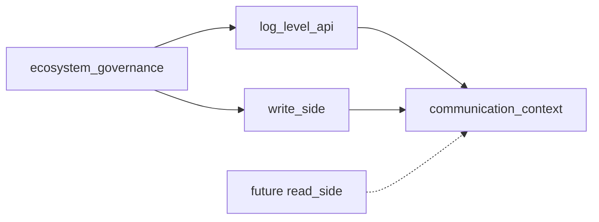
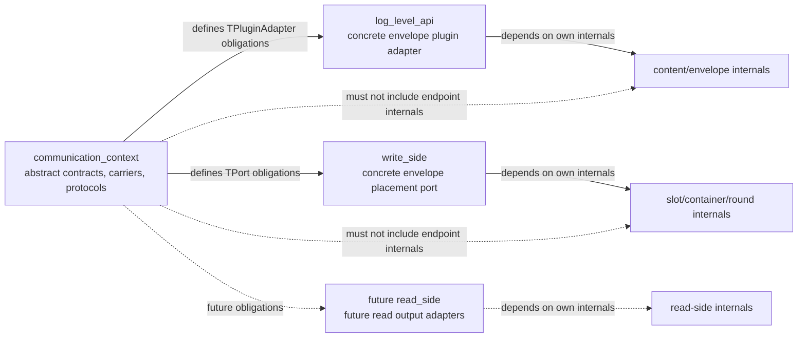

# ASCC-006 — Communication Context Folder Structure

## 1. Document Control

| Record ID | Field | Value |
|---:|---|---|
| ASCC-006-DOC-001 | Document Title | Communication Context Folder Structure |
| ASCC-006-DOC-002 | File Name | `ASCC-006_Communication_Context_Folder_Structure.md` |
| ASCC-006-DOC-003 | Documentation Pack | ASCC — Assembler System Communication Context Documentation Pack |
| ASCC-006-DOC-004 | Formal Version | Formal Draft V1 |
| ASCC-006-DOC-005 | Project | Assembler System |
| ASCC-006-DOC-006 | Primary Language | English |
| ASCC-006-DOC-007 | Scope Level | Root domain folder placement, internal communication-context folder taxonomy, hierarchy, ownership rules, domain binding placement |
| ASCC-006-DOC-008 | Implementation Direction | C++17, templates, traits, CRTP-compatible abstractions, static-first communication bindings |
| ASCC-006-DOC-009 | Status | Folder Structure Architecture Draft |
| ASCC-006-DOC-010 | Depends On | `ASCC-001`, `ASCC-002`, `ASCC-003`, `ASCC-004`, `ASCC-005` |
| ASCC-006-DOC-011 | Previous Document | `ASCC-005_External_Relationships_And_Extension_Model.md` |
| ASCC-006-DOC-012 | Next Candidate Document | `ASCC-007_Diagrams_Code_And_Visual_Reference_Pack.md` |
| ASCC-006-DOC-013 | Primary Rule | Folder structure mirrors communication semantics; it must not become a utility bucket or broker implementation |
| ASCC-006-DOC-014 | Structural Decision | `communication_context/` is a root DDD implementation domain |
| ASCC-006-DOC-015 | Folder Doctrine | Shared abstract communication semantics live under `communication_context/`; concrete domain-specific bindings remain near their owning domains when they depend on endpoint internals |

---

## 2. Purpose

### 2.1 Purpose Statement

This document defines the folder structure for the Assembler System `communication_context/` root domain.

It translates the conceptual model defined in `ASCC-001` through `ASCC-005` into a disciplined filesystem taxonomy.

It answers the question:

```text
How should the Communication Context be represented as folders so that bridge,
channel, session, binding, port, plugin-adapter, carrier, protocol, registry,
and integration-boundary semantics remain explicit, composable, testable,
and protected from semantic collapse?
```

### 2.2 Why This Document Exists

The Communication Context was promoted to a root DDD implementation domain because it owns communication semantics that are not exclusively owned by `log_level_api/`, `write_side/`, or future `read_side/`.

Without a precise folder structure, the project risks returning to one of the following failures:

1. placing bridges inside `write_side/` and making communication appear write-side-owned,
2. placing bridges inside `log_level_api/` and making write-side placement appear API-owned,
3. hiding bridge contracts under generic `contracts/` folders,
4. collapsing adapters and ports into one undifferentiated interface layer,
5. treating channels as sessions,
6. treating registries as brokers,
7. treating bridge carriers as endpoint-private state,
8. placing concrete domain bindings inside abstract communication folders,
9. leaking write-side internals into bridge implementation,
10. blocking future read-side, persistence, telemetry, and thin C ABI extensions.

### 2.3 Relationship to Previous Documents

| Record ID | Source Document | Folder-Structure Impact |
|---:|---|---|
| ASCC-006-SRC-001 | `ASCC-001_Communication_Context_Foundation.md` | Establishes `communication_context/` as root domain |
| ASCC-006-SRC-002 | `ASCC-002_Bridge_Channel_Session_Core_Model.md` | Requires folders for bridge, channel, session, binding, participants, protocol, carriers |
| ASCC-006-SRC-003 | `ASCC-003_TPort_TPluginAdapter_Contract_Model.md` | Requires explicit port and plugin-adapter obligation folders |
| ASCC-006-SRC-004 | `ASCC-004_Bridge_Protocol_And_State_Model.md` | Requires protocol-state and carrier folders |
| ASCC-006-SRC-005 | `ASCC-005_External_Relationships_And_Extension_Model.md` | Requires integration-boundary folders and domain-side binding guidance |

### 2.4 Non-Purpose

This document does not define:

1. final file inventory,
2. final C++ class names,
3. final C++ signatures,
4. final include graph,
5. final CMake targets,
6. final package layout,
7. final runtime algorithm,
8. final registry implementation,
9. final persistence implementation,
10. final telemetry implementation,
11. final thin C ABI implementation,
12. final read-side implementation.

This document defines folder semantics and hierarchy only.

---

## 3. Root Domain Placement

### 3.1 Root Domain Decision

The root implementation domain layout shall include `communication_context/` as a first-class peer of `ecosystem_governance/`, `log_level_api/`, and `write_side/`.

```text
assembler/
├── ecosystem_governance/
├── log_level_api/
├── communication_context/
└── write_side/
```

Future extension may add:

```text
assembler/
├── ecosystem_governance/
├── log_level_api/
├── communication_context/
├── write_side/
└── read_side/
```

### 3.2 Root Domain Meaning

| Record ID | Root Domain | Primary Ownership |
|---:|---|---|
| ASCC-006-ROOT-001 | `ecosystem_governance/` | Governance vocabulary, policy type system, policy registries, governance-facing provider and receiver surfaces |
| ASCC-006-ROOT-002 | `log_level_api/` | Content preparation, validation, timestamp stabilization, metadata injection, envelope assembly, API facade |
| ASCC-006-ROOT-003 | `communication_context/` | Bridge-mediated communication semantics, channels, sessions, bindings, carriers, protocols, registries, integration boundaries |
| ASCC-006-ROOT-004 | `write_side/` | Slot/container runtime, waiting lists, round management, reference precalculation, dispatch preparation, write-side placement internals |
| ASCC-006-ROOT-005 | future `read_side/` | Read-side retrieval, projections, read output preparation, future receiver-facing content source behavior |

### 3.3 Root Placement Rule

```text
communication_context/ is not a utility folder, not a generic infrastructure
folder, not a write-side subfolder, and not a log-level API subfolder.

It is a root DDD domain for communication semantics.
```

---

## 4. Folder Structure Doctrine

### 4.1 Folder Semantics Rule

Every folder under `communication_context/` must represent a stable semantic category in the communication model.

Folders must not be created merely for convenience.

A folder is valid only if it owns one of the following:

1. bridge orchestration semantics,
2. channel topology semantics,
3. session execution framing semantics,
4. binding association semantics,
5. participant descriptors,
6. port obligation abstractions,
7. plugin-adapter obligation abstractions,
8. bridge carrier families,
9. protocol families,
10. protocol state,
11. registry/catalog semantics,
12. integration boundary semantics,
13. diagnostics,
14. tests,
15. local documentation.

### 4.2 Anti-Utility Rule

The following folders are prohibited under `communication_context/`:

```text
utils/
helpers/
common/
misc/
shared/
generic/
interfaces/
models/
stuff/
```

If a type is shared, the folder must name the semantic reason it is shared.

Examples:

```text
bridge_carriers/
protocol_state/
compatibility/
diagnostics/
```

### 4.3 Narrowest Ownership Rule

A file or subfolder must live at the narrowest folder scope that owns its meaning.

If a concept belongs only to a protocol family, it must live under that protocol family.

If a concept belongs to all protocols, it may live under a shared communication-context folder.

If a concept depends on `write_side/` internals, it must not live as an abstract communication-context core file.

### 4.4 Concrete Binding Rule

Concrete adapter/port implementations that depend on endpoint internals should remain near the owning domain.

For example:

```text
log_level_api/
└── communication_bindings/
    └── envelope_plugin_adapter/

write_side/
└── communication_bindings/
    └── envelope_placement_port/
```

The abstract obligation surfaces remain in `communication_context/`.

### 4.5 Documentation and Tests Rule

Every meaningful folder level may contain:

```text
docs/
tests/
```

The content of those folders must be local to that level.

Domain-level docs explain the domain.

Component-level docs explain the component.

Protocol-level tests test the protocol.

Port-level tests test port obligations.

Adapter-level tests test adapter obligations.

---

## 5. Final Proposed Top-Level Folder Structure

### 5.1 Top-Level Structure

```text
communication_context/
├── docs/
├── tests/
│
├── bridge_core/
├── channels/
├── sessions/
├── bindings/
├── participants/
│
├── obligations/
│   ├── ports/
│   └── plugin_adapters/
│
├── bridge_carriers/
├── protocols/
├── protocol_state/
├── registries/
├── compatibility/
├── diagnostics/
└── integration_boundaries/
```

### 5.2 Top-Level Folder Table

| Record ID | Folder | Role |
|---:|---|---|
| ASCC-006-TOP-001 | `docs/` | Communication-context-level documentation |
| ASCC-006-TOP-002 | `tests/` | Communication-context-level tests and anti-collapse tests |
| ASCC-006-TOP-003 | `bridge_core/` | Core bridge orchestration abstractions |
| ASCC-006-TOP-004 | `channels/` | Channel topology definitions and profiles |
| ASCC-006-TOP-005 | `sessions/` | Session execution framing and session views |
| ASCC-006-TOP-006 | `bindings/` | Adapter-port association semantics |
| ASCC-006-TOP-007 | `participants/` | Participant descriptors and participant views |
| ASCC-006-TOP-008 | `obligations/ports/` | Abstract host-side port obligation model |
| ASCC-006-TOP-009 | `obligations/plugin_adapters/` | Abstract content-side plugin-adapter obligation model |
| ASCC-006-TOP-010 | `bridge_carriers/` | Shared carrier vocabulary used by bridge protocols |
| ASCC-006-TOP-011 | `protocols/` | Protocol families such as envelope placement and registry delivery |
| ASCC-006-TOP-012 | `protocol_state/` | Protocol stages, transition records, terminal states, and snapshots |
| ASCC-006-TOP-013 | `registries/` | Optional registries/catalogs for channels, bindings, participants, sessions |
| ASCC-006-TOP-014 | `compatibility/` | Static-first compatibility rules and views |
| ASCC-006-TOP-015 | `diagnostics/` | Bridge-visible diagnostic views, not endpoint-private diagnostics |
| ASCC-006-TOP-016 | `integration_boundaries/` | Boundary families for persistence, telemetry, receivers, thin C ABI, registry delivery |

---

## 6. `bridge_core/`

### 6.1 Purpose

`bridge_core/` owns the abstract bridge orchestration model.

It defines the bridge as orchestration-only.

It does not own endpoint internals.

### 6.2 Proposed Structure

```text
bridge_core/
├── docs/
├── tests/
├── orchestration/
├── execution/
├── results/
├── errors/
├── traits/
└── detail/
```

### 6.3 Subfolder Roles

| Record ID | Subfolder | Role |
|---:|---|---|
| ASCC-006-BRIDGE-001 | `docs/` | Bridge-core local documentation |
| ASCC-006-BRIDGE-002 | `tests/` | Bridge orchestration tests |
| ASCC-006-BRIDGE-003 | `orchestration/` | Abstract bridge orchestration surfaces |
| ASCC-006-BRIDGE-004 | `execution/` | Execution-framing abstractions, not endpoint algorithms |
| ASCC-006-BRIDGE-005 | `results/` | Bridge-result categories and bridge-level result helpers |
| ASCC-006-BRIDGE-006 | `errors/` | Bridge-visible error categories |
| ASCC-006-BRIDGE-007 | `traits/` | Static-first bridge traits |
| ASCC-006-BRIDGE-008 | `detail/` | Private bridge-core helpers |

### 6.4 Ownership Rule

```text
bridge_core/ owns how a bridge orchestrates communication.

It must not own validation internals, placement internals, persistence internals,
telemetry internals, ABI translation internals, or endpoint lifecycle.
```

---

## 7. `channels/`

### 7.1 Purpose

`channels/` owns topology definitions.

A channel defines the allowed communication lane.

A channel is not a session.

### 7.2 Proposed Structure

```text
channels/
├── docs/
├── tests/
├── profiles/
├── topology/
├── policies/
├── views/
└── detail/
```

### 7.3 Subfolder Roles

| Record ID | Subfolder | Role |
|---:|---|---|
| ASCC-006-CH-001 | `docs/` | Channel model documentation |
| ASCC-006-CH-002 | `tests/` | Channel topology tests |
| ASCC-006-CH-003 | `profiles/` | one-to-one, one-to-many, many-to-one, many-to-many profiles |
| ASCC-006-CH-004 | `topology/` | Declared adapter/port topology rules |
| ASCC-006-CH-005 | `policies/` | Binding and multiplicity policies |
| ASCC-006-CH-006 | `views/` | Bridge-visible channel views |
| ASCC-006-CH-007 | `detail/` | Private channel helpers |

### 7.4 Channel Profile Table

| Record ID | Profile | Status |
|---:|---|---|
| ASCC-006-CH-PROF-001 | `single_adapter_single_port` | Initial valid profile |
| ASCC-006-CH-PROF-002 | `single_adapter_many_ports` | Future / review-gated |
| ASCC-006-CH-PROF-003 | `many_adapters_single_port` | Future / review-gated |
| ASCC-006-CH-PROF-004 | `many_adapters_many_ports` | Future / high review |
| ASCC-006-CH-PROF-005 | `observer_channel` | Future |
| ASCC-006-CH-PROF-006 | `telemetry_side_channel` | Future |
| ASCC-006-CH-PROF-007 | `diagnostic_channel` | Diagnostic-only |

### 7.5 Channel Rule

```text
channels/ defines topology.

It must not implement broker semantics, queue storage, dynamic routing engines,
or endpoint runtime algorithms.
```

---

## 8. `sessions/`

### 8.1 Purpose

`sessions/` owns execution-framing semantics for one concrete bridge exchange.

A session is one exchange/trip under a channel.

It is not a web session.

It is not a queue lifetime.

It is not endpoint lifecycle.

### 8.2 Proposed Structure

```text
sessions/
├── docs/
├── tests/
├── lifecycle/
├── views/
├── handles/
├── correlation/
├── traces/
└── detail/
```

### 8.3 Subfolder Roles

| Record ID | Subfolder | Role |
|---:|---|---|
| ASCC-006-SESS-001 | `docs/` | Session model documentation |
| ASCC-006-SESS-002 | `tests/` | Session lifecycle and anti-collapse tests |
| ASCC-006-SESS-003 | `lifecycle/` | Communication session lifecycle, not endpoint lifecycle |
| ASCC-006-SESS-004 | `views/` | Session views safe for bridge diagnostics |
| ASCC-006-SESS-005 | `handles/` | Session-level handles and references |
| ASCC-006-SESS-006 | `correlation/` | Correlation with endpoint-side opaque references |
| ASCC-006-SESS-007 | `traces/` | Bridge-visible trace references |
| ASCC-006-SESS-008 | `detail/` | Private session helpers |

### 8.4 Session/Round Rule

```text
A session may correlate with a write-side round through opaque handles and
correlation tokens.

A session must not own, mutate, or expose write-side round internals.
```

---

## 9. `bindings/`

### 9.1 Purpose

`bindings/` owns the association model between plugin adapters and ports.

Binding declares which concrete participants are connected under a channel.

### 9.2 Proposed Structure

```text
bindings/
├── docs/
├── tests/
├── adapter_port_bindings/
├── binding_views/
├── binding_policies/
├── binding_results/
└── detail/
```

### 9.3 Subfolder Roles

| Record ID | Subfolder | Role |
|---:|---|---|
| ASCC-006-BIND-001 | `docs/` | Binding documentation |
| ASCC-006-BIND-002 | `tests/` | Binding compatibility and anti-collapse tests |
| ASCC-006-BIND-003 | `adapter_port_bindings/` | Association records between adapter and port |
| ASCC-006-BIND-004 | `binding_views/` | Read-only binding views |
| ASCC-006-BIND-005 | `binding_policies/` | Binding validity and activation policies |
| ASCC-006-BIND-006 | `binding_results/` | Binding result categories |
| ASCC-006-BIND-007 | `detail/` | Private binding helpers |

### 9.4 Binding Rule

```text
bindings/ declares associations.

It must not implement endpoint behavior, endpoint lifecycle, broker routing,
or port/adapter internals.
```

---

## 10. `participants/`

### 10.1 Purpose

`participants/` owns participant descriptors.

A participant descriptor represents a role in communication without exposing endpoint internals.

### 10.2 Proposed Structure

```text
participants/
├── docs/
├── tests/
├── descriptors/
├── roles/
├── views/
└── detail/
```

### 10.3 Participant Roles

| Record ID | Role | Meaning |
|---:|---|---|
| ASCC-006-PART-001 | `content_provider` | Produces or exposes material through a plugin adapter |
| ASCC-006-PART-002 | `host_provider` | Owns admission, placement, receiving, or host capacity through a port |
| ASCC-006-PART-003 | `receiver_provider` | Receives output material through a port |
| ASCC-006-PART-004 | `boundary_provider` | Represents persistence, telemetry, ABI, receiver, or external boundary |
| ASCC-006-PART-005 | `observer` | Observes bridge-visible diagnostic or signal surfaces only |
| ASCC-006-PART-006 | `registry` | Catalogs participants, bindings, sessions, or channels when enabled |

### 10.4 Participant Rule

```text
participants/ describes communication roles.

It must not contain endpoint implementations.
```

---

## 11. `obligations/`

### 11.1 Purpose

`obligations/` owns abstract contract surfaces for the two endpoint-facing sides:

1. `ports/`,
2. `plugin_adapters/`.

These folders define bridge-facing obligations, not concrete domain implementations.

### 11.2 Proposed Structure

```text
obligations/
├── docs/
├── tests/
├── ports/
│   ├── docs/
│   ├── tests/
│   ├── contracts/
│   ├── traits/
│   ├── views/
│   └── detail/
│
└── plugin_adapters/
    ├── docs/
    ├── tests/
    ├── contracts/
    ├── traits/
    ├── views/
    └── detail/
```

### 11.3 `obligations/ports/`

`obligations/ports/` owns abstract host-side obligations.

It may include future abstractions for:

1. admission,
2. reservation,
3. readiness,
4. handle production,
5. signal acceptance,
6. destination selection,
7. result emission,
8. error emission,
9. non-ownership statements.

### 11.4 `obligations/plugin_adapters/`

`obligations/plugin_adapters/` owns abstract content-side obligations.

It may include future abstractions for:

1. request preparation,
2. payload exposure,
3. handle interpretation,
4. result interpretation,
5. signal reaction,
6. destination request,
7. correlation propagation,
8. error interpretation,
9. non-ownership statements.

### 11.5 Obligations Rule

```text
obligations/ owns abstract bridge-facing contracts only.

Concrete implementations that depend on domain internals should live in
the owning domain's communication_bindings/ folder.
```

---

## 12. `bridge_carriers/`

### 12.1 Purpose

`bridge_carriers/` owns the bridge-visible carrier vocabulary.

Carriers are protocol artifacts.

They are not endpoint-private state.

### 12.2 Proposed Structure

```text
bridge_carriers/
├── docs/
├── tests/
├── requests/
├── handles/
├── admission/
├── readiness/
├── signals/
├── destination/
├── results/
├── errors/
├── correlation/
├── views/
└── detail/
```

### 12.3 Carrier Family Table

| Record ID | Folder | Meaning |
|---:|---|---|
| ASCC-006-CAR-001 | `requests/` | Placement, delivery, export, receiver, ABI requests |
| ASCC-006-CAR-002 | `handles/` | Opaque handles and safe references |
| ASCC-006-CAR-003 | `admission/` | Admission results and admission categories |
| ASCC-006-CAR-004 | `readiness/` | Readiness views and readiness categories |
| ASCC-006-CAR-005 | `signals/` | Load, completion, failure, pressure, availability signals |
| ASCC-006-CAR-006 | `destination/` | Next-destination requests and responses |
| ASCC-006-CAR-007 | `results/` | Bridge result categories |
| ASCC-006-CAR-008 | `errors/` | Bridge-visible error categories |
| ASCC-006-CAR-009 | `correlation/` | Correlation tokens and trace references |
| ASCC-006-CAR-010 | `views/` | Read-only carrier views |

### 12.4 Carrier Rule

```text
bridge_carriers/ owns communication artifacts.

It must not contain endpoint-private state, database records, telemetry SDK
objects, queue internals, or ABI-private memory structures.
```

---

## 13. `protocols/`

### 13.1 Purpose

`protocols/` owns protocol families.

Each protocol family defines required carriers, participants, stages, result categories, error categories, and non-ownership boundaries.

### 13.2 Proposed Structure

```text
protocols/
├── docs/
├── tests/
├── common/
├── envelope_placement/
├── registry_delivery/
├── receiver_delivery/
├── persistence_delivery/
├── telemetry_export/
├── thin_c_abi/
├── diagnostic_exchange/
└── detail/
```

### 13.3 Protocol Family Table

| Record ID | Folder | Status | Meaning |
|---:|---|---|---|
| ASCC-006-PROTO-001 | `common/` | Shared | Shared protocol abstractions |
| ASCC-006-PROTO-002 | `envelope_placement/` | Current primary | Log-level envelope placement into write-side host context |
| ASCC-006-PROTO-003 | `registry_delivery/` | Planned / review-gated | Write-side delivery to registry/persistence boundary |
| ASCC-006-PROTO-004 | `receiver_delivery/` | Future | Future read-side or source delivery to receivers |
| ASCC-006-PROTO-005 | `persistence_delivery/` | Future / review-gated | Delivery to persistence boundary |
| ASCC-006-PROTO-006 | `telemetry_export/` | Future | Export to telemetry boundary |
| ASCC-006-PROTO-007 | `thin_c_abi/` | Future / high review | Crossing selected bridge-visible material through thin C ABI |
| ASCC-006-PROTO-008 | `diagnostic_exchange/` | Future / diagnostic-only | Controlled diagnostic exchange |

### 13.4 Protocol Folder Rule

```text
A protocol-specific concept should live under its protocol folder unless it is
genuinely shared across multiple protocol families.
```

---

## 14. `protocol_state/`

### 14.1 Purpose

`protocol_state/` owns bridge-visible protocol stages, transitions, terminal states, snapshots, and diagnostics.

It does not own endpoint state.

### 14.2 Proposed Structure

```text
protocol_state/
├── docs/
├── tests/
├── stages/
├── transitions/
├── terminal_states/
├── snapshots/
├── lifecycle/
├── diagnostics/
└── detail/
```

### 14.3 Subfolder Roles

| Record ID | Folder | Meaning |
|---:|---|---|
| ASCC-006-PSTATE-001 | `stages/` | Bridge-visible protocol stages |
| ASCC-006-PSTATE-002 | `transitions/` | Valid bridge-stage transitions |
| ASCC-006-PSTATE-003 | `terminal_states/` | success, rejected, failed, deferred, cancelled, expired |
| ASCC-006-PSTATE-004 | `snapshots/` | Safe protocol-state snapshots |
| ASCC-006-PSTATE-005 | `lifecycle/` | Communication lifecycle, not endpoint lifecycle |
| ASCC-006-PSTATE-006 | `diagnostics/` | Safe protocol-state diagnostic views |

### 14.4 Protocol-State Rule

```text
protocol_state/ owns communication-state tracking.

It must not duplicate or expose endpoint domain state.
```

---

## 15. `registries/`

### 15.1 Purpose

`registries/` owns optional catalogs for channels, participants, bindings, ports, adapters, sessions, and protocols.

Registries are optional.

They are not required in the initial static one-to-one profile.

### 15.2 Proposed Structure

```text
registries/
├── docs/
├── tests/
├── channel_registry/
├── participant_registry/
├── binding_registry/
├── port_registry/
├── plugin_adapter_registry/
├── session_registry/
├── protocol_registry/
├── views/
└── detail/
```

### 15.3 Registry Folder Table

| Record ID | Folder | Meaning |
|---:|---|---|
| ASCC-006-REG-001 | `channel_registry/` | Catalogs available channel definitions |
| ASCC-006-REG-002 | `participant_registry/` | Catalogs participant descriptors |
| ASCC-006-REG-003 | `binding_registry/` | Catalogs adapter-port bindings |
| ASCC-006-REG-004 | `port_registry/` | Catalogs bridge-visible ports |
| ASCC-006-REG-005 | `plugin_adapter_registry/` | Catalogs bridge-visible plugin adapters |
| ASCC-006-REG-006 | `session_registry/` | Catalogs active/completed sessions where enabled |
| ASCC-006-REG-007 | `protocol_registry/` | Catalogs protocol families |
| ASCC-006-REG-008 | `views/` | Registry-safe views |

### 15.4 Registry Rule

```text
registries/ catalogs communication metadata.

It must not become a message bus, broker, dispatcher, storage engine,
runtime scheduler, or global lifecycle controller.
```

---

## 16. `compatibility/`

### 16.1 Purpose

`compatibility/` owns compatibility checks and traits between adapters, ports, channels, protocols, carriers, and sessions.

### 16.2 Proposed Structure

```text
compatibility/
├── docs/
├── tests/
├── channel_compatibility/
├── protocol_compatibility/
├── carrier_compatibility/
├── binding_compatibility/
├── visibility_compatibility/
├── performance_compatibility/
├── ownership_compatibility/
├── traits/
└── detail/
```

### 16.3 Compatibility Dimensions

| Record ID | Dimension | Meaning |
|---:|---|---|
| ASCC-006-COMP-001 | Channel compatibility | Can this adapter/port pair participate in this channel? |
| ASCC-006-COMP-002 | Protocol compatibility | Do both sides support the same protocol family? |
| ASCC-006-COMP-003 | Carrier compatibility | Do both sides support the required carriers? |
| ASCC-006-COMP-004 | Binding compatibility | Is the association valid? |
| ASCC-006-COMP-005 | Visibility compatibility | Are surfaces allowed to be bridge-visible? |
| ASCC-006-COMP-006 | Performance compatibility | Is this safe for hot/cold path expectations? |
| ASCC-006-COMP-007 | Ownership compatibility | Does the relation preserve endpoint non-ownership? |

### 16.4 Compatibility Rule

```text
compatibility/ validates bridge-level compatibility.

It must not perform endpoint-specific validation unless that validation is
itself expressed as a bridge-visible compatibility rule.
```

---

## 17. `diagnostics/`

### 17.1 Purpose

`diagnostics/` owns bridge-visible diagnostic surfaces.

Diagnostics may observe bridge-visible state.

Diagnostics must not expose endpoint-private internals by default.

### 17.2 Proposed Structure

```text
diagnostics/
├── docs/
├── tests/
├── channel_views/
├── binding_views/
├── session_views/
├── carrier_snapshots/
├── protocol_snapshots/
├── error_views/
├── timing_views/
└── detail/
```

### 17.3 Diagnostic View Table

| Record ID | View | Meaning |
|---:|---|---|
| ASCC-006-DIAG-001 | `channel_views/` | Channel ID, kind, topology, protocol family |
| ASCC-006-DIAG-002 | `binding_views/` | Binding ID, participants, compatibility status |
| ASCC-006-DIAG-003 | `session_views/` | Session ID, current stage, result/error category |
| ASCC-006-DIAG-004 | `carrier_snapshots/` | Safe carrier category snapshots |
| ASCC-006-DIAG-005 | `protocol_snapshots/` | Protocol-stage snapshots |
| ASCC-006-DIAG-006 | `error_views/` | Bridge-visible error categories |
| ASCC-006-DIAG-007 | `timing_views/` | Bridge-visible timing observations |

### 17.4 Diagnostic Rule

```text
diagnostics/ may expose bridge-visible state.

It must not expose endpoint-private state unless an explicit diagnostic
contract permits it.
```

---

## 18. `integration_boundaries/`

### 18.1 Purpose

`integration_boundaries/` owns abstract boundary families for external or adjacent integrations.

It does not own concrete endpoint implementation.

### 18.2 Proposed Structure

```text
integration_boundaries/
├── docs/
├── tests/
├── in_process_receivers/
├── persistence_ports/
├── registry_delivery/
├── open_telemetry_ports/
├── thin_c_abi_ports/
├── diagnostics/
└── detail/
```

### 18.3 Boundary Folder Table

| Record ID | Folder | Meaning |
|---:|---|---|
| ASCC-006-BOUND-001 | `in_process_receivers/` | Receiver-facing bridge boundaries within process |
| ASCC-006-BOUND-002 | `persistence_ports/` | Persistence-facing port abstractions |
| ASCC-006-BOUND-003 | `registry_delivery/` | Registry-delivery boundary abstractions |
| ASCC-006-BOUND-004 | `open_telemetry_ports/` | OpenTelemetry export boundary abstractions |
| ASCC-006-BOUND-005 | `thin_c_abi_ports/` | Thin C ABI bridge-facing boundary abstractions |
| ASCC-006-BOUND-006 | `diagnostics/` | Boundary-level diagnostics |

### 18.4 Boundary Non-Ownership Rules

| Record ID | Boundary | Non-Ownership Rule |
|---:|---|---|
| ASCC-006-BOUND-RULE-001 | `in_process_receivers/` | Does not own receiver business logic |
| ASCC-006-BOUND-RULE-002 | `persistence_ports/` | Does not own database schema, storage lifecycle, query lifecycle, replay, mutation, or correction |
| ASCC-006-BOUND-RULE-003 | `registry_delivery/` | Does not prove downstream persistence |
| ASCC-006-BOUND-RULE-004 | `open_telemetry_ports/` | Does not own OpenTelemetry SDK internals |
| ASCC-006-BOUND-RULE-005 | `thin_c_abi_ports/` | Does not expose full C++ object model |
| ASCC-006-BOUND-RULE-006 | `diagnostics/` | Does not leak endpoint-private internals by default |

---

## 19. Concrete Domain-Side Bindings

### 19.1 Why Concrete Bindings Stay Near Domains

Concrete bindings may depend on endpoint internals.

For example, a write-side placement port may need access to:

1. round manager,
2. reference precalculator,
3. waiting list,
4. slots container,
5. slots container moderator.

Such a concrete port should not live inside abstract `communication_context/` if doing so would import write-side internals into the communication domain.

### 19.2 Recommended Domain-Side Binding Folders

#### 19.2.1 `log_level_api/`

```text
log_level_api/
└── communication_bindings/
    ├── docs/
    ├── tests/
    └── envelope_plugin_adapter/
        ├── docs/
        ├── tests/
        ├── adapter/
        ├── traits/
        ├── views/
        └── detail/
```

#### 19.2.2 `write_side/`

```text
write_side/
└── communication_bindings/
    ├── docs/
    ├── tests/
    ├── envelope_placement_port/
    │   ├── docs/
    │   ├── tests/
    │   ├── port/
    │   ├── traits/
    │   ├── views/
    │   └── detail/
    │
    └── registry_delivery_plugin_adapter/
        ├── docs/
        ├── tests/
        ├── adapter/
        ├── traits/
        ├── views/
        └── detail/
```

#### 19.2.3 Future `read_side/`

```text
read_side/
└── communication_bindings/
    ├── docs/
    ├── tests/
    ├── read_output_plugin_adapter/
    ├── projection_delivery_plugin_adapter/
    ├── replay_delivery_plugin_adapter/
    └── diagnostic_plugin_adapter/
```

### 19.3 Concrete Binding Rule

```text
communication_context/ owns abstract communication contracts and bridge
semantics.

Endpoint domains own concrete bindings when those bindings depend on endpoint
internals.
```

---

## 20. Full Proposed Folder Tree

### 20.1 Communication Context Tree

```text
communication_context/
├── docs/
├── tests/
│
├── bridge_core/
│   ├── docs/
│   ├── tests/
│   ├── orchestration/
│   ├── execution/
│   ├── results/
│   ├── errors/
│   ├── traits/
│   └── detail/
│
├── channels/
│   ├── docs/
│   ├── tests/
│   ├── profiles/
│   ├── topology/
│   ├── policies/
│   ├── views/
│   └── detail/
│
├── sessions/
│   ├── docs/
│   ├── tests/
│   ├── lifecycle/
│   ├── views/
│   ├── handles/
│   ├── correlation/
│   ├── traces/
│   └── detail/
│
├── bindings/
│   ├── docs/
│   ├── tests/
│   ├── adapter_port_bindings/
│   ├── binding_views/
│   ├── binding_policies/
│   ├── binding_results/
│   └── detail/
│
├── participants/
│   ├── docs/
│   ├── tests/
│   ├── descriptors/
│   ├── roles/
│   ├── views/
│   └── detail/
│
├── obligations/
│   ├── docs/
│   ├── tests/
│   ├── ports/
│   │   ├── docs/
│   │   ├── tests/
│   │   ├── contracts/
│   │   ├── traits/
│   │   ├── views/
│   │   └── detail/
│   │
│   └── plugin_adapters/
│       ├── docs/
│       ├── tests/
│       ├── contracts/
│       ├── traits/
│       ├── views/
│       └── detail/
│
├── bridge_carriers/
│   ├── docs/
│   ├── tests/
│   ├── requests/
│   ├── handles/
│   ├── admission/
│   ├── readiness/
│   ├── signals/
│   ├── destination/
│   ├── results/
│   ├── errors/
│   ├── correlation/
│   ├── views/
│   └── detail/
│
├── protocols/
│   ├── docs/
│   ├── tests/
│   ├── common/
│   ├── envelope_placement/
│   ├── registry_delivery/
│   ├── receiver_delivery/
│   ├── persistence_delivery/
│   ├── telemetry_export/
│   ├── thin_c_abi/
│   ├── diagnostic_exchange/
│   └── detail/
│
├── protocol_state/
│   ├── docs/
│   ├── tests/
│   ├── stages/
│   ├── transitions/
│   ├── terminal_states/
│   ├── snapshots/
│   ├── lifecycle/
│   ├── diagnostics/
│   └── detail/
│
├── registries/
│   ├── docs/
│   ├── tests/
│   ├── channel_registry/
│   ├── participant_registry/
│   ├── binding_registry/
│   ├── port_registry/
│   ├── plugin_adapter_registry/
│   ├── session_registry/
│   ├── protocol_registry/
│   ├── views/
│   └── detail/
│
├── compatibility/
│   ├── docs/
│   ├── tests/
│   ├── channel_compatibility/
│   ├── protocol_compatibility/
│   ├── carrier_compatibility/
│   ├── binding_compatibility/
│   ├── visibility_compatibility/
│   ├── performance_compatibility/
│   ├── ownership_compatibility/
│   ├── traits/
│   └── detail/
│
├── diagnostics/
│   ├── docs/
│   ├── tests/
│   ├── channel_views/
│   ├── binding_views/
│   ├── session_views/
│   ├── carrier_snapshots/
│   ├── protocol_snapshots/
│   ├── error_views/
│   ├── timing_views/
│   └── detail/
│
└── integration_boundaries/
    ├── docs/
    ├── tests/
    ├── in_process_receivers/
    ├── persistence_ports/
    ├── registry_delivery/
    ├── open_telemetry_ports/
    ├── thin_c_abi_ports/
    ├── diagnostics/
    └── detail/
```

### 20.2 Current Domain Binding Tree

```text
log_level_api/
└── communication_bindings/
    └── envelope_plugin_adapter/

write_side/
└── communication_bindings/
    ├── envelope_placement_port/
    └── registry_delivery_plugin_adapter/
```

### 20.3 Future Domain Binding Tree

```text
read_side/
└── communication_bindings/
    ├── read_output_plugin_adapter/
    ├── projection_delivery_plugin_adapter/
    ├── replay_delivery_plugin_adapter/
    └── diagnostic_plugin_adapter/
```

---

## 21. Dependency Direction Rules

### 21.1 Abstract-to-Concrete Rule

`communication_context/` may define abstract contracts and carrier/protocol semantics.

Concrete domains may implement those abstractions.

The abstract communication domain must not include endpoint internals.

### 21.2 Allowed Dependency Patterns

| Record ID | Pattern | Allowed? | Reason |
|---:|---|---:|---|
| ASCC-006-DEP-001 | `communication_context` defines `TPort` obligations | Yes | Abstract bridge-facing contract |
| ASCC-006-DEP-002 | `communication_context` defines `TPluginAdapter` obligations | Yes | Abstract bridge-facing contract |
| ASCC-006-DEP-003 | `communication_context` defines `TBridgeCarriers` | Yes | Shared communication vocabulary |
| ASCC-006-DEP-004 | `log_level_api` implements concrete envelope plugin adapter | Yes | Domain owns content-side internals |
| ASCC-006-DEP-005 | `write_side` implements concrete envelope placement port | Yes | Domain owns host-side internals |
| ASCC-006-DEP-006 | `write_side` implements registry delivery plugin adapter | Yes | Domain owns dispatch material |
| ASCC-006-DEP-007 | future `read_side` implements read output plugin adapter | Yes | Domain owns read-side output |
| ASCC-006-DEP-008 | `communication_context` includes `write_side/slot/detail` | No | Violates endpoint non-ownership |
| ASCC-006-DEP-009 | `communication_context` includes `log_level_api/envelope_assembler/detail` | No | Violates endpoint non-ownership |
| ASCC-006-DEP-010 | `communication_context` owns OpenTelemetry SDK internals | No | Violates telemetry boundary |
| ASCC-006-DEP-011 | `communication_context` owns database schema | No | Violates persistence boundary |
| ASCC-006-DEP-012 | `communication_context` exposes full C++ object model through ABI | No | Violates thin C ABI boundary |

### 21.3 Dependency Rule

```text
Endpoint internals depend inward on abstract bridge-facing contracts when needed.

The Communication Context must not depend outward on endpoint-private internals.
```

---

## 22. Initial Active Profile

### 22.1 Initial Profile Statement

The initial active runtime profile remains:

```text
Single Writer / Dedicated Pipeline / Single Adapter / Single Port
```

### 22.2 Initial Active Folders

For the initial profile, the most relevant folders are:

```text
communication_context/
├── bridge_core/
├── channels/
├── sessions/
├── bindings/
├── obligations/
│   ├── ports/
│   └── plugin_adapters/
├── bridge_carriers/
├── protocols/
│   └── envelope_placement/
├── protocol_state/
├── compatibility/
└── diagnostics/
```

Concrete domain-side folders:

```text
log_level_api/
└── communication_bindings/
    └── envelope_plugin_adapter/

write_side/
└── communication_bindings/
    └── envelope_placement_port/
```

### 22.3 Deferred Folders

The following may exist as planned structure but should remain implementation-deferred until needed:

1. `registries/`,
2. `integration_boundaries/persistence_ports/`,
3. `integration_boundaries/open_telemetry_ports/`,
4. `integration_boundaries/thin_c_abi_ports/`,
5. `protocols/receiver_delivery/`,
6. `protocols/persistence_delivery/`,
7. `protocols/telemetry_export/`,
8. `protocols/thin_c_abi/`,
9. future `read_side/communication_bindings/`.

### 22.4 Initial Profile Rule

```text
The folder structure may prepare future extension, but the active implementation
profile remains one adapter to one port for the write-side feeding pipeline.
```

---

## 23. Folder Validation Matrix

### 23.1 Validation Table

| Record ID | Folder | Must Own | Must Not Own |
|---:|---|---|---|
| ASCC-006-VAL-001 | `bridge_core/` | Bridge orchestration | Endpoint internals |
| ASCC-006-VAL-002 | `channels/` | Topology | Sessions, queues, brokers |
| ASCC-006-VAL-003 | `sessions/` | Runtime communication exchange framing | Web sessions, endpoint lifecycle |
| ASCC-006-VAL-004 | `bindings/` | Adapter-port association | Endpoint implementation |
| ASCC-006-VAL-005 | `participants/` | Role descriptors | Domain internals |
| ASCC-006-VAL-006 | `obligations/ports/` | Host-side abstract obligations | Host implementation |
| ASCC-006-VAL-007 | `obligations/plugin_adapters/` | Content-side abstract obligations | Content implementation |
| ASCC-006-VAL-008 | `bridge_carriers/` | Communication artifacts | Endpoint-private state |
| ASCC-006-VAL-009 | `protocols/` | Protocol families | Runtime endpoint algorithms |
| ASCC-006-VAL-010 | `protocol_state/` | Bridge-visible state | Domain state |
| ASCC-006-VAL-011 | `registries/` | Catalog metadata | Message bus, broker |
| ASCC-006-VAL-012 | `compatibility/` | Bridge-level compatibility | Endpoint validation internals |
| ASCC-006-VAL-013 | `diagnostics/` | Bridge-visible diagnostics | Private endpoint diagnostics by default |
| ASCC-006-VAL-014 | `integration_boundaries/` | Boundary abstractions | Concrete external system internals |

### 23.2 Folder Creation Checklist

Before creating a subfolder under `communication_context/`, answer:

| Record ID | Question | Required Answer |
|---:|---|---|
| ASCC-006-CHK-001 | Does the folder represent a stable communication-context semantic? | Yes |
| ASCC-006-CHK-002 | Can the folder be named without generic words like utils/common/helpers? | Yes |
| ASCC-006-CHK-003 | Does the folder avoid endpoint-private ownership? | Yes |
| ASCC-006-CHK-004 | Does the folder fit the narrowest ownership rule? | Yes |
| ASCC-006-CHK-005 | Does the folder preserve bridge/port/adapter distinction? | Yes |
| ASCC-006-CHK-006 | Does the folder preserve channel/session distinction? | Yes |
| ASCC-006-CHK-007 | Does the folder avoid broker semantics? | Yes |
| ASCC-006-CHK-008 | Does the folder allow local docs/tests where meaningful? | Yes |
| ASCC-006-CHK-009 | Is future extension explicit rather than hidden? | Yes |
| ASCC-006-CHK-010 | Is the folder necessary now or clearly marked deferred? | Yes |

---

## 24. Anti-Collapse Index

| Rule ID | Protected Folder | Must Not Collapse Into | Severity |
|---:|---|---|---|
| ASCC-006-AC-001 | `communication_context/` | `write_side/communications/` | Critical |
| ASCC-006-AC-002 | `communication_context/` | `log_level_api/write_side_bridge/` | Critical |
| ASCC-006-AC-003 | `bridge_core/` | `ports/` | Critical |
| ASCC-006-AC-004 | `bridge_core/` | `plugin_adapters/` | Critical |
| ASCC-006-AC-005 | `channels/` | `sessions/` | High |
| ASCC-006-AC-006 | `sessions/` | web sessions | High |
| ASCC-006-AC-007 | `bindings/` | endpoint implementation | High |
| ASCC-006-AC-008 | `obligations/ports/` | host internals | Critical |
| ASCC-006-AC-009 | `obligations/plugin_adapters/` | content internals | Critical |
| ASCC-006-AC-010 | `bridge_carriers/` | endpoint-private state | Critical |
| ASCC-006-AC-011 | `protocol_state/` | domain state | Critical |
| ASCC-006-AC-012 | `registries/` | message broker | Critical |
| ASCC-006-AC-013 | `integration_boundaries/persistence_ports/` | database owner | Critical |
| ASCC-006-AC-014 | `integration_boundaries/open_telemetry_ports/` | OpenTelemetry SDK owner | High |
| ASCC-006-AC-015 | `integration_boundaries/thin_c_abi_ports/` | full C++ ABI exposure | Critical |
| ASCC-006-AC-016 | `diagnostics/` | endpoint-private diagnostics | High |
| ASCC-006-AC-017 | domain `communication_bindings/` | abstract communication contracts | High |
| ASCC-006-AC-018 | `compatibility/` | endpoint validation engine | High |

---

## 25. Mermaid Diagrams

### 25.1 Root Domain Placement



### 25.2 Communication Context Folder Map

```mermaid
flowchart TB
    CC["communication_context/"]

    CC --> DOCS["docs/"]
    CC --> TESTS["tests/"]
    CC --> BC["bridge_core/"]
    CC --> CH["channels/"]
    CC --> SE["sessions/"]
    CC --> BI["bindings/"]
    CC --> PA["participants/"]
    CC --> OB["obligations/"]
    CC --> CAR["bridge_carriers/"]
    CC --> PR["protocols/"]
    CC --> PS["protocol_state/"]
    CC --> RG["registries/"]
    CC --> CO["compatibility/"]
    CC --> DG["diagnostics/"]
    CC --> IB["integration_boundaries/"]

    OB --> PORTS["ports/"]
    OB --> ADAPT["plugin_adapters/"]

    PR --> ENV["envelope_placement/"]
    PR --> REG["registry_delivery/"]
    PR --> TEL["telemetry_export/"]
    PR --> ABI["thin_c_abi/"]

    IB --> RX["in_process_receivers/"]
    IB --> PER["persistence_ports/"]
    IB --> OT["open_telemetry_ports/"]
    IB --> CABI["thin_c_abi_ports/"]
```



### 25.3 Abstract vs Concrete Binding Placement



---

## 26. Implementation Readiness Notes

### 26.1 Ready for Next Documentation Step

This document prepares:

```text
ASCC-007_Diagrams_Code_And_Visual_Reference_Pack.md
```

The next document should consolidate:

1. canonical diagrams,
2. pseudo-C++ snippets,
3. visual reference blocks,
4. folder hierarchy diagrams,
5. bridge/channel/session diagrams,
6. port/plugin-adapter obligation diagrams,
7. protocol-state diagrams,
8. extension diagrams.

### 26.2 Still Deferred

The following remain deferred:

1. file inventory,
2. final C++ code,
3. final include graph,
4. final package graph,
5. CMake layout,
6. final registry implementation,
7. final persistence integration,
8. final OpenTelemetry integration,
9. final thin C ABI implementation,
10. final read-side implementation.

### 26.3 Post-ASCC Recommendation

After `ASCC-007`, the project may decide whether to produce a small implementation-readiness appendix for the Communication Context.

That appendix should be much narrower than the previous filesystem documentation track and should not reopen all folder decisions.

---

## 27. Summary

`ASCC-006` defines the folder structure for the `communication_context/` root domain.

The key decisions are:

1. `communication_context/` is a root DDD implementation domain.
2. It is not a write-side subfolder.
3. It is not a log-level API subfolder.
4. Its top-level folders mirror communication semantics.
5. `bridge_core/` owns bridge orchestration.
6. `channels/` owns topology.
7. `sessions/` owns runtime communication exchange framing.
8. `bindings/` owns adapter-port association semantics.
9. `participants/` owns role descriptors.
10. `obligations/ports/` owns host-side abstract obligations.
11. `obligations/plugin_adapters/` owns content-side abstract obligations.
12. `bridge_carriers/` owns communication artifacts.
13. `protocols/` owns protocol families.
14. `protocol_state/` owns bridge-visible protocol state.
15. `registries/` owns optional catalogs, not broker behavior.
16. `compatibility/` owns bridge-level compatibility.
17. `diagnostics/` owns bridge-visible diagnostic surfaces.
18. `integration_boundaries/` owns boundary abstractions for future integrations.
19. Concrete domain-specific bindings remain near owning domains when they depend on endpoint internals.
20. The initial active runtime profile remains one adapter to one port for the dedicated write-side pipeline.

The next document is:

```text
ASCC-007_Diagrams_Code_And_Visual_Reference_Pack.md
```

It should provide canonical visual and pseudo-code references for the ASCC model.
