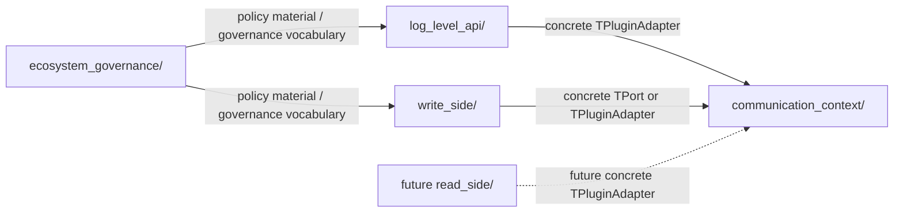
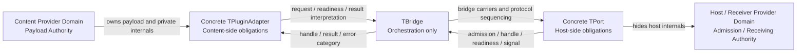
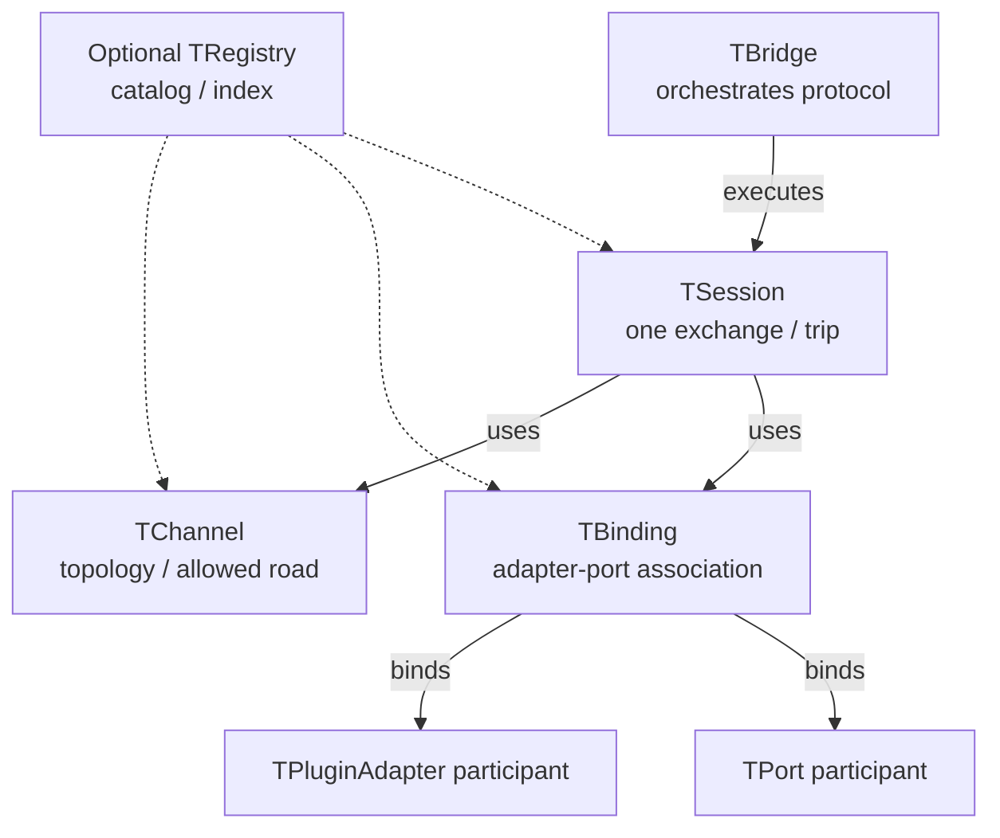
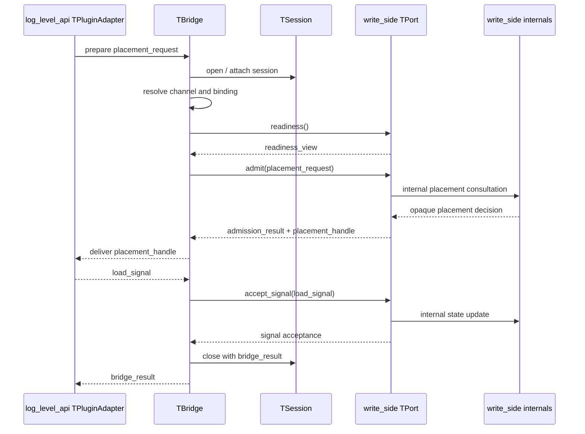
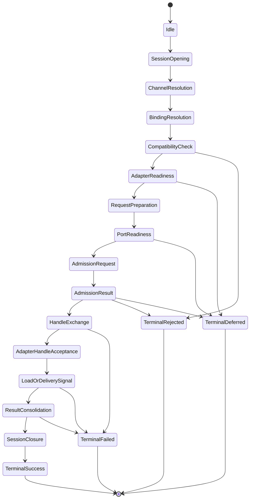
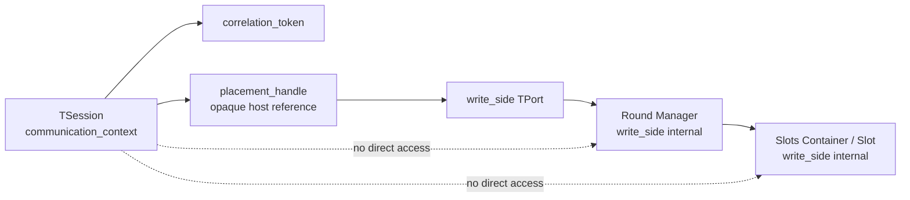
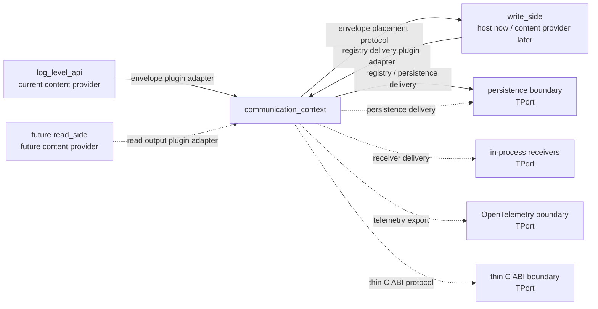
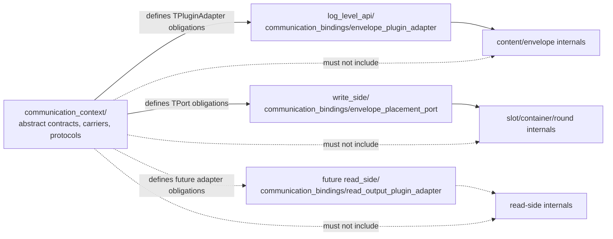

# ASCC-007 — Diagrams, Code, and Visual Reference Pack

## 1. Document Control

| Record ID | Field | Value |
|---:|---|---|
| ASCC-007-DOC-001 | Document Title | Diagrams, Code, and Visual Reference Pack |
| ASCC-007-DOC-002 | File Name | `ASCC-007_Diagrams_Code_And_Visual_Reference_Pack.md` |
| ASCC-007-DOC-003 | Documentation Pack | ASCC — Assembler System Communication Context Documentation Pack |
| ASCC-007-DOC-004 | Formal Version | Formal Draft V1 |
| ASCC-007-DOC-005 | Project | Assembler System |
| ASCC-007-DOC-006 | Primary Language | English |
| ASCC-007-DOC-007 | Scope Level | Visual references, Mermaid diagrams, pseudo-C++ references, glossary alignment, visual governance |
| ASCC-007-DOC-008 | Implementation Direction | C++17, templates, traits, CRTP-compatible abstractions, static-first communication bindings |
| ASCC-007-DOC-009 | Status | Visual and Code Reference Draft |
| ASCC-007-DOC-010 | Depends On | `ASCC-001`, `ASCC-002`, `ASCC-003`, `ASCC-004`, `ASCC-005`, `ASCC-006` |
| ASCC-007-DOC-011 | Previous Document | `ASCC-006_Communication_Context_Folder_Structure.md` |
| ASCC-007-DOC-012 | Pack Position | Final document in the ASCC foundation sequence |
| ASCC-007-DOC-013 | Primary Rule | Diagrams and pseudo-code explain architecture; they do not freeze implementation |
| ASCC-007-DOC-014 | Visual Status | Mermaid diagrams are canonical text references; FigJam/Figma visuals may be generated from them later |
| ASCC-007-DOC-015 | Code Status | Pseudo-C++ is illustrative and non-final |

---

## 2. Purpose

### 2.1 Purpose Statement

This document provides the visual and pseudo-code reference pack for the Assembler System Communication Context.

It consolidates the model introduced in:

1. `ASCC-001_Communication_Context_Foundation.md`,
2. `ASCC-002_Bridge_Channel_Session_Core_Model.md`,
3. `ASCC-003_TPort_TPluginAdapter_Contract_Model.md`,
4. `ASCC-004_Bridge_Protocol_And_State_Model.md`,
5. `ASCC-005_External_Relationships_And_Extension_Model.md`,
6. `ASCC-006_Communication_Context_Folder_Structure.md`.

It answers the question:

```text
What diagrams, pseudo-code shapes, and visual references should be treated as
the canonical explanatory material for the Communication Context model?
```

### 2.2 Scope

This document includes:

1. context map diagrams,
2. bridge anatomy diagrams,
3. channel/session/binding diagrams,
4. port and plugin-adapter obligation diagrams,
5. protocol-stage diagrams,
6. carrier-flow diagrams,
7. session/round correlation diagrams,
8. folder hierarchy diagrams,
9. future-extension diagrams,
10. pseudo-C++ reference snippets,
11. visual governance rules.

### 2.3 Non-Purpose

This document does not define:

1. final C++ implementation,
2. final C++ signatures,
3. final file inventory,
4. final build system,
5. final Figma styling,
6. final UI diagrams,
7. final implementation sequence,
8. final runtime algorithms,
9. final registry implementation,
10. final persistence implementation,
11. final telemetry implementation,
12. final thin C ABI implementation.

---

## 3. Visual Reference Doctrine

### 3.1 Diagram Status

All diagrams in this document are architectural references.

They are intended to clarify:

1. ownership,
2. boundaries,
3. relationships,
4. flow,
5. anti-collapse rules,
6. extension paths,
7. folder structure.

They must not be treated as final runtime implementation diagrams.

### 3.2 Mermaid as Canonical Source

Mermaid source blocks are the canonical text representation of diagrams in this document.

Visual tools such as FigJam, Figma, or other diagramming systems may be generated from them.

If a visual tool rendering diverges from the Mermaid source, the Mermaid source remains the reference unless explicitly revised.

### 3.3 Visual Anti-Collapse Rule

```text
A diagram must not visually imply ownership that the architecture explicitly
forbids.
```

For example:

1. the bridge must not be drawn inside `write_side/`,
2. the bridge must not be drawn inside `log_level_api/`,
3. `TChannel` must not be drawn as a runtime session,
4. `TSession` must not be drawn as a web session,
5. `TRegistry` must not be drawn as a message broker,
6. persistence ports must not be drawn as database ownership,
7. telemetry ports must not be drawn as OpenTelemetry SDK ownership,
8. thin C ABI ports must not expose the full C++ object model.

---

## 4. Diagram Catalog

| Record ID | Diagram | Purpose |
|---:|---|---|
| ASCC-007-DIAG-001 | Root Domain Context Map | Shows `communication_context/` as root DDD domain |
| ASCC-007-DIAG-002 | Core Communication Model | Shows content provider, plugin adapter, bridge, port, host provider |
| ASCC-007-DIAG-003 | Bridge / Channel / Session / Binding Map | Separates topology, exchange, association, and orchestration |
| ASCC-007-DIAG-004 | Port and PluginAdapter Obligation Map | Shows what each side exposes to the bridge |
| ASCC-007-DIAG-005 | Envelope Placement Sequence | Shows current primary `log_level_api` to `write_side` flow |
| ASCC-007-DIAG-006 | Generic Protocol State Machine | Shows bridge-visible protocol stages |
| ASCC-007-DIAG-007 | Session and Write-Side Round Correlation | Shows correlation without ownership |
| ASCC-007-DIAG-008 | External Extension Map | Shows read-side, persistence, telemetry, ABI, and receivers |
| ASCC-007-DIAG-009 | Communication Context Folder Tree | Shows ASCC-006 folder taxonomy |
| ASCC-007-DIAG-010 | Abstract vs Concrete Binding Placement | Shows abstract contracts in `communication_context/` and concrete bindings in domains |

---

## 5. Diagram 001 — Root Domain Context Map

### 5.1 Purpose

This diagram shows that `communication_context/` is a root DDD implementation domain.

It is not a subfolder of `write_side/` or `log_level_api/`.

### 5.2 Mermaid Source



### 5.3 Interpretation

| Record ID | Element | Meaning |
|---:|---|---|
| ASCC-007-D001-001 | `communication_context/` | Root domain for bridge-mediated communication |
| ASCC-007-D001-002 | `log_level_api/` | Current content provider for envelope placement |
| ASCC-007-D001-003 | `write_side/` | Current host provider for envelope placement and future content provider for registry delivery |
| ASCC-007-D001-004 | future `read_side/` | Future content provider for receivers, persistence, telemetry, or ABI boundaries |
| ASCC-007-D001-005 | `ecosystem_governance/` | Governance and policy vocabulary source |

---

## 6. Diagram 002 — Core Communication Model

### 6.1 Purpose

This diagram shows the central relationship:

```text
Content Provider → TPluginAdapter → TBridge → TPort → Host Provider
```

### 6.2 Mermaid Source



### 6.3 Interpretation

The bridge coordinates.

The plugin adapter handles the content side.

The port handles the host side.

Endpoint internals are hidden behind the concrete adapter and port.

### 6.4 Anti-Collapse Notes

| Record ID | Forbidden Collapse | Reason |
|---:|---|---|
| ASCC-007-D002-AC-001 | Bridge into adapter | Bridge must not own content-side preparation |
| ASCC-007-D002-AC-002 | Bridge into port | Bridge must not own host-side placement |
| ASCC-007-D002-AC-003 | Adapter into port | Content-side and host-side obligations differ |
| ASCC-007-D002-AC-004 | Port into host internals | Port exposes obligations, not internals |

---

## 7. Diagram 003 — Bridge, Channel, Session, and Binding Map

### 7.1 Purpose

This diagram separates:

1. `TBridge`,
2. `TChannel`,
3. `TSession`,
4. `TBinding`,
5. participants.

### 7.2 Mermaid Source



### 7.3 Interpretation

| Record ID | Concept | Meaning |
|---:|---|---|
| ASCC-007-D003-001 | `TChannel` | Defines topology |
| ASCC-007-D003-002 | `TSession` | Represents one exchange instance |
| ASCC-007-D003-003 | `TBinding` | Associates adapter and port |
| ASCC-007-D003-004 | `TBridge` | Executes session under protocol |
| ASCC-007-D003-005 | `TRegistry` | Optional catalog, not broker |

### 7.4 Canonical Metaphor

```text
Channel = allowed road.
Session = one trip on that road.
Binding = which vehicle and gate are paired.
Bridge = orchestrator of the trip.
Registry = optional map or catalog.
```

---

## 8. Diagram 004 — Port and PluginAdapter Obligation Map

### 8.1 Purpose

This diagram shows what the bridge may ask from each side.

### 8.2 Mermaid Source

```mermaid
flowchart LR
    BR["TBridge"]

    subgraph AD["TPluginAdapter Obligations"]
        A1["identify adapter"]
        A2["declare compatibility"]
        A3["prepare request"]
        A4["attach correlation"]
        A5["interpret handle"]
        A6["interpret result / error"]
    end

    subgraph PT["TPort Obligations"]
        P1["identify port"]
        P2["declare compatibility"]
        P3["admit / reject / defer"]
        P4["produce handle"]
        P5["expose readiness"]
        P6["accept signal / return result"]
    end

    AD --> BR
    BR --> PT
    PT --> BR
    BR --> AD
```



### 8.3 Interpretation

`TPluginAdapter` answers content-side questions.

`TPort` answers host-side questions.

The bridge coordinates.

Concrete implementations decide internal validation, hot-path handling, caching, and domain-specific procedures.

---

## 9. Diagram 005 — Envelope Placement Sequence

### 9.1 Purpose

This is the current primary scenario:

```text
log_level_api → communication_context → write_side
```

### 9.2 Mermaid Source



### 9.3 Interpretation

The bridge sees carriers and results.

The write-side port may internally consult round manager, waiting lists, slots containers, moderators, or reference precalculators.

The bridge must not access those internals.

---

## 10. Diagram 006 — Generic Protocol State Machine

### 10.1 Purpose

This diagram captures bridge-visible protocol progress.

It does not model endpoint domain state.

### 10.2 Mermaid Source



### 10.3 Interpretation

The state machine belongs to bridge-visible protocol execution.

It is not:

1. write-side round state,
2. slot lifecycle state,
3. content validation state,
4. persistence lifecycle state,
5. telemetry SDK state.

---

## 11. Diagram 007 — Session and Write-Side Round Correlation

### 11.1 Purpose

This diagram shows how a communication session may correlate with a write-side round without owning it.

### 11.2 Mermaid Source



### 11.3 Interpretation

Correlation is allowed.

Ownership is forbidden.

A session may carry a token or handle that references host-side placement context, but it must not expose `RoundManager`, `Slot`, or `SlotsContainer` internals.

---

## 12. Diagram 008 — External Extension Map

### 12.1 Purpose

This diagram shows that the same communication model supports future extension.

### 12.2 Mermaid Source



### 12.3 Interpretation

Future integrations must use bridge protocols.

They must not create direct dependency on endpoint internals.

---

## 13. Diagram 009 — Communication Context Folder Tree

### 13.1 Purpose

This diagram summarizes the folder structure from `ASCC-006`.

### 13.2 Mermaid Source

```mermaid
flowchart TB
    CC["communication_context/"]

    CC --> DOCS["docs/"]
    CC --> TESTS["tests/"]
    CC --> BC["bridge_core/"]
    CC --> CH["channels/"]
    CC --> SE["sessions/"]
    CC --> BI["bindings/"]
    CC --> PA["participants/"]
    CC --> OB["obligations/"]
    CC --> CAR["bridge_carriers/"]
    CC --> PR["protocols/"]
    CC --> PS["protocol_state/"]
    CC --> RG["registries/"]
    CC --> CO["compatibility/"]
    CC --> DG["diagnostics/"]
    CC --> IB["integration_boundaries/"]

    OB --> PORTS["ports/"]
    OB --> ADAPT["plugin_adapters/"]

    PR --> ENV["envelope_placement/"]
    PR --> REG["registry_delivery/"]
    PR --> REC["receiver_delivery/"]
    PR --> PER["persistence_delivery/"]
    PR --> TEL["telemetry_export/"]
    PR --> ABI["thin_c_abi/"]

    IB --> RX["in_process_receivers/"]
    IB --> PPORT["persistence_ports/"]
    IB --> OT["open_telemetry_ports/"]
    IB --> CABI["thin_c_abi_ports/"]
```



### 13.3 Interpretation

The folder structure mirrors communication semantics.

It is not a generic utility layout.

---

## 14. Diagram 010 — Abstract vs Concrete Binding Placement

### 14.1 Purpose

This diagram shows where abstract contracts live versus where concrete domain bindings live.

### 14.2 Mermaid Source



### 14.3 Interpretation

`communication_context/` owns abstract communication contracts.

Concrete bindings that depend on domain internals live near the owning domain.

---

## 15. Pseudo-C++ Reference Catalog

### 15.1 Pseudo-Code Status

All code snippets in this document are pseudo-C++ references.

They are intended to clarify architecture.

They do not freeze:

1. final class names,
2. final method names,
3. final signatures,
4. final template constraints,
5. final namespace layout,
6. final include graph,
7. final implementation strategy.

### 15.2 Bridge Carrier Set

```cpp
struct TPlacementRequest;
struct TPlacementHandle;
struct TAdmissionResult;
struct TReadinessView;
struct TLoadSignal;
struct TNextDestinationRequest;
struct TBridgeResult;
struct TBridgeError;
struct TCorrelationToken;

template<class ProtocolFamilyT>
struct TBridgeCarrierSet
{
    using request_type = TPlacementRequest;
    using handle_type = TPlacementHandle;
    using admission_result_type = TAdmissionResult;
    using readiness_view_type = TReadinessView;
    using load_signal_type = TLoadSignal;
    using next_destination_request_type = TNextDestinationRequest;
    using bridge_result_type = TBridgeResult;
    using error_type = TBridgeError;
    using correlation_token_type = TCorrelationToken;
};
```

### 15.3 TPluginAdapter Contract Shape

```cpp
template<class DerivedT, class CarrierSetT>
struct TPluginAdapterContract
{
    using carrier_set = CarrierSetT;
    using request_type = typename carrier_set::request_type;
    using handle_type = typename carrier_set::handle_type;
    using bridge_result_type = typename carrier_set::bridge_result_type;
    using error_type = typename carrier_set::error_type;
    using correlation_token_type = typename carrier_set::correlation_token_type;

    // illustrative only
    // DerivedT prepares request carriers and interprets handles/results.
};
```

### 15.4 TPort Contract Shape

```cpp
template<class DerivedT, class CarrierSetT>
struct TPortContract
{
    using carrier_set = CarrierSetT;
    using request_type = typename carrier_set::request_type;
    using handle_type = typename carrier_set::handle_type;
    using admission_result_type = typename carrier_set::admission_result_type;
    using readiness_view_type = typename carrier_set::readiness_view_type;
    using load_signal_type = typename carrier_set::load_signal_type;

    // illustrative only
    // DerivedT admits requests, produces handles, exposes readiness,
    // and accepts bridge-visible signals.
};
```

### 15.5 TChannel Shape

```cpp
template<class AdapterFamilyT, class PortFamilyT, class TopologyProfileT, class ProtocolFamilyT>
struct TChannel
{
    using adapter_family = AdapterFamilyT;
    using port_family = PortFamilyT;
    using topology_profile = TopologyProfileT;
    using protocol_family = ProtocolFamilyT;
};
```

### 15.6 TBinding Shape

```cpp
template<class AdapterT, class PortT, class ChannelT>
struct TBinding
{
    using adapter_type = AdapterT;
    using port_type = PortT;
    using channel_type = ChannelT;

    // association relation only
    // not endpoint implementation
};
```

### 15.7 TSession Shape

```cpp
template<class ChannelT, class BindingT, class CarrierSetT>
struct TSession
{
    using channel_type = ChannelT;
    using binding_type = BindingT;
    using carrier_set = CarrierSetT;

    typename carrier_set::correlation_token_type correlation;
    // protocol stage and result are intentionally omitted here
};
```

### 15.8 Protocol Stage Shape

```cpp
enum class TBridgeStage
{
    idle,
    session_opening,
    channel_resolution,
    binding_resolution,
    compatibility_check,
    adapter_readiness,
    request_preparation,
    port_readiness,
    admission_request,
    admission_result,
    handle_exchange,
    adapter_handle_acceptance,
    load_or_delivery_signal,
    next_destination,
    result_consolidation,
    session_closure,
    terminal_success,
    terminal_rejected,
    terminal_failed,
    terminal_deferred
};
```

### 15.9 TBridge Protocol State Shape

```cpp
template<class CarrierSetT>
struct TBridgeProtocolState
{
    TBridgeStage current_stage;
    TBridgeStage previous_stage;
    typename CarrierSetT::correlation_token_type correlation;
    typename CarrierSetT::bridge_result_type result;
};
```

### 15.10 TBridge Shape

```cpp
template<class SessionT, class ProtocolT>
class TBridge
{
public:
    using session_type = SessionT;
    using protocol_type = ProtocolT;
    using carrier_set = typename session_type::carrier_set;
    using bridge_result_type = typename carrier_set::bridge_result_type;

    bridge_result_type execute(session_type& session);
};
```

---

## 16. Visual-to-Code Mapping

### 16.1 Mapping Table

| Record ID | Diagram Concept | Pseudo-C++ Reference |
|---:|---|---|
| ASCC-007-MAP-001 | Bridge | `TBridge<SessionT, ProtocolT>` |
| ASCC-007-MAP-002 | Channel | `TChannel<AdapterFamilyT, PortFamilyT, TopologyProfileT, ProtocolFamilyT>` |
| ASCC-007-MAP-003 | Session | `TSession<ChannelT, BindingT, CarrierSetT>` |
| ASCC-007-MAP-004 | Binding | `TBinding<AdapterT, PortT, ChannelT>` |
| ASCC-007-MAP-005 | Plugin Adapter | `TPluginAdapterContract<DerivedT, CarrierSetT>` |
| ASCC-007-MAP-006 | Port | `TPortContract<DerivedT, CarrierSetT>` |
| ASCC-007-MAP-007 | Carriers | `TBridgeCarrierSet<ProtocolFamilyT>` |
| ASCC-007-MAP-008 | Stage | `TBridgeStage` |
| ASCC-007-MAP-009 | Protocol State | `TBridgeProtocolState<CarrierSetT>` |
| ASCC-007-MAP-010 | Correlation | `TCorrelationToken` or equivalent carrier |

### 16.2 Mapping Rule

The pseudo-code must remain aligned with diagrams.

If a diagram changes a relationship, the pseudo-code interpretation must be reviewed.

If pseudo-code adds a new concept, the diagrams must be reviewed for possible visual update.

---

## 17. FigJam / Figma Visual Reference Guidance

### 17.1 Status

The Mermaid diagrams in this document are suitable for conversion into FigJam or Figma diagrams.

A direct FigJam/Figma visual may be produced later from:

1. Diagram 001 — Root Domain Context Map,
2. Diagram 002 — Core Communication Model,
3. Diagram 003 — Bridge/Channel/Session/Binding Map,
4. Diagram 005 — Envelope Placement Sequence,
5. Diagram 009 — Folder Tree.

### 17.2 Recommended Visual Set

| Record ID | Visual Name | Source Diagram | Recommended Use |
|---:|---|---|---|
| ASCC-007-FIG-001 | ASCC Root Context Map | Diagram 001 | High-level architecture explanation |
| ASCC-007-FIG-002 | ASCC Core Bridge Anatomy | Diagram 002 + Diagram 003 | Core model explanation |
| ASCC-007-FIG-003 | ASCC Port Adapter Obligations | Diagram 004 | Contract discussion |
| ASCC-007-FIG-004 | ASCC Envelope Placement Flow | Diagram 005 | Current primary runtime scenario |
| ASCC-007-FIG-005 | ASCC Protocol State Machine | Diagram 006 | Protocol-state explanation |
| ASCC-007-FIG-006 | ASCC Session Round Correlation | Diagram 007 | Write-side correlation explanation |
| ASCC-007-FIG-007 | ASCC Extension Map | Diagram 008 | Future scalability discussion |
| ASCC-007-FIG-008 | ASCC Folder Taxonomy | Diagram 009 | Filesystem/folder planning |

### 17.3 Figma/FigJam Rendering Rules

A visual rendering must preserve:

1. root-domain independence of `communication_context/`,
2. bridge orchestration-only role,
3. adapter vs port distinction,
4. channel vs session distinction,
5. registry as optional catalog, not broker,
6. carrier as communication artifact, not endpoint-private state,
7. session/round correlation without ownership,
8. abstract contracts in `communication_context/`,
9. concrete bindings near owning domains,
10. future extensions as dashed or review-gated where appropriate.

---

## 18. Diagram Governance

### 18.1 Diagram Update Rule

A diagram must be updated if:

1. a root domain is added or removed,
2. a concept changes ownership,
3. a protocol family is promoted from future to active,
4. a channel topology changes,
5. a new integration boundary is introduced,
6. a folder structure changes,
7. a concrete binding placement rule changes,
8. a new anti-collapse rule is added,
9. a previous visual implies forbidden ownership.

### 18.2 Diagram Validation Checklist

| Record ID | Question | Required Answer |
|---:|---|---|
| ASCC-007-DV-001 | Does the diagram preserve `communication_context/` root-domain status? | Yes |
| ASCC-007-DV-002 | Does the bridge remain orchestration-only? | Yes |
| ASCC-007-DV-003 | Are adapter and port distinct? | Yes |
| ASCC-007-DV-004 | Are channel and session distinct? | Yes |
| ASCC-007-DV-005 | Is registry optional or clearly non-broker? | Yes |
| ASCC-007-DV-006 | Are endpoint internals hidden? | Yes |
| ASCC-007-DV-007 | Is session/round relation shown as correlation only? | Yes |
| ASCC-007-DV-008 | Are persistence/telemetry/ABI boundaries non-owning? | Yes |
| ASCC-007-DV-009 | Are future extensions visually marked as future or dashed? | Yes |
| ASCC-007-DV-010 | Does the diagram avoid generic utility wording? | Yes |

---

## 19. Pseudo-Code Governance

### 19.1 Pseudo-Code Rule

Pseudo-code is explanatory.

It is not implementation.

It should preserve:

1. conceptual clarity,
2. ownership boundaries,
3. bridge/adapter/port distinction,
4. carrier/protocol/state separation,
5. static-first C++ direction,
6. CRTP compatibility,
7. endpoint non-leakage.

### 19.2 Pseudo-Code Must Not

Pseudo-code must not:

1. define final ABI,
2. define final templates,
3. define final signatures,
4. define final inheritance tree,
5. define final namespace layout,
6. define final memory model,
7. define final concurrency model,
8. expose endpoint internals,
9. imply database ownership,
10. imply telemetry SDK ownership,
11. imply full C++ object exposure through C ABI.

### 19.3 Pseudo-Code Review Checklist

| Record ID | Question | Required Answer |
|---:|---|---|
| ASCC-007-PC-001 | Does the pseudo-code preserve abstraction? | Yes |
| ASCC-007-PC-002 | Does it avoid final implementation commitment? | Yes |
| ASCC-007-PC-003 | Does it avoid endpoint internals? | Yes |
| ASCC-007-PC-004 | Does it match the diagrams? | Yes |
| ASCC-007-PC-005 | Does it preserve static-first direction? | Yes |
| ASCC-007-PC-006 | Does it remain C++17-compatible in spirit? | Yes |
| ASCC-007-PC-007 | Does it avoid unowned external SDK details? | Yes |
| ASCC-007-PC-008 | Does it avoid broker semantics? | Yes |

---

## 20. Anti-Collapse Visual Index

| Rule ID | Visual Risk | Required Correction |
|---:|---|---|
| ASCC-007-ACV-001 | Bridge drawn inside `write_side/` | Move bridge to `communication_context/` |
| ASCC-007-ACV-002 | Bridge drawn inside `log_level_api/` | Move bridge to `communication_context/` |
| ASCC-007-ACV-003 | Channel drawn as runtime exchange | Rename or redraw as topology |
| ASCC-007-ACV-004 | Session drawn as topology | Redraw as one execution instance |
| ASCC-007-ACV-005 | Registry drawn as broker | Redraw as optional catalog |
| ASCC-007-ACV-006 | Port drawn as host internals | Redraw as host-side obligation surface |
| ASCC-007-ACV-007 | PluginAdapter drawn as content internals | Redraw as content-side obligation surface |
| ASCC-007-ACV-008 | Carrier drawn as endpoint object | Redraw as bridge-visible artifact |
| ASCC-007-ACV-009 | Readiness view drawn as mutable state | Redraw as read-only projection |
| ASCC-007-ACV-010 | Placement handle drawn as slot pointer | Redraw as opaque host reference |
| ASCC-007-ACV-011 | Bridge result drawn as persistence proof | Redraw as communication outcome |
| ASCC-007-ACV-012 | Telemetry port drawn as SDK owner | Redraw as boundary port |
| ASCC-007-ACV-013 | Thin C ABI drawn as full C++ exposure | Redraw as selected bridge-visible surface only |
| ASCC-007-ACV-014 | Future read-side shown as active implementation | Mark as future / dashed |

---

## 21. Recommended Documentation Usage

### 21.1 When Explaining the Model

Use the diagrams in this order:

1. Diagram 001 — Root Domain Context Map,
2. Diagram 002 — Core Communication Model,
3. Diagram 003 — Bridge/Channel/Session/Binding Map,
4. Diagram 004 — Port and PluginAdapter Obligation Map,
5. Diagram 005 — Envelope Placement Sequence.

### 21.2 When Explaining Runtime Flow

Use:

1. Diagram 005 — Envelope Placement Sequence,
2. Diagram 006 — Generic Protocol State Machine,
3. Diagram 007 — Session and Write-Side Round Correlation.

### 21.3 When Explaining Scalability

Use:

1. Diagram 008 — External Extension Map,
2. Diagram 010 — Abstract vs Concrete Binding Placement.

### 21.4 When Explaining Folder Structure

Use:

1. Diagram 009 — Communication Context Folder Tree,
2. Diagram 010 — Abstract vs Concrete Binding Placement.

---

## 22. ASCC Pack Closure

### 22.1 ASCC Sequence

The ASCC foundation sequence is:

```text
ASCC-001_Communication_Context_Foundation.md
ASCC-002_Bridge_Channel_Session_Core_Model.md
ASCC-003_TPort_TPluginAdapter_Contract_Model.md
ASCC-004_Bridge_Protocol_And_State_Model.md
ASCC-005_External_Relationships_And_Extension_Model.md
ASCC-006_Communication_Context_Folder_Structure.md
ASCC-007_Diagrams_Code_And_Visual_Reference_Pack.md
```

### 22.2 Closure Statement

This document closes the ASCC foundation sequence.

After this point, the project may proceed toward a limited implementation-readiness step for the Communication Context if required.

That step should not reopen all ASCC foundation decisions.

### 22.3 Possible Next Artifact

If needed, the next artifact should be narrow:

```text
ASCC-IMPL-001_Communication_Context_First_Skeleton_Plan.md
```

Its purpose would be to identify a minimal skeleton plan for:

1. `bridge_core/`,
2. `bridge_carriers/`,
3. `obligations/ports/`,
4. `obligations/plugin_adapters/`,
5. `protocols/envelope_placement/`,
6. `protocol_state/`,
7. concrete `log_level_api` envelope plugin adapter,
8. concrete `write_side` envelope placement port.

It should not create full implementation behavior.

---

## 23. Summary

`ASCC-007` provides the canonical diagrams, pseudo-C++ references, and visual governance rules for the Assembler System Communication Context.

The key conclusions are:

1. Mermaid diagrams are the canonical textual visual references.
2. FigJam/Figma visuals may be generated later from Mermaid sources.
3. The bridge remains orchestration-only in all visuals.
4. `TChannel` and `TSession` are visually and conceptually distinct.
5. `TPort` and `TPluginAdapter` are visually and conceptually distinct.
6. Bridge carriers are communication artifacts, not endpoint-private state.
7. Session/round relationship is correlation only, not ownership.
8. Future read-side, persistence, telemetry, and thin C ABI are extension paths, not active implementation commitments.
9. Pseudo-C++ snippets are explanatory and non-final.
10. Visual and code references must preserve anti-collapse rules.
11. The ASCC foundation sequence is complete.

The ASCC pack is now ready to support either:

1. implementation-readiness planning for the Communication Context, or
2. integration back into the broader Assembler System filesystem and architecture documentation.
