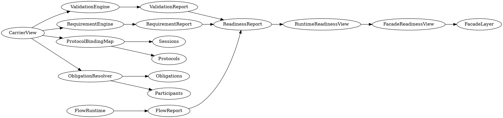
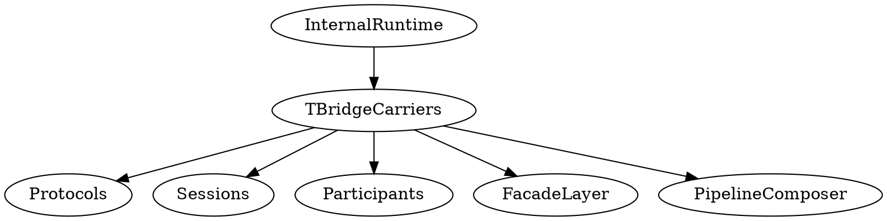
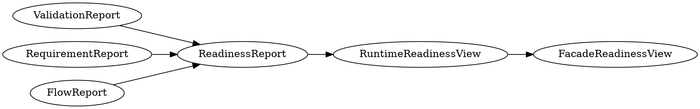

# TBridgeCarriers Internal Operational Catalog

---

# Purpose

This document defines the internal operational architecture of the
`bridge_carriers/` subsystem.

The subsystem is no longer treated as a descriptive carrier taxonomy.

It is now an operational runtime subsystem responsible for:

- carrier runtime validation
- runtime requirement satisfaction
- carrier flow orchestration
- readiness aggregation
- readiness projection
- protocol compatibility semantics
- obligation semantic resolution
- bounded operational composition

---

# Architectural Role

`bridge_carriers/` acts as the canonical runtime semantics layer for all
carrier-oriented orchestration inside the ASCC bridge orchestrator.

Higher-level domains consume carrier semantics through stable runtime surfaces
instead of accessing low-level runtime internals.

Consumed by:

- protocols/
- sessions/
- participants/
- obligations/
- diagnostics/
- facade_layer/
- pipeline composition/orchestration

---

# Runtime Topology



---

# Internal Runtime Flow

## Step 1 — Carrier Validation

`TCarrierValidationEngine`

Responsible for:

- carrier structural validation
- runtime admissibility verification
- validation evidence generation

Produces:

- `TCarrierValidationReport`

---

## Step 2 — Requirement Satisfaction

`TCarrierRequirementSatisfactionEngine`

Responsible for:

- runtime requirement evaluation
- capability satisfaction verification
- operational requirement evidence

Produces:

- `TCarrierRequirementSatisfactionReport`

---

## Step 3 — Flow Runtime

`TCarrierFlowRuntime`

Responsible for:

- runtime flow recording
- inbound/outbound orchestration evidence
- runtime flow aggregation

Produces:

- `TCarrierFlowReport`

---

## Step 4 — Readiness Aggregation

`TCarrierReadinessReport`

Acts as the bounded readiness aggregation layer.

Aggregates:

- validation readiness
- requirement readiness
- flow readiness
- runtime rejection metrics

---

## Step 5 — Runtime Readiness Projection

`TCarrierRuntimeReadinessView`

Acts as the bounded runtime readiness projection.

Responsibilities:

- runtime readiness normalization
- readiness state projection
- bounded readiness semantics

---

## Step 6 — Facade Projection

`TAsccCarrierReadinessView`

Facade-safe readiness surface.

Responsibilities:

- managerial projection
- administrative-safe projection
- facade-bound readiness translation

This layer intentionally prevents facade consumers from depending on:

- validation internals
- flow internals
- runtime aggregation internals

---

# Protocol Compatibility Semantics

`TCarrierProtocolBindingMap`

Defines bounded compatibility semantics between:

- carrier runtime kinds
- protocol semantic families

Responsibilities:

- compatibility registration
- runtime compatibility lookup
- admission compatibility semantics

Consumed by:

- protocols/
- sessions/
- pipeline orchestration

---

# Obligation Semantic Resolution

`TCarrierObligationResolver`

Defines bounded operational obligation semantics.

Responsibilities:

- obligation family registration
- mandatory obligation resolution
- operational obligation lookup

Consumed by:

- obligations/
- participants/
- diagnostics/
- runtime orchestration

---

# Stable Operational Composition Boundary



`TBridgeCarriers.hpp`

Acts as the canonical operational composition surface.

Purpose:

- bounded subsystem export
- dependency stabilization
- prevention of topology leakage
- operational composition normalization

---

# Dependency Discipline

Allowed:

```text
higher-level domains
    ↓
TBridgeCarriers.hpp
```

Forbidden:

```text
higher-level domains
    ↓
internal validation/*
internal flow/*
internal readiness/*
```

---

# Readiness Projection Pipeline



---

# Operational Outcome

`bridge_carriers/` is now treated as:

- operationally composable
- runtime-verifiable
- readiness-aware
- facade-safe
- protocol-aware
- obligation-aware

The subsystem is no longer considered a passive descriptor namespace.
